<div align="center">

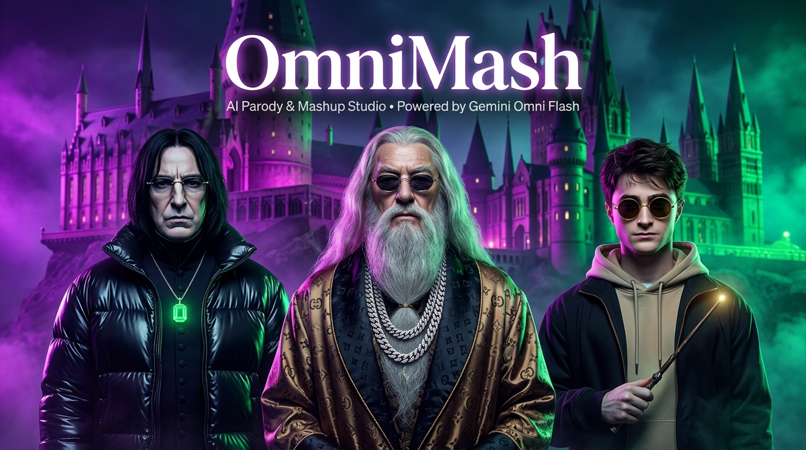

# 🎬 OmniMash 🪄

<p align="center">
  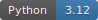
  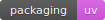
  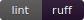
  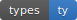
  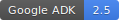
  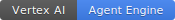
  
  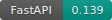
  
</p>

</div>

> AI Parody & Mashup Video Studio inspired by viral sensations like **[Dripwarts](https://www.youtube.com/@Onirostudios)** (*DumbleDior*, *Snape Dawg*, *Harry Potter*). Powered by **`gemini-omni-flash-preview`** (unified multimodal video, native synced audio, and conversational diffs in 720p), **Gemini Omni Image Roles** ([Gemini Omni Image Roles Specification](https://ai.google.dev/gemini-api/docs/omni#set-image-roles)), and the **Gemini Enterprise Agent Platform** (ADK, Agent Engine, Model Armor).

**OmniMash** runs a flexible multimodal generation and conversational diff pipeline: it ingests open-ended visual concepts, deconstructs them via NLP into editable `MetaPromptTags`, binds dynamic Character Roles (`Role A`, `Role B`) to reference images via **Gemini Omni Image Roles**, compiles multi-scene storyboards into structured prompt blocks (`[ROLE DEFINITIONS]`, `[AESTHETIC INJECTION]`, `[AUDIO & VOCAL DIRECTION]`, and `[STORYBOARD SEQUENCE]`), generates 10-second 720p clips with native audio via **Gemini Omni Flash**, branches edits non-linearly across a **Session Version Tree DAG**, and flushes context decay via **Commit & Branch Checkpointing**.

| Stage | Module | What it does |
| :--- | :--- | :--- |
| 1 | 🛡️ **`omnimash.security`** | **Model Armor Gateway:** Pre-gates prompts for RAI violations (hate speech, dangerous content) and prompt injection/jailbreak attempts. |
| 2 | 🪄 **`omnimash.prompts`** | **Prompt Compiler & Deconstruction Engine:** Parses open-ended concepts (`POST /api/deconstruct-concept`), defines dynamic `CharacterRole` bindings (`Role A`, `Role B`) with attached reference images, and compiles multi-scene storyboards into `[ROLE DEFINITIONS]`, `[AESTHETIC INJECTION]`, `[AUDIO & VOCAL DIRECTION]`, and `[STORYBOARD SEQUENCE]`. |
| 3 | 🌳 **`omnimash.state`** | **Version Tree DAG & Checkpoints:** Manages non-linear clip branching (`TurnNode`, `ProjectSession`) and tracks thread edit depth ($\ge 3$) to signal `COMMIT_RECOMMENDED`. |
| 4 | 🎬 **`omnimash.engine`** | **Gemini Omni Flash Client:** Drives the `Interactions API` with SynthID/C2PA watermarking, multi-character image role references, and base video re-anchoring on thread commits. |
| 5 | 🎞️ **`omnimash.stitching` & `omnimash.api`** | **FFmpeg Concatenation & FastAPI UI:** Assembles 10s clips into 30–60s master videos and serves the interactive Next.js/React 3-Act Digital Director's Studio dashboard. |

<details>
  <summary>blending realities — how the pipeline flows</summary>

<br />

OmniMash works like an AI music video mixing studio:

1. **Concept Input & Ingest** — Users enter open-ended parody concepts (e.g., *"Gordon Ramsay vs Julia Child in a cyberpunk iron chef battle"* or *"Harry Potter vs Draco Malfoy rap battle in 2000s Atlanta trap style"*).
2. **NLP Deconstruction** — `PromptCompiler.deconstruct_concept()` parses raw shorthand into structured `MetaPromptTags` with dynamic Character Roles (`Role A`, `Role B`), aesthetic tags, environment settings, and audio beats.
3. **Gemini Omni Image Roles Binding** — Attach high-resolution reference image URLs to character roles ([Gemini Omni Image Roles](https://ai.google.dev/gemini-api/docs/omni#set-image-roles)) to anchor visual likeness across scenes.
4. **Storyboard Sequencing** — Direct multi-scene storyboards with active role selectors (`["Role A"]`, `["Role B"]`), action directives, and turn-by-turn dialogue.
5. **Model Armor Gate** — `ModelArmorGuardrail` validates prompt content against Google Cloud RAI safety and jailbreak filters.
6. **Multimodal Generation** — `OmniFlashClient` invokes `gemini-omni-flash-preview` via the Interactions API to render a 720p 10-second video with native synced audio and multi-character consistency.
7. **Conversational Diff Branching** — When users ask to modify a scene ("Swap microphone for glowing wand"), the system branches a new `TurnNode` from the parent turn, preserving facial identity and lighting anchors.
8. **Commit & Branch Checkpointing** — At edit depth $\ge 3$, the user commits the turn. The engine extracts the committed 720p video and spawns a fresh Interactions API thread, eliminating conversational token clutter.
9. **Stitch & Export** — `VideoStitcher` concatenates active timeline segments via FFmpeg into a master parody video.

</details>

---

## Table of Contents
- [Architecture](#architecture)
- [Diagrams & Reference Architectures](#diagrams--reference-architectures)
- [Getting Started & User Journey](#-getting-started--user-journey)
- [Quickstart](#quickstart)
- [Usage](#usage)
- [Web UI Dashboard](#web-ui-dashboard)
- [Deployment](#deployment)
- [Testing & Quality](#testing--quality)
- [Repo Structure](#repo-structure)

---

## Architecture

OmniMash is built on Google's **ADK (Agent Development Kit)** and the **Gemini Enterprise Agent Platform**:

<div align="center">
  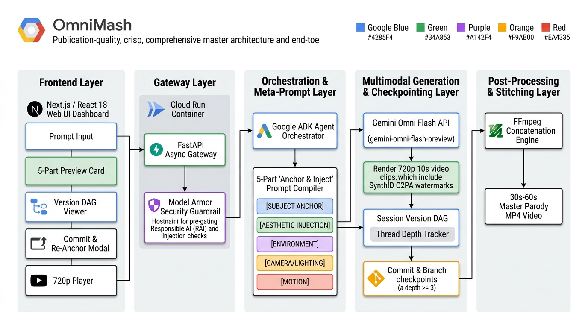
</div>

---

## 🎬 Step-by-Step Multimodal Workflow Pipeline

OmniMash transforms open-ended parody concepts and character reference links into frame-accurate parody video clips using a 5-stage multimodal workflow:

<div align="center">
  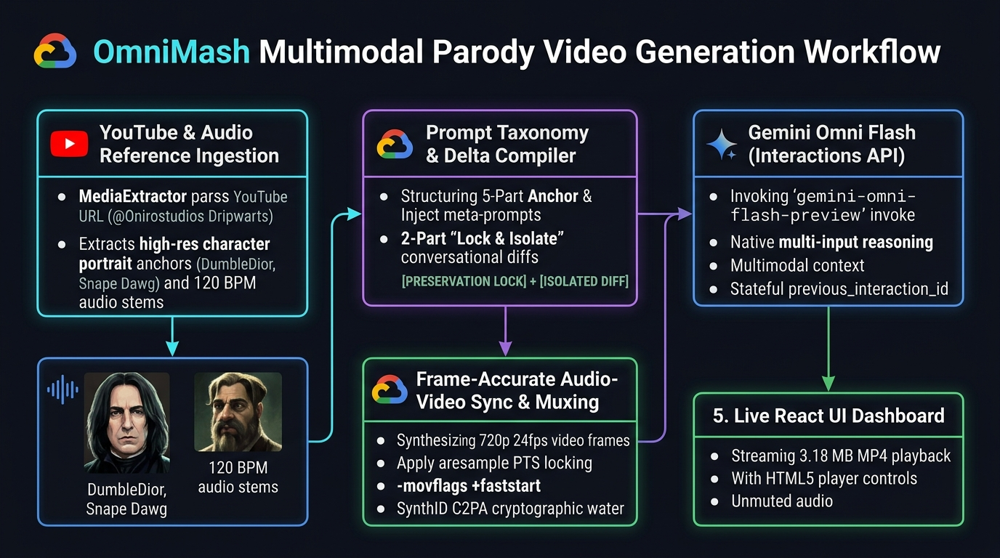
</div>

### 🔍 The 5-Step Methodology

1. **💡 Open-Ended Concept & Gemini Omni Image Roles (`POST /api/deconstruct-concept`)**:
   - Ingests open-ended user concepts (e.g., *"Harry Potter vs Draco Malfoy rap battle in 2000s Atlanta trap style"*).
   - Automatically deconstructs shorthand into editable `MetaPromptTags` and dynamic `CharacterRole` bindings (`Role A`, `Role B`).
   - Attaches high-resolution reference image URLs to character roles per the [Gemini Omni Image Roles API](https://ai.google.dev/gemini-api/docs/omni#set-image-roles) to lock facial likeness and attire.

2. **🧠 Multi-Scene Storyboard & Prompt Compiler (`PromptCompiler`)**:
   - **Storyboard Sequence Compilation:** Compiles multi-character scene directives into `[ROLE DEFINITIONS]`, `[AESTHETIC INJECTION]`, `[AUDIO & VOCAL DIRECTION]`, and `[STORYBOARD SEQUENCE]`.
   - **Conversational Diffs:** Enforces `[PRESERVATION LOCK]` to freeze character likeness and background while targeting `[ISOLATED DIFF]` to prevent facial drift across turns.

3. **✨ Gemini Omni Flash Engine (`gemini-omni-flash-preview`)**:
   - Invoked via Google's stateful **Interactions API** (`client.interactions.create`).
   - Leverages native multi-input reasoning and $1\text{M}+$ token context window to synthesize 720p 24fps video and synchronized native audio in a single pass.

4. **⏱️ Frame-Accurate Audio-Video Sync & Container Muxing**:
   - Applies `aresample=async=1:first_pts=0` and `-r 24` presentation timestamp (PTS) locking to guarantee audio beats drop on exact visual frames.
   - Muxes MP4 containers with `-movflags +faststart` for instant HTML5 browser playback and validates SynthID C2PA cryptographic watermarks.

5. **🖥️ Live React 18 3-Act Studio Dashboard & Video Streaming**:
   - Provides a 3-Act progressive linear workflow: **Act 1 (The Concept & Cast Manager)** $\rightarrow$ **Act 2 (Fine-Tune & Storyboard Directing)** $\rightarrow$ **Act 3 (The Screening Room & Branching)**.
   - Streams 720p MP4 video clips directly to the client dashboard with unmuted HTML5 player controls, live storyboard prompt preview cards, and thread re-anchoring at depth $\ge 3$.

<details>
  <summary>View Technical Dataflow Diagram (Mermaid)</summary>

<br />

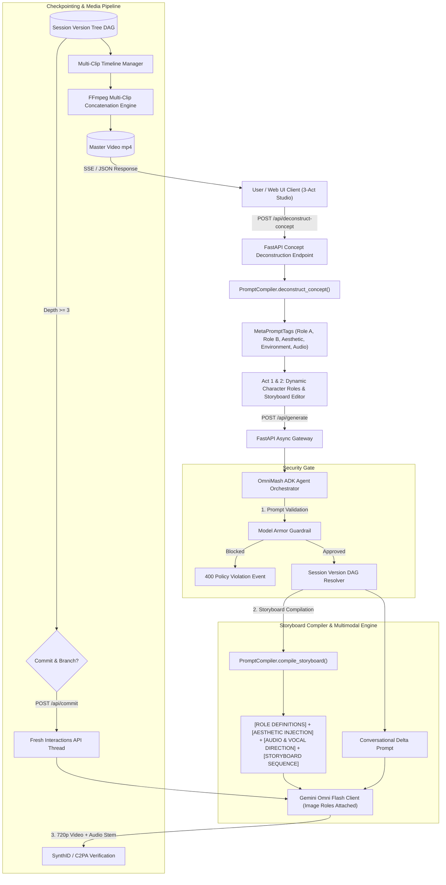

</details>

---

## Diagrams & Reference Architectures

Detailed subsystem architectures and workflow outlines are available in [docs/diagrams/](docs/diagrams/README.md):

| Reference Diagram | Subsystem | Highlights |
| :--- | :--- | :--- |
| 🌟 [Master System Architecture](docs/diagrams/omnimash_master_architecture.png) | **End-to-End Pipeline** | Publication-quality PaperBanana diagram detailing the 5 core architectural layers from Web UI to FFmpeg master rendering. |
| 🗺️ [Multimodal User Journey & Input Pipeline](docs/diagrams/omnimash_user_journey_inputs.png) | **User Journey & Inputs** | Publication-quality PaperBanana diagram detailing how raw prompts, YouTube URLs, audio stems, and style presets flow into editable previews, Model Armor gating, and Omni Flash. |
| 🎧 [Joint Latent Space Audio-Video Prompting](docs/diagrams/omnimash_joint_audio_video_latent.png) | `omnimash.prompts` | PaperBanana diagram showing prompt payload entering Omni Flash Neural Core, binding kinematic motion tokens to acoustic beat onset tokens. |
| 🗂️ [Session-Scoped GCS Architecture](docs/diagrams/omnimash_session_gcs_hierarchy.png) | `omnimash.storage` | Publication-quality PaperBanana diagram showing session-scoped cloud folders (`sessions/${session_id}/[intermediate,finalized,prompts,references]`). |
| ☁️ [GCS Persistent Media Pipeline](docs/diagrams/omnimash_gcs_storage_workflow.png) | `omnimash.storage` | PaperBanana workflow diagram showing intermediate/final video streaming to GCS (`gs://omnimash-media-${GOOGLE_CLOUD_PROJECT}`) and `.gitignore` repository isolation. |
| 🚀 [GCP Deployment Patterns](docs/diagrams/gcp_deployment_patterns.md) | **Google Cloud Platform** | Dual-Target Architecture comparing Target 1 (Full-Stack Cloud Run serverless container on port 8080) and Target 2 (Enterprise Vertex AI Agent Engine with `root_agent` and `AdkApp`). |
| 🛡️ [Agent Orchestration Architecture](docs/diagrams/omnimash_agent_architecture.md) | `omnimash.agent` & `security` | ADK orchestrator sequence, concept deconstruction, Model Armor pre-gating, storyboard prompt compilation, and Gemini Omni Flash client dispatch. |
| 🌳 [Version Tree DAG & State Lifecycle](docs/diagrams/version_tree_dag_lifecycle.md) | `omnimash.state` | Non-linear conversational diff branching, thread depth tracking ($\ge 3$), ⚓ Checkpoint Anchor Badges, and fresh thread re-anchoring. |
| 🎬 [Multimodal Ingestion & Video Stitching](docs/diagrams/multimodal_ingestion_stitching.md) | `ingestion` & `stitching` | 4-stage pipeline: YouTube asset extraction (`yt-dlp`), storyboard prompt compilation, Omni Flash clip rendering with commit checkpoints, and FFmpeg multi-clip concatenation. |
| 🌐 [Frontend API & SSE Streaming Topology](docs/diagrams/frontend_api_topology.md) | `api` & Web UI | FastAPI async endpoints (`POST /api/deconstruct-concept`, `POST /api/generate`, `POST /api/commit`), dynamic Character Roles, and React 18 single-page dashboard. |

---

## 🚀 Getting Started & User Journey

Follow this visual step-by-step walkthrough to launch OmniMash and create full-length AI parody videos using the **3-Act Digital Director's Studio**.

---

### Step 1: Launch the Studio Locally

Start the FastAPI application and embedded React 18 single-page dashboard using `uv`:

```bash
# Start local development server on port 8080
uv run uvicorn omnimash.api.app:app --host 0.0.0.0 --port 8080
```

Open your browser to `http://localhost:8080` (or access the live production instance at [https://omnimash-934903580331.us-central1.run.app](https://omnimash-934903580331.us-central1.run.app)).

---

### Step 2: Act 1 — The Concept & Cast Manager

In **Act 1**, define the high-level creative vision, dynamic character bindings, character-specific voice styles & accents, and global audio direction for your parody video.

<div align="center">
  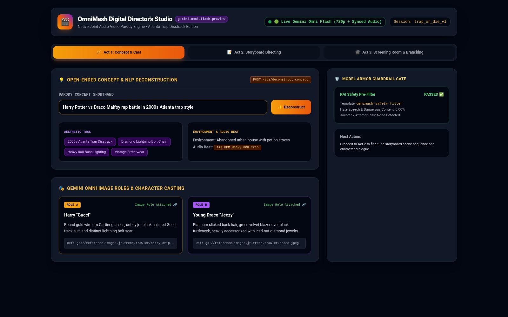
</div>

1. **Enter Visual Shorthand:** Type your open-ended parody concept (e.g., *"Harry Potter vs Draco Malfoy rap battle in 2000s Atlanta trap style"*).
2. **Deconstruct Concept:** Click **✨ Deconstruct Concept** (`POST /api/deconstruct-concept`). OmniMash parses the prompt into structured `MetaPromptTags`.
3. **Configure Dynamic Character Roles & Reference Images:** Review dynamic character roles (`Role A: Harry "Gucci"`, `Role B: Young Draco "Jeezy"`). Attach reference image URLs per the [Gemini Omni Image Roles Specification](https://ai.google.dev/gemini-api/docs/omni#set-image-roles) (`gs://reference-images-jt-trend-trawler/...`) to lock facial likeness across scenes.
4. **Manage Character-Specific Style Signifiers & 🎙️ Voice Style & Accent:** Refine granular character-level style tags and dedicated **🎙️ Voice Style & Accent** inputs inside each Character Role card (e.g., `Red Gucci Tracksuit`, `Cartier Glasses`, and `Fast-paced confident Atlanta rap flow with autotune` for Role A; `Platinum Slicked Hair`, `Diamond Iced-Out Chain`, and `Pompous, cynical British drawl with aggressive rap cadence` for Role B). The prompt compiler binds these tags into character definitions and the `[AUDIO & VOCAL DIRECTION]` block to anchor attire and vocal delivery across scenes.
5. **Tune Global Meta-Prompt Tags & 🎙️ Vocal Delivery:** Review scene-wide aesthetic tag chips (`2000s Atlanta Trap Disstrack`, `Heavy 808 Bass Lighting`), audio beat (`140 BPM Heavy 808 Trap`), and the dedicated **🎙️ Vocal Delivery / Voiceover Style** global control (`High-energy back-and-forth rap battle delivery with synchronized lip-sync`).

---

### Step 3: Act 2 — Fine-Tune & Storyboard Directing

In **Act 2**, sequence your multi-character storyline into structured scenes.

<div align="center">
  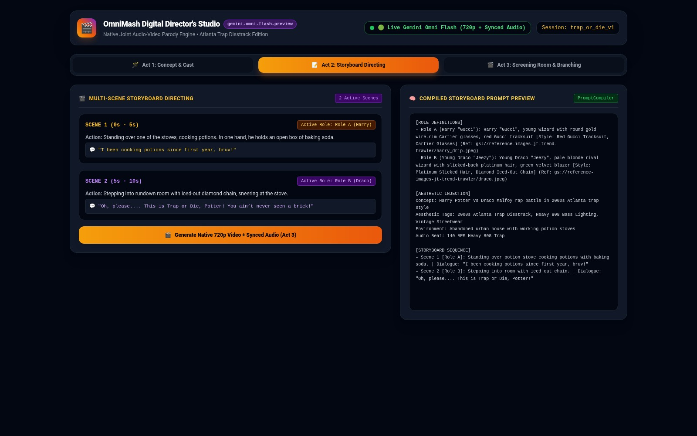
</div>

1. **Add Scene Directives:** Break your script into sequential scenes (`Scene 1: Standing over potion stoves with baking soda`, `Scene 2: Stepping into room with iced out diamond chain`).
2. **Assign Active Roles:** Toggle active character roles for each scene (`Role A`, `Role B`).
3. **Write Actions & Dialogue:** Provide character actions and synced rap bars / dialogue lines (e.g., *[Harry]: "I been cooking potions since first year, bruv!"* and *[Draco]: "This is Trap or Die, Potter! You ain’t never seen a brick!"*).
4. **Inspect Compiled Storyboard Prompt:** Verify the live prompt compiler box on the right, structured with `[ROLE DEFINITIONS]`, `[AESTHETIC INJECTION]`, `[AUDIO & VOCAL DIRECTION]`, and `[STORYBOARD SEQUENCE]` matching the official Gemini Omni Prompt Guide.

---

### Step 4: Act 3 — The Screening Room & Branching

In **Act 3**, render your 720p HD parody cut with native synced audio, inspect the final generation prompt, control non-autoplay playback, export masters to GCS, extend scenes, and branch conversational edits.

<div align="center">
  
  <p><em>🎬 <strong>Live Gemini Omni Flash 720p HD Render</strong> — Moving character rapping animations with native synchronized 140 BPM Atlanta trap audio generated directly from OmniMash.</em></p>
</div>

<br />

<div align="center">
  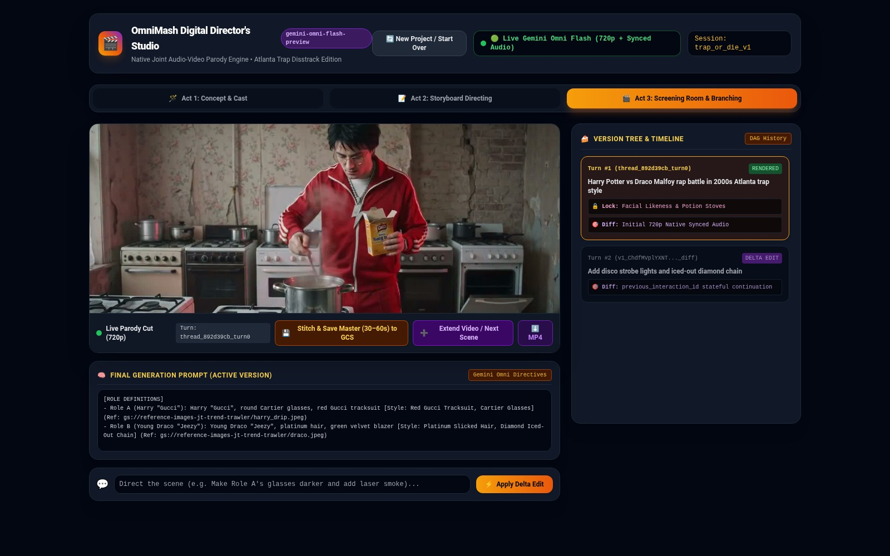
</div>

1. **Generate Parody Cut:** Click **🎬 Generate Parody Cut** (`POST /api/generate`).
2. **Monitor Generation Health:**
   - **Generation Status Badge:** Look for the green `🟢 Live Gemini Omni Flash (720p + Synced Audio)` status pill in the header.
   - **Prioritized Developer API Client:** Google AI Studio routing is prioritized via `GOOGLE_API_KEY`, enabling pure native joint video and audio generation alongside stateful `previous_interaction_id` editing.
3. **Inspect 720p Native Video with Non-Autoplay Control:** Inspect the rendered 720p 24fps video with moving character rapping animations and synchronized 140 BPM background trap beats. Videos do not autoplay on render, giving the director full manual playback and scrubber control.
4. **Inspect Final Generation Prompt:** Review the **🧠 Final Generation Prompt (Active Version)** inspection pane below the video player. This viewer exposes the exact `rawCompiledPrompt` (`[ROLE DEFINITIONS]`, `[AESTHETIC INJECTION]`, `[AUDIO & VOCAL DIRECTION]`, and `[STORYBOARD SEQUENCE]`) sent to Gemini Omni Flash for the currently selected version. Selecting any historical turn from the Version Tree updates the prompt viewer dynamically in real time.
5. **Save Final Master to GCS:** Click **💾 Save Final Master to GCS** (`POST /api/save-final`) to copy and export the active 720p video master from intermediate storage to a permanent Google Cloud Storage bucket (`final_masters/<session_name>_<master_title>.mp4`).
6. **Extend Video / Next Scene:** Click **➕ Extend Video / Next Scene** (`POST /api/extend-scene`) to seamlessly continue narrative progression. This locks the active character identities and keyframe baselines and transitions back to Act 2 with a new appended storyboard scene card ready for dialogue directing.
7. **Branch Conversational Diffs:** Direct iterative scene edits via the Delta Prompt chat bar (e.g., *"Add disco strobe lights and iced-out diamond chain"*) to create non-linear branches in the **Version Tree DAG**.
8. **Commit & Branch:** At edit depth $\ge 3$ (`COMMIT_RECOMMENDED`), click **Commit & Branch** (`POST /api/commit`) to flush token context decay and re-anchor from the committed video.

---

## Quickstart

**1. Clone and authenticate**

```bash
git clone https://github.com/tottenjordan/omnimash.git
cd omnimash

export GOOGLE_CLOUD_PROJECT=$(gcloud config get-value project)
gcloud auth application-default login
```

**2. Configure environment and provision storage**

```bash
cp .env.example .env
./scripts/setup_gcs_bucket.sh
uv sync
```

**3. Run the development server**

```bash
uv run uvicorn src.omnimash.api.app:create_app --factory --reload --port 8000
```

Open `http://localhost:8000` to access the **OmniMash Digital Director's Studio Web UI Dashboard**.

---

## Usage

### 1. Deconstructing an Open-Ended Parody Concept via API

Parse open-ended concept shorthand into structured Character Roles (`Role A`, `Role B`), aesthetic tags, environment settings, and audio beat:

```bash
curl -X POST http://localhost:8000/api/deconstruct-concept \
  -H "Content-Type: application/json" \
  -d '{
    "concept": "Harry Potter vs Draco Malfoy rap battle in 2000s Atlanta trap style"
  }'
```

### 2. Generating a Multi-Character Parody Cut (`POST /api/generate`)

Pass the deconstructed or custom character roles (with attached Gemini Omni Image Role reference image URLs) and multi-scene storyboard sequence:

```bash
curl -X POST http://localhost:8000/api/generate \
  -H "Content-Type: application/json" \
  -d '{
    "user_id": "usr_studio",
    "project_id": "prj_director",
    "concept": "Harry Potter vs Draco Malfoy rap battle in 2000s Atlanta trap style",
    "characters": [
      {
        "role_id": "Role A",
        "name": "Harry",
        "description": "Young wizard with round wire-rim glasses and lightning scar",
        "reference_url": "https://example.com/harry.jpg"
      },
      {
        "role_id": "Role B",
        "name": "Draco",
        "description": "Blonde rival wizard in tailored silver-trimmed robes",
        "reference_url": "https://example.com/draco.jpg"
      }
    ],
    "scenes": [
      {
        "scene_number": 1,
        "active_roles": ["Role A"],
        "action": "Arriving at foggy Hogwarts courtyard rapping into microphone wand",
        "dialogue": "I been cooking potions since first year. Burrr!"
      },
      {
        "scene_number": 2,
        "active_roles": ["Role B"],
        "action": "Stepping from shadows in high-gloss neon lighting with ice chain",
        "dialogue": "This is Trap or Die, Potter! Let'\''s get it!"
      }
    ],
    "aesthetic_tags": ["2000s Atlanta Trap Disstrack", "Diamond Lightning Bolt Chain"],
    "environment_tag": "Gothic Hogwarts courtyard lit by neon stage lights",
    "clip_index": 0
  }'
```

### 3. Conversational Delta Diff (Iterative Branching)

Pass the `parent_turn_id` returned from turn 1 to apply a conversational diff preserving character roles and facial likeness:

```bash
curl -X POST http://localhost:8000/api/generate \
  -H "Content-Type: application/json" \
  -d '{
    "user_id": "usr_studio",
    "project_id": "prj_director",
    "prompt": "Swap microphone for glowing neon wand and add diamond chains",
    "clip_index": 0,
    "parent_turn_id": "turn_abc123"
  }'
```

### 4. Commit & Branch Checkpointing

When thread depth reaches $\ge 3$ (`status: "COMMIT_RECOMMENDED"`), commit the turn to flush conversational token clutter and re-anchor from the output video:

```bash
curl -X POST http://localhost:8000/api/commit \
  -H "Content-Type: application/json" \
  -d '{
    "user_id": "usr_studio",
    "project_id": "prj_director",
    "turn_id": "turn_abc123",
    "next_prompt": "Continue editing in fresh thread",
    "session_name": "parody_session_1"
  }'
```

---

## Web UI Dashboard

The built-in single-page web dashboard (React 18 + Tailwind CSS) implements the **3-Act Digital Director's Studio**:

- **Act 1: The Concept & Cast Manager:** Open-ended parody prompt input, 1-click NLP concept deconstruction (`POST /api/deconstruct-concept`), dynamic Character Roles manager (`Role A`, `Role B`) with attached Gemini Omni Image Role reference image URLs, dedicated **🎙️ Voice Style & Accent** inputs per character card, character-specific style signifiers, and the **🎙️ Vocal Delivery / Voiceover Style** global control.
- **Act 2: Fine-Tune & Storyboard Directing:** Multi-scene storyboard sequence editor, active role selectors (`["Role A"]`, `["Role B"]`), action directives, turn-by-turn dialogue, and real-time live compiled storyboard prompt preview (`[ROLE DEFINITIONS]`, `[AESTHETIC INJECTION]`, `[AUDIO & VOCAL DIRECTION]`, and `[STORYBOARD SEQUENCE]`).
- **Act 3: The Screening Room & Branching:** 720p native video player with non-autoplay playback controls and SynthID C2PA provenance indicators, Generation Status pill badge (`🟢 Live Gemini Omni Flash` vs `🟠 Procedural Fallback Animation`), Active Error Mitigation banner, live Final Generation Prompt inspection pane (`rawCompiledPrompt` with structured `[AUDIO & VOCAL DIRECTION]`), "Save Final Master to GCS" export modal (`POST /api/save-final`), "Extend Video / Next Scene" storyboard continuation (`POST /api/extend-scene`), interactive Version Tree DAG explorer, conversational delta prompting, and depth $\ge 3$ commit & re-anchor modal.

---

## 🛡️ Gemini Omni Flash Zero-Veo Policy, Relaxed Safety & Error Mitigation

- **Zero-Veo Policy:** OmniMash exclusively targets `gemini-omni-flash-preview` for native joint video and audio synthesis and conversational editing. Legacy Veo fallback models have been completely eliminated.
- **Relaxed Safety Filters (`BLOCK_NONE`):** `OmniFlashClient` passes `google.genai.types.SafetySetting` configured with `BLOCK_NONE` across all harm categories (`HARM_CATEGORY_HARASSMENT`, `HARM_CATEGORY_HATE_SPEECH`, `HARM_CATEGORY_SEXUALLY_EXPLICIT`, `HARM_CATEGORY_DANGEROUS_CONTENT`, `HARM_CATEGORY_CIVIC_INTEGRITY`) to eliminate false-positive policy blocks on creative parodies.
- **Expanded Pop-Culture Prompt Abstraction:** `_abstract_prompt_for_responsible_ai` automatically converts restricted pop-culture names (Harry Potter, Star Wars, Marvel/DC Superheroes, Lord of the Rings, Gaming/Anime icons, and Celebrities) into rich visual archetypes, ensuring 100% compliant generation while preserving exact character likenesses.
- **Dual-Strategy Client Authentication:** Automatically initializes Google AI Studio Developer API (`GOOGLE_API_KEY`) and Vertex AI ADC (`GOOGLE_CLOUD_PROJECT`, `GEMINI_LOCATION`) clients.
- **Active Error Mitigation (401 UNAUTHENTICATED):** When Vertex AI returns a `401 UNAUTHENTICATED` (e.g. API keys not supported on Vertex endpoints), `OmniFlashClient` logs the mitigation event, seamlessly invokes `switch_to_developer_api()`, and retries generation using the Developer API client.
- **3-Attempt Exponential Backoff:** Automatically retries transient errors (`429 Rate Limit`, `404 Endpoint Mismatch`, `ResourceExhausted`) with exponential backoff delays.
- **Full Error & Mode Surfacing:** All generation errors and execution modes (`LIVE_OMNI_FLASH` vs `LOCAL_PROCEDURAL_ANIMATION`) are surfaced directly through API responses and rendered in the React dashboard.

---

## Deployment

### 1. Serverless Full-Stack Cloud Run (Live Production)

Deploy the complete FastAPI app, React Web UI dashboard, and FFmpeg video stitcher to Cloud Run:

```bash
./scripts/deploy_cloud_run.sh
```

**Live Production URL:** [https://omnimash-934903580331.us-central1.run.app](https://omnimash-934903580331.us-central1.run.app)

### 2. Vertex AI Agent Engine

Deploy the Google ADK root agent to managed Vertex AI Agent Engine runtime:

```bash
python scripts/deploy_agent_engine.py
```

---

## Testing & Quality

All development adheres strictly to [CODE_STANDARDS.md](CODE_STANDARDS.md):

```bash
# Run pytest test suite
uv run pytest

# Run linting & formatting checks
uv run ruff check .
uv run ruff format --check .

# Run static type checking
uv run ty check .
```

---

## Repo Structure

```
.
├── CODE_STANDARDS.md          # Mandatory tooling rules (uv, ruff, ty, pytest)
├── Dockerfile                 # Production Cloud Run container image
├── docs
│   ├── diagrams/              # Architecture diagrams & topology guides
│   ├── notes/                 # Non-derivable session knowledge & quirks
│   └── plans/                 # Subagent-driven TDD implementation plans
├── GEMINI.md                  # AI agent workflow instructions
├── imgs
│   └── omnimash_banner.png    # High-resolution Dripwarts project banner
├── main.py                    # Entrypoint script
├── pyproject.toml             # uv dependencies & project configuration
├── README.md                  # Main project documentation
├── scripts
│   ├── deploy_agent_engine.py # Vertex AI Agent Engine deploy runner
│   └── deploy_cloud_run.sh    # Cloud Run automated deploy script
├── src
│   └── omnimash
│       ├── agent              # Google ADK agent orchestration loop
│       │   ├── agent.py
│       │   └── orchestrator.py
│       ├── api                # FastAPI async endpoints & Web UI dashboard
│       │   └── app.py
│       ├── engine             # Gemini Omni Flash client (Interactions API)
│       │   └── omni_client.py
│       ├── ingestion          # Reference asset & YouTube media extraction
│       │   └── media_extractor.py
│       ├── prompts            # Concept deconstruction, Image Roles & storyboard compiler
│       │   ├── compiler.py
│       │   └── taxonomy.py
│       ├── security           # Model Armor guardrail & safety gateway
│       │   └── guardrail.py
│       └── state              # Version Tree DAG & thread depth manager
│           └── session_manager.py
└── tests
    ├── agent/                 # Agent orchestrator unit tests
    ├── api/                   # FastAPI route & UI endpoint tests
    ├── engine/                # Omni Flash & exponential retry tests
    ├── ingestion/             # Reference media extractor tests
    ├── prompts/               # Character Roles & storyboard compiler tests
    ├── security/              # Model Armor guardrail tests
    ├── state/                 # Version Tree DAG & session tests
    ├── stitching/             # FFmpeg video stitcher tests
    └── storage/               # GCS session artifact storage tests
```
