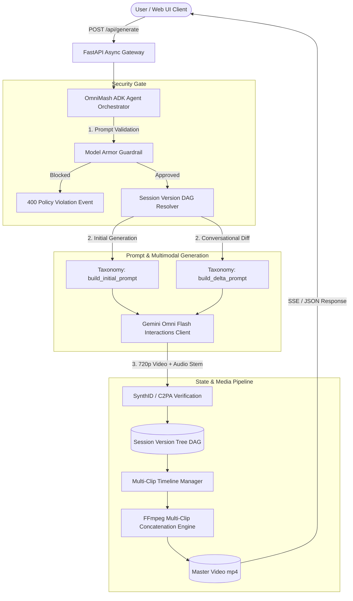

<div align="center">


<h1 align="center">🎬 OmniMash 🪄</h1>

> Parody & mashup video creator using **gemini-omni-flash-preview** (unified multimodal text, image, audio, video in 720p with native audio and conversational diffs) and the **Gemini Enterprise Agent Platform** (ADK, Agent Engine, Model Armor).


</div>

**OmniMash** runs a 4-step multimodal generation and conversational diff pipeline: it ingests character lore and video stems, applies a style-blending meta-prompt taxonomy, generates 10-second 720p clips with native audio via **Gemini Omni Flash**, branches edits non-linearly across a **Session Version Tree DAG**, and stitches multi-clip sequences via **FFmpeg**.

| Stage | Module | What it does |
| :---: | --- | --- |
| 1 | 🛡️ **`omnimash.security`** | **Model Armor Gateway:** Pre-gates prompts for RAI violations (hate speech, dangerous content) and prompt injection/jailbreak attempts. |
| 2 | 🌳 **`omnimash.state`** | **Version Tree DAG:** Manages non-linear clip branching (`TurnNode`, `ProjectSession`) to enable conversational delta diffs without overwriting history. |
| 3 | 🪄 **`omnimash.prompts` & `omnimash.engine`** | **Taxonomy & Omni Flash Client:** Compiles style-blended meta-prompts (90s rap video, trap disstrack, cyberpunk, VHS anime) and drives the `Interactions API` with SynthID/C2PA watermarking. |
| 4 | 🎬 **`omnimash.stitching` & `omnimash.api`** | **FFmpeg Concatenation & FastAPI UI:** Assembles 10s clips into 30–60s master videos and serves the interactive Next.js/React dashboard. |

<details>
  <summary>blending realities — how the pipeline flows</summary>

<br />

OmniMash works like an AI music video mixing studio:

1. **Ingest & Extract** — `MediaExtractor` pulls keyframe portraits and audio stems from public YouTube URLs (via `yt-dlp`) or user uploads.
2. **Model Armor Gate** — `ModelArmorGuardrail` validates the user prompt against Google Cloud RAI safety and jailbreak filters.
3. **Taxonomy & Prompt Assembly** — `PromptTaxonomyEngine` blends character anchors (`Severus Snape`) with aesthetic presets (`90s fisheye lens, boom-bap rhythm cadence`).
4. **Multimodal Generation** — `OmniFlashClient` invokes `gemini-omni-flash-preview` via the Interactions API to render a 720p 10-second video with native synced audio.
5. **Conversational Diff Branching** — When users ask to modify a scene ("Add sunglasses and neon green lights"), the system branches a new `TurnNode` from the parent turn, preserving facial identity and lighting anchors.
6. **Stitch & Export** — `VideoStitcher` concatenates active timeline segments via FFmpeg into a master parody video.

</details>

---

## Table of Contents
- [Architecture](#architecture)
- [Diagrams & Reference Architectures](#diagrams--reference-architectures)
- [Quickstart](#quickstart)
- [Usage](#usage)
- [Web UI Dashboard](#web-ui-dashboard)
- [Deployment](#deployment)
- [Testing & Quality](#testing--quality)
- [Repo Structure](#repo-structure)

---

## Architecture

OmniMash is built on Google's **ADK (Agent Development Kit)** and the **Gemini Enterprise Agent Platform**:



---

## Diagrams & Reference Architectures

Detailed subsystem architectures and workflow outlines are available in [docs/diagrams/](docs/diagrams/README.md):

| Reference Diagram | Subsystem | Highlights |
| :--- | :--- | :--- |
| 🛡️ [Agent Orchestration Architecture](docs/diagrams/omnimash_agent_architecture.md) | `omnimash.agent` & `security` | ADK orchestrator sequence, Model Armor pre-gating, Prompt Taxonomy blending, and Gemini Omni Flash client dispatch. |
| 🌳 [Version Tree DAG & State Lifecycle](docs/diagrams/version_tree_dag_lifecycle.md) | `omnimash.state` | Non-linear conversational diff branching, parent turn pointers, and active clip timeline management. |
| 🎬 [Multimodal Ingestion & Video Stitching](docs/diagrams/multimodal_ingestion_stitching.md) | `ingestion` & `stitching` | YouTube asset extraction (`yt-dlp`), portrait keyframe extraction, and FFmpeg multi-clip concatenation. |
| 🌐 [Frontend API & SSE Streaming Topology](docs/diagrams/frontend_api_topology.md) | `api` & Web UI | FastAPI async endpoints (`POST /api/generate`), SSE stream events, and Next.js / React 18 single-page dashboard. |

---

## Quickstart

**1. Clone and authenticate**

```bash
git clone https://github.com/tottenjordan/omnimash.git
cd omnimash

export GOOGLE_CLOUD_PROJECT=$(gcloud config get-value project)
gcloud auth application-default login
```

**2. Install dependencies via `uv`**

```bash
uv sync
```

**3. Run the development server**

```bash
uv run uvicorn src.omnimash.api.app:create_app --factory --reload --port 8000
```

Open `http://localhost:8000` to access the **OmniMash Web UI Dashboard**.

---

## Usage

### Generating a Mashup Clip via API

```bash
curl -X POST http://localhost:8000/api/generate \
  -H "Content-Type: application/json" \
  -d '{
    "user_id": "user_prod",
    "project_id": "prj_dripwarts",
    "prompt": "Severus Snape in 90s rap video wearing oversized bomber jacket",
    "clip_index": 0
  }'
```

### Conversational Delta Diff (Iterative Branching)

Pass the `parent_turn_id` returned from turn 1 to apply a conversational diff preserving facial anchors:

```bash
curl -X POST http://localhost:8000/api/generate \
  -H "Content-Type: application/json" \
  -d '{
    "user_id": "user_prod",
    "project_id": "prj_dripwarts",
    "prompt": "Swap microphone for glowing neon wand and add diamond chains",
    "clip_index": 0,
    "parent_turn_id": "turn_abc123"
  }'
```

---

## Web UI Dashboard

The built-in single-page web dashboard (React 18 + Tailwind CSS) provides:
- **Prompt Input & Style Selector:** Instant switching between 90s Rap Video, Trap Disstrack, Cyberpunk Drift, and VHS Anime presets.
- **Interactive Version Tree DAG:** Visual explorer for inspecting and branching clip generations.
- **720p Video Preview Player:** Media playback with SynthID C2PA provenance indicators.

---

## Deployment

### Vertex AI Agent Engine

OmniMash is ready for deployment on **Vertex AI Agent Engine** using `google.adk` and `vertexai.agent_engines`:

```python
from vertexai.agent_engines import AdkApp
import vertexai.agent_engines as vae
from omnimash.agent.orchestrator import OmniMashAgent

agent = OmniMashAgent(mock_mode=False)
app = AdkApp(agent=agent)

remote_agent = vae.create(
    agent_engine=app,
    display_name="omnimash-agent-production",
    requirements=["google-cloud-aiplatform[agent_engines,a2a]", "google-genai"],
)
```

---

## Testing & Quality

All development adheres strictly to [CODE_STANDARDS.md](CODE_STANDARDS.md):

```bash
# Run pytest test suite
uv run pytest

# Run linting & formatting checks
uv run ruff check .
uv run ruff format --check .

# Run static type checking
uv run ty check .
```

---

## Repo Structure

```
.
├── CODE_STANDARDS.md          # Mandatory tooling rules (uv, ruff, ty, pytest)
├── docs
│   ├── diagrams               # Architecture diagrams & topology guides
│   │   ├── frontend_api_topology.md
│   │   ├── multimodal_ingestion_stitching.md
│   │   ├── omnimash_agent_architecture.md
│   │   ├── README.md
│   │   └── version_tree_dag_lifecycle.md
│   ├── notes                  # Non-derivable session knowledge & quirks
│   │   ├── architecture_omnimash.md
│   │   ├── README.md
│   │   ├── request_lifecycle.md
│   │   └── subagent_workflow_quirks.md
│   └── plans                  # Core architecture 10-task implementation plan
│       └── 2026-07-18-omnimash-core-architecture.md
├── GEMINI.md                  # AI agent workflow instructions
├── imgs
│   └── omnimash_banner.png    # High-resolution project banner
├── main.py                    # Entrypoint script
├── pyproject.toml             # uv dependencies & project configuration
├── README.md                  # Main project documentation
├── src
│   └── omnimash
│       ├── agent              # Google ADK agent orchestration loop
│       │   └── orchestrator.py
│       ├── api                # FastAPI async endpoints & Web UI dashboard
│       │   └── app.py
│       ├── engine             # Gemini Omni Flash client (Interactions API)
│       │   └── omni_client.py
│       ├── ingestion          # Reference asset & YouTube media extraction
│       │   └── media_extractor.py
│       ├── prompts            # Style-blending meta-prompt taxonomy engine
│       │   └── taxonomy.py
│       ├── security           # Model Armor guardrail & safety gateway
│       │   └── guardrail.py
│       ├── state              # Version Tree DAG & multi-turn session manager
│       │   └── session_manager.py
│       └── stitching          # FFmpeg multi-clip concatenation engine
│           └── stitcher.py
├── tests                      # Unit & E2E integration test suites (14 passed)
│   ├── agent/test_orchestrator.py
│   ├── api/test_app.py
│   ├── api/test_integration.py
│   ├── engine/test_omni_client.py
│   ├── ingestion/test_media_extractor.py
│   ├── prompts/test_taxonomy.py
│   ├── security/test_guardrail.py
│   ├── state/test_session_manager.py
│   ├── stitching/test_stitcher.py
│   ├── test_foundation.py
│   └── test_main.py
└── uv.lock                    # Exact locked dependency graph
```
