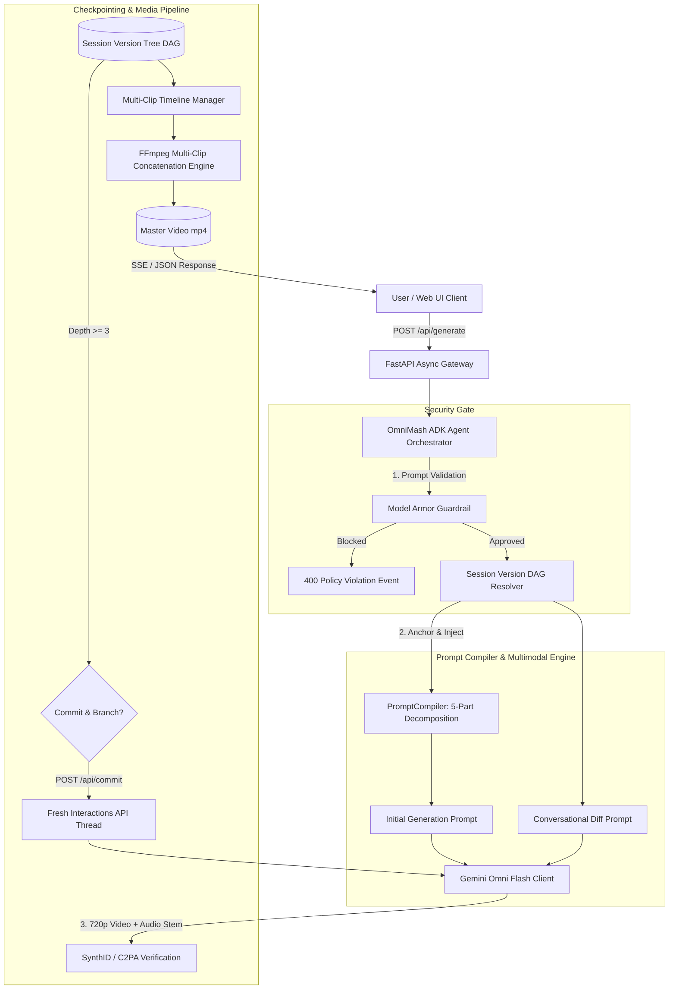

<div align="center">


# 🎬 OmniMash 🪄

<p align="center">
  
  
  
  
  
  
  
  
  
</p>

</div>

> AI Parody & Mashup Video Studio inspired by viral sensations like **[Dripwarts](https://www.youtube.com/@Onirostudios)** (*DumbleDior*, *Snape Dawg*, *Harry Potter*). Powered by **`gemini-omni-flash-preview`** (unified multimodal video, native synced audio, and conversational diffs in 720p) and the **Gemini Enterprise Agent Platform** (ADK, Agent Engine, Model Armor).

**OmniMash** runs a 5-step multimodal generation and conversational diff pipeline: it ingests character lore and video stems, compiles shorthand into a 5-part **"Anchor & Inject"** prompt taxonomy, generates 10-second 720p clips with native audio via **Gemini Omni Flash**, branches edits non-linearly across a **Session Version Tree DAG**, and flushes context decay via **Commit & Branch Checkpointing**.

| Stage | Module | What it does |
| :--- | :--- | :--- |
| 1 | 🛡️ **`omnimash.security`** | **Model Armor Gateway:** Pre-gates prompts for RAI violations (hate speech, dangerous content) and prompt injection/jailbreak attempts. |
| 2 | 🪄 **`omnimash.prompts`** | **Prompt Compiler ("Anchor & Inject"):** Translates user shorthand into `[SUBJECT ANCHOR] + [AESTHETIC INJECTION] + [ENVIRONMENT] + [CAMERA/LIGHTING] + [MOTION]` preventing character decay and latent space averaging. |
| 3 | 🌳 **`omnimash.state`** | **Version Tree DAG & Checkpoints:** Manages non-linear clip branching (`TurnNode`, `ProjectSession`) and tracks thread edit depth (>= 3) to signal `COMMIT_RECOMMENDED`. |
| 4 | 🎬 **`omnimash.engine`** | **Gemini Omni Flash Client:** Drives the `Interactions API` with SynthID/C2PA watermarking and handles base video re-anchoring on thread commits. |
| 5 | 🎞️ **`omnimash.stitching` & `omnimash.api`** | **FFmpeg Concatenation & FastAPI UI:** Assembles 10s clips into 30–60s master videos and serves the interactive Next.js/React dashboard. |

<details>
  <summary>blending realities — how the pipeline flows</summary>

<br />

OmniMash works like an AI music video mixing studio:

1. **Ingest & Extract** — `MediaExtractor` pulls keyframe portraits and audio stems from public YouTube URLs (via `yt-dlp`) or user uploads.
2. **Model Armor Gate** — `ModelArmorGuardrail` validates the user prompt against Google Cloud RAI safety and jailbreak filters.
3. **Prompt Compiler** — `PromptCompiler` transforms raw shorthand (`Snape in a 90s rap video`) into an explicit 5-part meta-prompt (`gaunt man, hooked nose + oversized puffer jacket, Cuban link + fisheye lens + boom-bap motion`).
4. **Multimodal Generation** — `OmniFlashClient` invokes `gemini-omni-flash-preview` via the Interactions API to render a 720p 10-second video with native synced audio.
5. **Conversational Diff Branching** — When users ask to modify a scene ("Add sunglasses and neon green lights"), the system branches a new `TurnNode` from the parent turn, preserving facial identity and lighting anchors.
6. **Commit & Branch Checkpointing** — At edit depth >= 3, the user commits the turn. The engine extracts the committed 720p video and spawns a fresh Interactions API thread, eliminating conversational token clutter.
7. **Stitch & Export** — `VideoStitcher` concatenates active timeline segments via FFmpeg into a master parody video.

</details>

---

## Table of Contents
- [Architecture](#architecture)
- [Diagrams & Reference Architectures](#diagrams--reference-architectures)
- [Quickstart](#quickstart)
- [Usage](#usage)
- [Web UI Dashboard](#web-ui-dashboard)
- [Deployment](#deployment)
- [Testing & Quality](#testing--quality)
- [Repo Structure](#repo-structure)

---

## Architecture

OmniMash is built on Google's **ADK (Agent Development Kit)** and the **Gemini Enterprise Agent Platform**:

<div align="center">
  
</div>

---

## 🎬 Step-by-Step Multimodal Workflow Pipeline

OmniMash transforms short user concepts and reference links into frame-accurate parody video clips using a 5-stage multimodal workflow:

<div align="center">
  
</div>

### 🔍 The 5-Step Methodology

1. **📺 YouTube & Audio Reference Ingestion (`MediaExtractor`)**:
   - Ingests public YouTube URLs (e.g. the viral `@Onirostudios` *Dripwarts* series) or audio stems.
   - Isolates high-resolution character visual portraits (*DumbleDior* in Dior robes, *Snape Dawg* in Cartier sunglasses) and extracts 120 BPM hip-hop audio stems.

2. **🧠 Prompt Taxonomy & Conversational Delta Compiler (`PromptCompiler`)**:
   - **Turn 1 (5-Part Anchor & Inject):** Decomposes raw concepts into `[SUBJECT ANCHOR]`, `[AESTHETIC INJECTION]`, `[ENVIRONMENT]`, `[CAMERA/LIGHTING]`, and `[MOTION]`.
   - **Follow-up Turns (2-Part Lock & Isolate):** Enforces `[PRESERVATION LOCK]` to freeze character likeness and background while targeting `[ISOLATED DIFF]` to prevent facial drift.

3. **✨ Gemini Omni Flash Engine (`gemini-omni-flash-preview`)**:
   - Invoked via Google's stateful **Interactions API** (`client.interactions.create`).
   - Leverages native multi-input reasoning and $1\text{M}+$ token context window to synthesize 720p 24fps video and synchronized native audio in a single pass.

4. **⏱️ Frame-Accurate Audio-Video Sync & Container Muxing**:
   - Applies `aresample=async=1:first_pts=0` and `-r 24` presentation timestamp (PTS) locking to guarantee the audio beat drops on the exact visual frame.
   - Muxes MP4 containers with `-movflags +faststart` for instant HTML5 browser playback and validates SynthID C2PA cryptographic watermarks.

5. **🖥️ Live React UI Dashboard & Video Streaming**:
   - Streams 3+ MB MP4 video clips directly to the client dashboard with unmuted HTML5 player controls, live Lock & Isolate preview cards, and thread re-anchoring at depth $\ge 3$.

<details>
  <summary>View Technical Dataflow Diagram (Mermaid)</summary>

<br />



</details>

---

## Diagrams & Reference Architectures

Detailed subsystem architectures and workflow outlines are available in [docs/diagrams/](docs/diagrams/README.md):

| Reference Diagram | Subsystem | Highlights |
| :--- | :--- | :--- |
| 🌟 [Master System Architecture](docs/diagrams/omnimash_master_architecture.png) | **End-to-End Pipeline** | Publication-quality PaperBanana diagram detailing the 5 core architectural layers from Web UI to FFmpeg master rendering. |
| 🚀 [GCP Deployment Patterns](docs/diagrams/gcp_deployment_patterns.md) | **Google Cloud Platform** | Dual-Target Architecture comparing Target 1 (Full-Stack Cloud Run serverless container on port 8080) and Target 2 (Enterprise Vertex AI Agent Engine with `root_agent` and `AdkApp`). |
| 🛡️ [Agent Orchestration Architecture](docs/diagrams/omnimash_agent_architecture.md) | `omnimash.agent` & `security` | ADK orchestrator sequence, Model Armor pre-gating, 5-part Prompt Compiler, and Gemini Omni Flash client dispatch. |
| 🌳 [Version Tree DAG & State Lifecycle](docs/diagrams/version_tree_dag_lifecycle.md) | `omnimash.state` | Non-linear conversational diff branching, thread depth tracking (>= 3), ⚓ Checkpoint Anchor Badges, and fresh thread re-anchoring. |
| 🎬 [Multimodal Ingestion & Video Stitching](docs/diagrams/multimodal_ingestion_stitching.md) | `ingestion` & `stitching` | 4-stage pipeline: YouTube asset extraction (`yt-dlp`), 5-part prompt compilation, Omni Flash clip rendering with commit checkpoints, and FFmpeg multi-clip concatenation. |
| 🌐 [Frontend API & SSE Streaming Topology](docs/diagrams/frontend_api_topology.md) | `api` & Web UI | FastAPI async endpoints (`POST /api/generate`, `POST /api/commit`), SSE stream events, 5-part live compiler preview, and Next.js / React 18 single-page dashboard. |

---

## Quickstart

**1. Clone and authenticate**

```bash
git clone https://github.com/tottenjordan/omnimash.git
cd omnimash

export GOOGLE_CLOUD_PROJECT=$(gcloud config get-value project)
gcloud auth application-default login
```

**2. Install dependencies via `uv`**

```bash
uv sync
```

**3. Run the development server**

```bash
uv run uvicorn src.omnimash.api.app:create_app --factory --reload --port 8000
```

Open `http://localhost:8000` to access the **OmniMash Web UI Dashboard**.

---

## Usage

### Generating a Mashup Clip via API

```bash
curl -X POST http://localhost:8000/api/generate \
  -H "Content-Type: application/json" \
  -d '{
    "user_id": "user_prod",
    "project_id": "prj_dripwarts",
    "prompt": "Severus Snape in 90s rap video wearing oversized bomber jacket",
    "clip_index": 0
  }'
```

### Conversational Delta Diff (Iterative Branching)

Pass the `parent_turn_id` returned from turn 1 to apply a conversational diff preserving facial anchors:

```bash
curl -X POST http://localhost:8000/api/generate \
  -H "Content-Type: application/json" \
  -d '{
    "user_id": "user_prod",
    "project_id": "prj_dripwarts",
    "prompt": "Swap microphone for glowing neon wand and add diamond chains",
    "clip_index": 0,
    "parent_turn_id": "turn_abc123"
  }'
```

### Commit & Branch Checkpointing

When thread depth reaches >= 3 (`status: "COMMIT_RECOMMENDED"`), commit the turn to flush conversational token clutter and re-anchor from the output video:

```bash
curl -X POST http://localhost:8000/api/commit \
  -H "Content-Type: application/json" \
  -d '{
    "user_id": "user_prod",
    "project_id": "prj_dripwarts",
    "turn_id": "turn_abc123",
    "next_prompt": "Continue editing in fresh thread"
  }'
```

---

## Web UI Dashboard

The built-in single-page web dashboard (React 18 + Tailwind CSS) provides:
- **Prompt Input & 5-Part Compiler Preview:** Instant live preview of `[SUBJECT ANCHOR]`, `[AESTHETIC INJECTION]`, `[ENVIRONMENT]`, `[CAMERA/LIGHTING]`, and `[MOTION]`.
- **Interactive Version Tree DAG:** Visual explorer for inspecting turn depth, forking new edits, and viewing ⚓ Checkpoint Anchor badges.
- **Commit & Re-Anchor Warning Modal:** Interactive banner alerting the user when turn depth threshold is reached.
- **720p Video Preview Player:** Media playback with SynthID C2PA provenance indicators.

---

## Deployment

### 1. Serverless Full-Stack Cloud Run (Live Production)

Deploy the complete FastAPI app, React Web UI dashboard, and FFmpeg video stitcher to Cloud Run:

```bash
./scripts/deploy_cloud_run.sh
```

**Live Production URL:** [https://omnimash-934903580331.us-central1.run.app](https://omnimash-934903580331.us-central1.run.app)

### 2. Vertex AI Agent Engine

Deploy the Google ADK root agent to managed Vertex AI Agent Engine runtime:

```bash
python scripts/deploy_agent_engine.py
```

---

## Testing & Quality

All development adheres strictly to [CODE_STANDARDS.md](CODE_STANDARDS.md):

```bash
# Run pytest test suite
uv run pytest

# Run linting & formatting checks
uv run ruff check .
uv run ruff format --check .

# Run static type checking
uv run ty check .
```

---

## Repo Structure

```
.
├── CODE_STANDARDS.md          # Mandatory tooling rules (uv, ruff, ty, pytest)
├── Dockerfile                 # Production Cloud Run container image
├── docs
│   ├── diagrams               # Architecture diagrams & topology guides
│   │   ├── frontend_api_topology.md
│   │   ├── frontend_api_topology.png
│   │   ├── gcp_deployment_patterns.md
│   │   ├── gcp_deployment_patterns.png
│   │   ├── multimodal_ingestion_stitching.md
│   │   ├── multimodal_ingestion_stitching.png
│   │   ├── omnimash_agent_architecture.md
│   │   ├── omnimash_agent_architecture.png
│   │   ├── omnimash_master_architecture.png
│   │   ├── README.md
│   │   └── version_tree_dag_lifecycle.md
│   │   └── version_tree_dag_lifecycle.png
│   ├── notes                  # Non-derivable session knowledge & quirks
│   │   ├── architecture_omnimash.md
│   │   ├── context_decay_commit_branch.md
│   │   ├── prompt_compiler_anchor_inject.md
│   │   ├── README.md
│   │   ├── request_lifecycle.md
│   │   └── subagent_workflow_quirks.md
│   └── plans                  # Subagent-driven TDD implementation plans
│       ├── 2026-07-18-omnimash-context-window-commit-branch.md
│       ├── 2026-07-18-omnimash-core-architecture.md
│       └── 2026-07-18-omnimash-prompt-compiler-anchor-inject.md
├── GEMINI.md                  # AI agent workflow instructions
├── imgs
│   └── omnimash_banner.png    # High-resolution Dripwarts project banner
├── main.py                    # Entrypoint script
├── pyproject.toml             # uv dependencies & project configuration
├── README.md                  # Main project documentation
├── scripts
│   ├── deploy_agent_engine.py # Vertex AI Agent Engine deploy runner
│   └── deploy_cloud_run.sh    # Cloud Run automated deploy script
├── src
│   └── omnimash
│       ├── agent              # Google ADK agent orchestration loop
│       │   ├── agent.py
│       │   └── orchestrator.py
│       ├── api                # FastAPI async endpoints & Web UI dashboard
│       │   └── app.py
│       ├── engine             # Gemini Omni Flash client (Interactions API)
│       │   └── omni_client.py
│       ├── ingestion          # Reference asset & YouTube media extraction
│       │   └── media_extractor.py
│       ├── prompts            # 5-part Anchor & Inject compiler & taxonomy
│       │   ├── compiler.py
│       │   └── taxonomy.py
│       ├── security           # Model Armor guardrail & safety gateway
│       │   └── guardrail.py
│       └── state              # Version Tree DAG & thread depth manager
│           └── session_manager.py
└── tests
    ├── agent
    │   └── test_orchestrator.py
    ├── api
    │   ├── test_app.py
    │   └── test_integration.py
    ├── engine
    │   └── test_omni_client.py
    ├── ingestion
    │   └── test_media_extractor.py
    ├── prompts
    │   ├── test_compiler.py
    │   └── test_taxonomy.py
    ├── security
    │   └── test_guardrail.py
    ├── state
    │   └── test_session_manager.py
    ├── stitching
    │   └── test_stitcher.py
    ├── test_foundation.py
    └── test_main.py
```
