<div align="center">

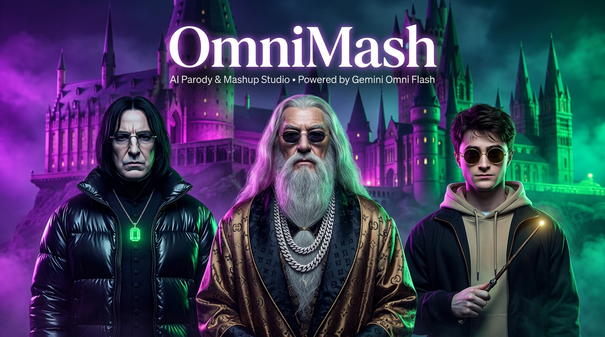

# 🎬 OmniMash 🪄

<p align="center">
  
  
  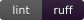
  
  
  
  
  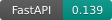
  
</p>

</div>

> AI Parody & Mashup Video Studio inspired by viral sensations like **[Dripwarts](https://www.youtube.com/@Onirostudios)** (*DumbleDior*, *Snape Dawg*, *Harry Potter*). Powered by **`gemini-omni-1.1-flash-preview`** (Gemini Omni Flash 1.1 Preview with stateful scene extension via `previous_interaction_id`, dual keyframing `<FIRST_FRAME>` & `<LAST_FRAME>`, multi-resolution rendering `360p` / `720p` / `4K`, 3s motion reference video ingestion, native synced audio, and conversational diffs), **Gemini Omni Image Roles** ([Gemini Omni Image Roles Specification](https://ai.google.dev/gemini-api/docs/omni#set-image-roles)), **Google ADK (Agent Development Kit >= 2.8.0)** multi-agent orchestration, and the **Gemini Enterprise Agent Platform** (ADK, Agent Engine, Model Armor).

**OmniMash** runs a flexible multimodal generation and conversational diff pipeline: it ingests open-ended visual concepts, deconstructs them via NLP into editable `MetaPromptTags`, binds dynamic Character Roles (`Role A`, `Role B`) to reference images via **Gemini Omni Image Roles**, compiles multi-scene storyboards into structured prompt blocks (`### INPUT ROLES & REFERENCES`, `### CUMULATIVE SHOT STATE`, `### VISUAL ACTION & CAMERA`, and `### TIMELINE & DIALOGUE`), supports **Dual Keyframe Interpolation** (`<FIRST_FRAME>` & `<LAST_FRAME>`), enables rapid prototyping via **⚡ The Draft Room (360p Multi-Card Comparison Studio)**, ingests 3-second `.mp4` choreography reference clips (`@VideoReference1`), manages **Dual-Layer Audio Specifications**, orchestrates parallel shot rendering via **ADK Multi-Agent Pipelines**, generates stateful clips with native audio via **Gemini Omni Flash 1.1**, branches edits non-linearly across a **Session Version Tree DAG**, and flushes context decay via **Commit & Branch Checkpointing**.

| Stage | Module | What it does |
| :--- | :--- | :--- |
| 1 | 🛡️ **`omnimash.security`** | **Model Armor Gateway:** Pre-gates prompts for RAI violations (hate speech, dangerous content, prompt injections) and abstracts pop-culture/celebrity names, street slang, and tattoo signifiers. |
| 2 | 🪄 **`omnimash.prompts`** | **Prompt Compiler & Deconstruction Engine:** Parses concepts into dynamic `CharacterRole` bindings, manages dual-layer audio specifications, dual keyframe anchors (`<FIRST_FRAME>` and `<LAST_FRAME>`), and compiles 4-block structured prompts. |
| 3 | 🤖 **`omnimash.agent`** | **Google ADK Multi-Agent Pipeline:** Orchestrates story deconstruction (`ScriptDeconstructorAgent`), storyboard compilation (`StoryboardCompilerAgent`), parallel shot rendering (`ParallelAgent` worker pool), and final cut stitching (`FinalCutStitcherAgent` / `RootProductionOrchestrator`). |
| 4 | 🌳 **`omnimash.state`** | **Version Tree DAG & Checkpoints:** Manages non-linear clip branching (`TurnNode`, `ProjectSession`) and tracks thread edit depth ($\ge 3$) to signal `COMMIT_RECOMMENDED`. |
| 5 | 🎬 **`omnimash.engine`** | **Gemini Omni Flash 1.1 Client:** Drives the `Interactions API` with `gemini-omni-1.1-flash-preview`, stateful thread extension via `previous_interaction_id`, multi-resolution control (`360p` / `720p` / `4K`), 3s motion reference ingestion (`@VideoReference1`), SynthID/C2PA watermarking, and multi-character image role references. |
| 6 | 🎞️ **`omnimash.stitching` & `omnimash.api`** | **FFmpeg Concatenation & FastAPI UI:** Assembles 10s clips into 30–60s master videos and serves the interactive Continuity Studio dashboard with The Draft Room 360p preview grid, Stage 2 dual keyframe controls, project-level Character Vaults, and 1-click reference sheet selection. |

<details>
  <summary>blending realities — how the pipeline flows</summary>

<br />

OmniMash works like an AI music video mixing studio:

1. **Concept Input & Ingest** — Users enter open-ended parody concepts (e.g., *"Gordon Ramsay vs Julia Child in a cyberpunk iron chef battle"* or *"Harry Potter vs Draco Malfoy rap battle in 2000s Atlanta trap style"*).
2. **NLP Deconstruction & Roster Reset** — `PromptCompiler.deconstruct_concept()` parses raw shorthand into structured `MetaPromptTags` with dynamic Character Roles (`Role A`, `Role B`), aesthetic tags, environment settings, and audio beats, automatically isolating rosters across sessions.
3. **Gemini Omni Image Roles & Turnaround Sheets** — Attach high-resolution reference image URLs or 1-click generated character turnaround sheets ([Gemini Omni Image Roles](https://ai.google.dev/gemini-api/docs/omni#set-image-roles)) from the Project-Level Character Vault to anchor visual likeness across scenes.
4. **Dual-Layer Audio Control** — Specify background beats globally at the session level (Place 1) or customize audio modes per shot card (`🌐 Inherit Global`, `🎵 Custom Shot Beat`, `🔇 Silent Shot` in Place 2).
5. **ADK Multi-Agent Pipeline** — `RootProductionOrchestrator` (`SequentialAgent`) invokes `ScriptDeconstructorAgent`, `StoryboardCompilerAgent`, `ParallelAgent` shot execution workers, and `FinalCutStitcherAgent` for parallel rendering and stitching.
6. **Model Armor Gate & Safety Abstractor** — `ModelArmorGuardrail` validates content against Cloud RAI policies and abstract real names, street slang (`stepped on` $\rightarrow$ `diluted`), band trademarks (`Widespread Panic` $\rightarrow$ `vintage band emblem`), and tattoo signifiers (`tear drop tattoo` $\rightarrow$ `facial ink accent`).
7. **Multimodal Generation** — `OmniFlashClient` invokes `gemini-omni-flash-preview` via the Interactions API to render 720p 10-second video clips with native synced audio.
8. **Conversational Diff Branching** — When users ask to modify a scene ("Swap microphone for glowing wand"), the system branches a new `TurnNode` from the parent turn, preserving facial identity and lighting anchors.
9. **Commit & Branch Checkpointing** — At edit depth $\ge 3$, the user commits the turn. The engine extracts the committed 720p video and spawns a fresh Interactions API thread, eliminating conversational token clutter.
10. **Stitch & Export** — `VideoStitcher` concatenates active timeline segments via FFmpeg into a master parody video saved to GCS.

</details>

---

## Table of Contents
- [Architecture](#architecture)
  - [Google ADK Multi-Agent Pipeline Architecture](#-google-adk-multi-agent-pipeline-architecture)
  - [Dual-Layer Audio Specification & Prompt Compiler Architecture](#-dual-layer-audio-specification--prompt-compiler-architecture)
  - [Multi-Scene 30–60s Master Video Assembly Architecture](#-multi-scene-3060s-master-video-assembly-architecture)
- [Gemini Omni Flash 1.1 Preview Capabilities & Next-Gen Workstations](#-gemini-omni-flash-11-preview-capabilities--next-gen-workstations)
- [Storyboard & Multi-Shot Production User Journey](#-storyboard--multi-shot-production-user-journey-act-2)
- [Project-Level Character Vault & Turnaround Sheets](#-project-level-character-vault--turnaround-sheets)
- [Diagrams & Reference Architectures](#diagrams--reference-architectures)
- [Getting Started & User Journey](#-getting-started--user-journey)
- [Quickstart](#quickstart)
- [Usage](#usage)
- [Web UI Dashboard](#web-ui-dashboard)
- [Deployment](#deployment)
- [Testing & Quality](#testing--quality)
- [Repo Structure](#repo-structure)

---

## Architecture

OmniMash is built on Google's **ADK (Agent Development Kit)** and the **Gemini Enterprise Agent Platform**:

<div align="center">
  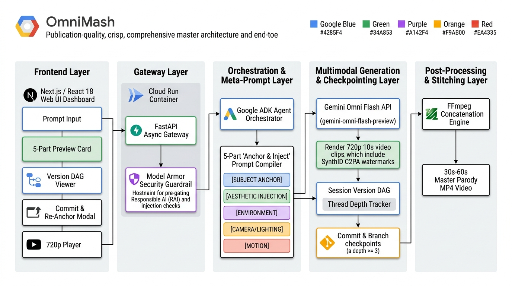
</div>

---

### 🤖 Google ADK Multi-Agent Pipeline Architecture

OmniMash utilizes a hybrid multi-agent orchestration architecture built with Google's **Agent Development Kit (`google-adk>=2.5.0`)**, combining `SequentialAgent` for linear production steps and `ParallelAgent` for concurrent shot execution:

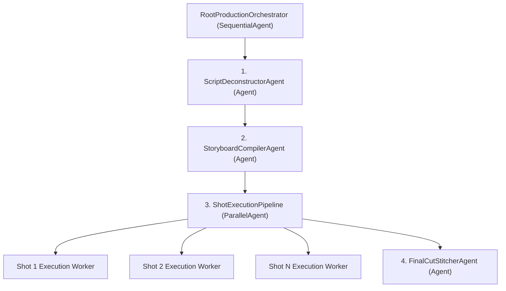
```mermaid
graph TD
    Root["RootProductionOrchestrator (SequentialAgent)"] --> Deconstruct["1. ScriptDeconstructorAgent (Agent)"]
    Deconstruct --> Storyboard["2. StoryboardCompilerAgent (Agent)"]
    Storyboard --> ParallelExec["3. ShotExecutionPipeline (ParallelAgent)"]
    ParallelExec --> Worker1["Shot 1 Execution Worker"]
    ParallelExec --> Worker2["Shot 2 Execution Worker"]
    ParallelExec --> WorkerN["Shot N Execution Worker"]
    ParallelExec --> Stitcher["4. FinalCutStitcherAgent (Agent)"]
```

#### 🏛️ Agent Roles & Hierarchy

1. **`RootProductionOrchestrator` (`SequentialAgent`)**: Top-level production container that orchestrates the linear lifecycle: Concept Deconstruction $\rightarrow$ Storyboard Compilation $\rightarrow$ Parallel Shot Execution $\rightarrow$ Master Video Stitching.
2. **`ScriptDeconstructorAgent` (`Agent`)**: Parses open-ended story concepts and screenplays, extracting character profiles, aesthetic signifiers, environment settings, and voice styles.
3. **`StoryboardCompilerAgent` (`Agent`)**: Splits screenplays into timecoded 10-second shot directives (`expand_vision`) and builds structured 4-block Omni Flash prompts.
4. **`ShotExecutionPipeline` (`ParallelAgent`)**: Fan-out execution pool triggering concurrent video generation API calls (`gemini-omni-flash-preview`) across independent shots, reducing batch generation latency by up to 70%.
5. **`FinalCutStitcherAgent` (`Agent`)**: Aggregates rendered 10-second MP4 clips and calls `VideoStitcher` (FFmpeg) to produce stitched master video exports.

---

### 🎧 Dual-Layer Audio Specification & Prompt Compiler Architecture

OmniMash implements a dual-layer audio capture system that provides both session-wide convenience and granular per-shot override flexibility:

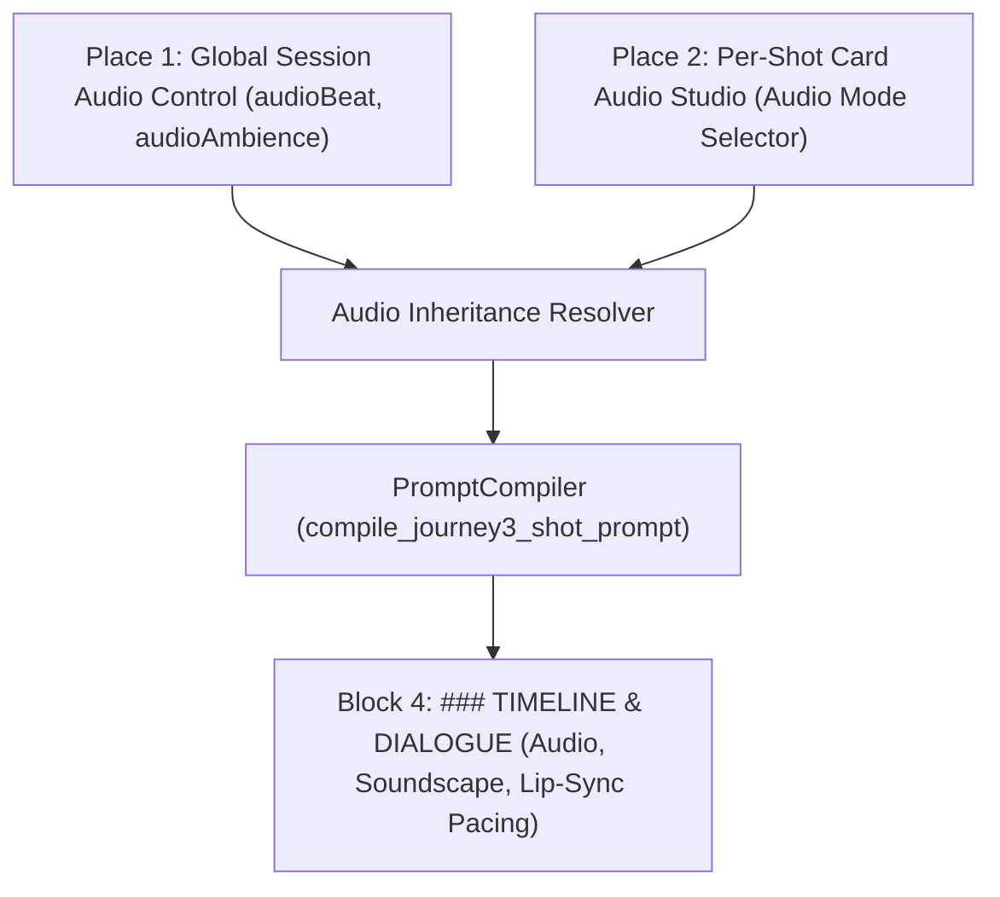
```mermaid
graph TD
    Place1["Place 1: Global Session Audio Control (audioBeat, audioAmbience)"] --> Inherit["Audio Inheritance Resolver"]
    Place2["Place 2: Per-Shot Card Audio Studio (Audio Mode Selector)"] --> Inherit
    Inherit --> Compiler["PromptCompiler (compile_journey3_shot_prompt)"]
    Compiler --> Block4["Block 4: ### TIMELINE & DIALOGUE (Audio, Soundscape, Lip-Sync Pacing)"]
```

#### 📍 Dual Input Places

* **Place 1: Global Session Audio Control Box (Session Level)**
  - Position: Continuity Studio header control panel.
  - Fields: `Global Background Beat / Instrumental` (e.g., `140 BPM Heavy 808 Trap`) and `Global Environmental Soundscape` (e.g., `Thunder rumbling, rain pattering`).
  - Purpose: Sets a single audio baseline once for the entire project/session.

* **Place 2: Dedicated Per-Shot Card Audio Studio (Shot Level)**
  - Position: Integrated onto every individual Shot Card in Continuity Studio.
  - Audio Mode Dropdown Selector:
    - **`🌐 Inherit Global`** (Default — automatically inherits session audio with zero extra typing)
    - **`🎵 Custom Shot Beat`** (Opens custom text fields for shot-specific sound design/music overrides)
    - **`🔇 Silent Shot`** (Instantly mutes background audio for dramatic effect)
  - Fields: Custom per-shot soundscape text input, spoken dialogue text input, and active character voice delivery badges (`🎙️ Harry: Aggressive 2000s rap delivery`).

#### ⚙️ Compiler Resolution (`Block 4: ### TIMELINE & DIALOGUE`)

The prompt compiler resolves active audio modes and merges character voice styles directly into dialogue pacing:
> `[0-10s] Action: ... Audio: Spoken dialogue is dominant. Background beat (instrumental 140 BPM Heavy 808 Trap) is subtly ducked. Dialogue: Draco (Vocal Delivery: Aggressive 2000s rap) says: "..."`

---

### 🎬 Multi-Scene 30–60s Master Video Assembly Architecture

To overcome the **10-second per-clip single-turn limit** of Gemini Omni Flash and Veo video models, OmniMash implements a **3-Stage Hybrid Orchestration Workflow** that sequentially generates, anchors, and stitches multi-scene clips into a unified 30–60s master parody video with continuous audio and consistent character visual fidelity:

#### 🏛️ The 3-Stage Hybrid Orchestration Workflow

1. **Stage 1: Upfront NLP Concept Deconstruction (Gemini 3.5 / 3.6 Flash)**
   - Deconstructs open-ended prompt shorthand (`POST /api/deconstruct-concept`) into a multi-scene storyboard sequence (`Scene 1`, `Scene 2`, `Scene 3...`).
   - Resolves dynamic `CharacterRole` definitions (`Role A`, `Role B`), global aesthetic tags, environment settings, and continuous background audio parameters (e.g., 140 BPM Heavy 808 Trap beat).

2. **Stage 2: Turn-by-Turn Scene Generation & Anchor Locking (`gemini-omni-flash-preview`)**
   - Renders each 10-second scene turn-by-turn via `POST /api/extend-scene`.
   - Preserves character visual likeness and attire across scenes by attaching persistent Cloud Storage reference image URLs (`gs://...`) per the [Gemini Omni Image Roles API](https://ai.google.dev/gemini-api/docs/omni#set-image-roles).
   - Locks character-specific voice styles, accents, and vocal delivery instructions to prevent AI amnesia and vocal drift across consecutive scenes.

3. **Stage 3: FFmpeg Multi-Clip Concatenation & Master Export (`MediaStitcher` / `VideoStitcher`)**
   - Triggered via `POST /api/save-final` to stitch sequential 10s MP4 clips and continuous 140 BPM audio stems into a unified 30–60s master video MP4.
   - Saves master exports directly to GCS using explicit GCS session name preservation (`session_name` / `session_id`) at `sessions/{session_name}/final_masters/{master_title}.mp4` using `VideoStitcher` / `MediaStitcher` with `aresample=async=1:first_pts=0` and presentation timestamp (PTS) frame locking.

#### 🗂️ Project & Session Storage Hierarchy in Google Cloud Storage

OmniMash maintains a structured, project and session-scoped folder hierarchy in Google Cloud Storage (`gs://omnimash-media-${GOOGLE_CLOUD_PROJECT}/`):

```text
gs://omnimash-media-${GOOGLE_CLOUD_PROJECT}/
├── 🏛️ projects/{project_id}/
│   ├── saved_characters/              <-- PROJECT-LEVEL CHARACTER VAULT
│   │   ├── harry_potter.json          - Shared character JSON definitions across sessions
│   │   ├── draco_malfoy.json
│   │   └── waka_flocka.json
│   ├── saved_reference_sheets/        <-- PROJECT-LEVEL TURNAROUND SHEETS
│   │   ├── harry_sheet_v1.png         - Visual turnaround reference sheets
│   │   └── draco_sheet_v1.png
│   └── sessions/{session_id}/         <-- SESSION WORKSPACES
│       ├── prompts/
│       │   └── session_manifest.json  - Roster, presets, aspect ratio, image model
│       ├── intermediate/              - 10s turn MP4 video renders
│       └── final_masters/             - Concatenated master parody videos
```

---

## 🎬 Step-by-Step Multimodal Workflow Pipeline

OmniMash transforms open-ended parody concepts and character reference links into frame-accurate parody video clips using a 5-stage multimodal workflow:

<div align="center">
  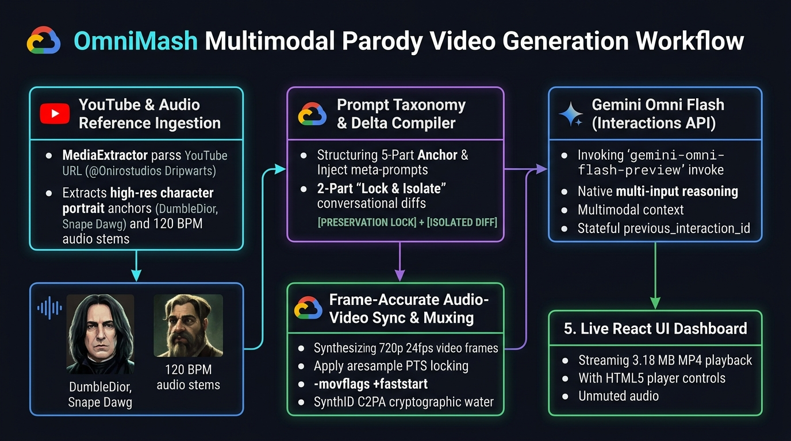
</div>

### 🔍 The 5-Step Methodology

1. **💡 Open-Ended Concept & Gemini Omni Image Roles (`POST /api/deconstruct-concept`)**:
   - Ingests open-ended user concepts (e.g., *"Harry Potter vs Draco Malfoy rap battle in 2000s Atlanta trap style"*).
   - Automatically deconstructs shorthand into editable `MetaPromptTags` and dynamic `CharacterRole` bindings (`Role A`, `Role B`).
   - Attaches high-resolution reference image URLs to character roles per the [Gemini Omni Image Roles API](https://ai.google.dev/gemini-api/docs/omni#set-image-roles) to lock facial likeness and attire.

2. **🧠 Multi-Scene Storyboard & Prompt Compiler (`PromptCompiler`)**:
   - **Storyboard Sequence Compilation:** Compiles multi-character scene directives into `[ROLE DEFINITIONS]`, `[AESTHETIC INJECTION]`, `[AUDIO & VOCAL DIRECTION]`, and `[STORYBOARD SEQUENCE]`.
   - **Conversational Diffs:** Enforces `[PRESERVATION LOCK]` to freeze character likeness and background while targeting `[ISOLATED DIFF]` to prevent facial drift across turns.

3. **✨ Gemini Omni Flash Engine (`gemini-omni-flash-preview`)**:
   - Invoked via Google's stateful **Interactions API** (`client.interactions.create`).
   - Leverages native multi-input reasoning and $1\text{M}+$ token context window to synthesize 720p 24fps video and synchronized native audio in a single pass.

4. **⏱️ Frame-Accurate Audio-Video Sync & Container Muxing**:
   - Applies `aresample=async=1:first_pts=0` and `-r 24` presentation timestamp (PTS) locking to guarantee audio beats drop on exact visual frames.
   - Muxes MP4 containers with `-movflags +faststart` for instant HTML5 browser playback and validates SynthID C2PA cryptographic watermarks.

5. **🖥️ Live React 18 3-Act Studio Dashboard & Video Streaming**:
   - Provides a 3-Act progressive linear workflow: **Act 1 (The Concept & Cast Manager)** $\rightarrow$ **Act 2 (Fine-Tune & Storyboard Directing)** $\rightarrow$ **Act 3 (The Screening Room & Branching)**.
   - Streams 720p MP4 video clips directly to the client dashboard with unmuted HTML5 player controls, live storyboard prompt preview cards, and thread re-anchoring at depth $\ge 3$.

<details>
  <summary>View Technical Dataflow Diagram (Mermaid)</summary>

<br />

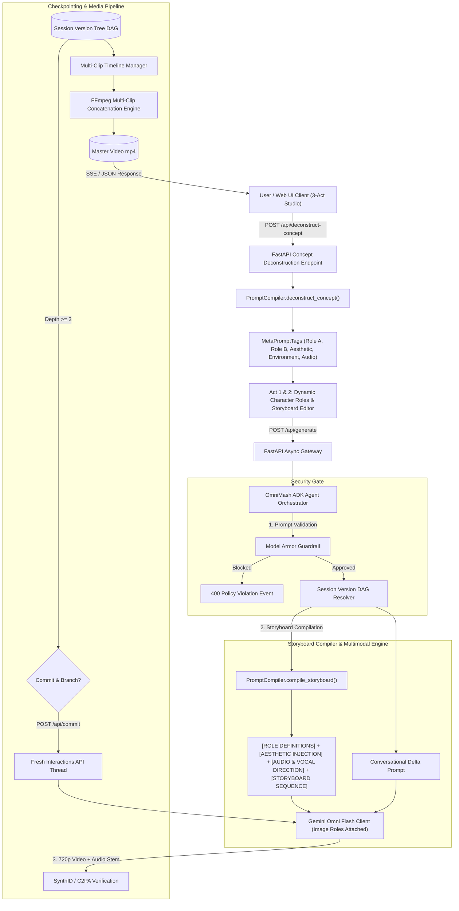
```mermaid
graph TD
    User["User / Web UI Client (3-Act Studio)"] -->|POST /api/deconstruct-concept| DeconstructAPI["FastAPI Concept Deconstruction Endpoint"]
    DeconstructAPI --> NLP["PromptCompiler.deconstruct_concept()"]
    NLP --> MetaTags["MetaPromptTags (Role A, Role B, Aesthetic, Environment, Audio)"]
    MetaTags --> UIEditor["Act 1 & 2: Dynamic Character Roles & Storyboard Editor"]
    
    UIEditor -->|POST /api/generate| API["FastAPI Async Gateway"]
    API --> Agent["OmniMash ADK Agent Orchestrator"]
    
    subgraph SecurityGate["Security Gate"]
        Agent -->|1. Prompt Validation| Guard["Model Armor Guardrail"]
        Guard -->|Blocked| Reject["400 Policy Violation Event"]
        Guard -->|Approved| SessionState["Session Version DAG Resolver"]
    end

    subgraph PromptEngine["Storyboard Compiler & Multimodal Engine"]
        SessionState -->|2. Storyboard Compilation| Compiler["PromptCompiler.compile_storyboard()"]
        Compiler --> StoryboardPrompt["[ROLE DEFINITIONS] + [AESTHETIC INJECTION] + [AUDIO & VOCAL DIRECTION] + [STORYBOARD SEQUENCE]"]
        SessionState --> TaxDelta["Conversational Delta Prompt"]
        
        StoryboardPrompt --> Omni["Gemini Omni Flash Client (Image Roles Attached)"]
        TaxDelta --> Omni
    end

    subgraph MediaPipeline["Checkpointing & Media Pipeline"]
        Omni -->|3. 720p Video + Audio Stem| Watermark["SynthID / C2PA Verification"]
        DAGStore[("Session Version Tree DAG")]
        DAGStore -->|"Depth >= 3"| CommitGate{"Commit & Branch?"}
        CommitGate -->|POST /api/commit| ReAnchor["Fresh Interactions API Thread"]
        ReAnchor --> Omni
        DAGStore --> Timeline["Multi-Clip Timeline Manager"]
        Timeline --> Stitcher["FFmpeg Multi-Clip Concatenation Engine"]
        Stitcher --> MasterVideo[("Master Video mp4")]
    end

    MasterVideo -->|SSE / JSON Response| User
```

</details>

---

## 🚀 Gemini Omni Flash 1.1 Preview Capabilities & Next-Gen Workstations

OmniMash natively integrates **Gemini Omni Flash 1.1 Preview** (`gemini-omni-1.1-flash-preview`), unlocking stateful multi-turn extensions, multi-resolution rendering control, dual keyframing, and multimodal motion transfer:

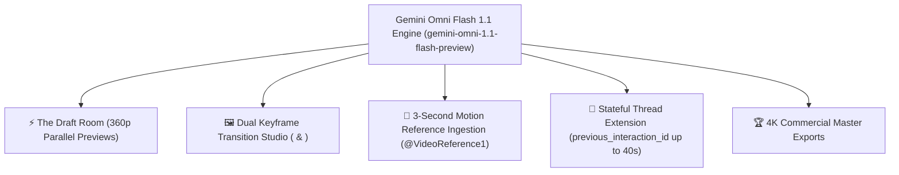
```mermaid
graph TD
    Omni11["Gemini Omni Flash 1.1 Engine (gemini-omni-1.1-flash-preview)"]
    Omni11 --> DraftRoom["⚡ The Draft Room (360p Parallel Previews)"]
    Omni11 --> DualKey["🖼️ Dual Keyframe Transition Studio (<FIRST_FRAME> & <LAST_FRAME>)"]
    Omni11 --> MotionRef["💃 3-Second Motion Reference Ingestion (@VideoReference1)"]
    Omni11 --> StatefulExt["🔄 Stateful Thread Extension (previous_interaction_id up to 40s)"]
    Omni11 --> Master4K["🏆 4K Commercial Master Exports"]
```

### ⚡ 1. "The Draft Room" Multi-Resolution Comparison Studio
- **360p Draft Mode (`POST /api/storyboard/draft-batch`)**: Renders 3–4 prompt concept variations in parallel at **360p Draft resolution** (`response_format={"resolution": "360p"}`). Drafts render ~60% faster at 1/3 the cost, allowing directors to test lighting, soundscape, or character movement options side-by-side.
- **🏆 1-Click 4K Upscale**: Once a favorite draft variation is selected, directors click **🏆 Upgrade to 4K Master** to trigger a high-res re-render (`response_format={"resolution": "4k"}`) preserving keyframe anchors.

### 🖼️ 2. Transition Studio Dual Keyframe Controls
- **Dual Keyframe Anchors (`<FIRST_FRAME>` & `<LAST_FRAME>`)**: Binds a starting keyframe image `<FIRST_FRAME>@Image1` and an ending keyframe image `<LAST_FRAME>@Image2` on Stage 2 Shot Cards.
- **Cinematic Transition Presets**: Enables frame-accurate camera movement presets (*Whip-Pan*, *Dolly Zoom*, *360 Orbit*, *Seamless Loop*) connecting the two bounding keyframes.

### 💃 3. 3-Second Motion Reference Ingestion & Choreography Transfer
- **Video Reference Clips (`POST /api/motion-reference/upload`)**: Crops up to 3 seconds of `.mp4` choreography or stunt video references via `ffmpeg` with timestamp alignment.
- **Multimodal Motion Binding**: Ingests video clips into Gemini Omni Flash 1.1 payloads (`@VideoReference1`), transferring exact body dance moves, gestures, and performance timing onto parody characters.

### 🔄 4. Native Stateful Scene Extension (`previous_interaction_id`)
- **Stateful Continuation**: Passes `previous_interaction_id` to analyze up to 10 seconds of prior video context.
- **40-Second Extended Context**: Extends consecutive scene turns up to 40 seconds of total cumulative video without jump cuts or identity decay.

---

## 🎬 Storyboard & Multi-Shot Production User Journey (Act 2)

OmniMash provides a canonical **4-Stage Storyboard & Multi-Shot Production Workflow** in **Act 2 (The Director's Studio)** that bridges open-ended creative concepts and fine-grained, shot-by-shot video directing. By decoupling initial narrative deconstruction from sequential keyframe chaining and conversational diff editing, the studio guarantees 100% character visual consistency, continuous audio sync, and surgical iteration across multi-shot productions.

<div align="center">
  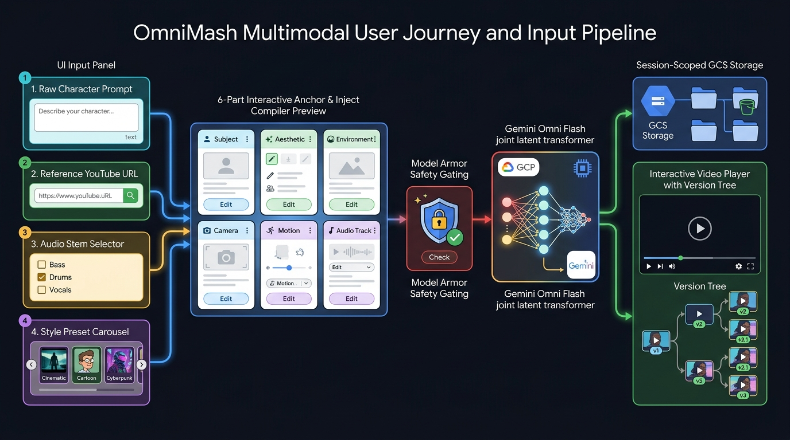
</div>

### 🏛️ The 4 Canonical Stages

#### Stage 1: Concept & Character Roster Intake (The Anchor Stage)
* **Narrative & Aesthetic Intake:** Users enter the core narrative concept, style tags (e.g., `Cinematic Trap Parody`, `Gritty 90s Rap Video`), background audio beats (e.g., `140 BPM Heavy 808 Trap`), and character roster definitions in the **Tab 1 / Tab 2** header interface.
* **Visual Baseline & Reference Binding:** Establishing the character cast roster upfront binds dynamic Character Roles (`Role A`, `Role B`, etc.) to high-resolution reference image URLs (`gs://...` or HTTP URLs). These reference images serve as immutable visual anchors (`@Image1`, `@Image2`) per the [Gemini Omni Image Roles API](https://ai.google.dev/gemini-api/docs/omni#set-image-roles), locking character facial identity, wardrobe attire, and lighting across every shot in the sequence.

#### Stage 2: Screenplay & Director's Notes Breakdown (The Narrative Pipeline)
* **Screenplay & Scripting Syntax:** In **Widget 6 (Screenplay & Director's Notes)**, directors can script multi-shot sequences using either of two canonical formatting syntaxes:
  - **Theatrical Syntax:** Explicit character dialogue and parenthetical stage/audio directions:
    ```text
    Harry: (Inspects the glowing wand. Audio: heavy sub-bass drop.) "Is this the 1017 edition?"
    Ollivander: (Nods approvingly.) "For you, Mr. Potter? Just put 1017 in your bio."
    ```
  - **Timecoded Syntax:** Precise timestamp intervals for frame-accurate timing:
    ```text
    [0-5s] Action: Harry inspects glowing wand in dimly lit shop. Dialogue: "Is this the 1017 edition?"
    [5-10s] Action: Ollivander leans over counter smiling. Dialogue: "Just put 1017 in your bio."
    ```
* **Automated Storyboard Deconstruction:** Clicking **`"🎬 Generate Storyboard Grid"`** invokes the NLP `PromptCompiler` to deconstruct the screenplay into structured **Shot Cards**. Each generated card automatically receives explicit `<IMAGE_REF_N>` tag bindings and a 5-part directorial breakdown:
  1. `Action/Subject`: Core physical movement and character acting.
  2. `Location`: Set dressing and background environment.
  3. `Style & Lighting`: Color grading, lighting fixtures, and atmosphere.
  4. `Framing & Motion`: Camera lens, angle, focal depth, and kinematic motion.
  5. `Audio`: Soundscape, voiceover style, and sound effects.

#### Stage 3: Interactive Sequential Shot Production & Keyframe Chaining (The Visual Chain)
* **Shot #1 Master Anchor:** Production begins with Shot #1, which acts as the visual cornerstone of the scene sequence. Users first generate a high-resolution concept art keyframe image via **`gemini-3.1-flash-image`**, inspect and approve the composition, and then generate the 10-second 720p video clip via **`gemini-omni-flash-preview`**.
* **Master Keyframe Visual Anchor Chaining (Shots #2+):** To prevent facial drift, wardrobe mutation, and lighting decay across camera cuts, subsequent shot cards (Shot #2, Shot #3, etc.) automatically employ **Master Keyframe Visual Anchor Chaining**. The engine seeds each subsequent shot generation request with Shot #1's approved keyframe image using the `<FIRST_FRAME>@Image1` conditioning syntax. This guarantees 100% character likeness and aesthetic continuity across consecutive scene cuts.

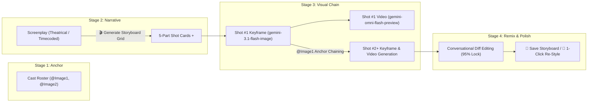
```mermaid
graph LR
    subgraph Stage 1: Anchor
        Roster["Cast Roster (@Image1, @Image2)"]
    end
    subgraph Stage 2: Narrative
        Script["Screenplay (Theatrical / Timecoded)"] -->|"🎬 Generate Storyboard Grid"| Cards["5-Part Shot Cards + <IMAGE_REF_N>"]
    end
    subgraph Stage 3: Visual Chain
        Cards --> Shot1Img["Shot #1 Keyframe (gemini-3.1-flash-image)"]
        Shot1Img --> Shot1Vid["Shot #1 Video (gemini-omni-flash-preview)"]
        Shot1Img -->|"<FIRST_FRAME>@Image1 Anchor Chaining"| Shot2["Shot #2+ Keyframe & Video Generation"]
    end
    subgraph Stage 4: Remix & Polish
        Shot2 --> Diff["Conversational Diff Editing (95% Lock)"]
        Diff --> Lib["💾 Save Storyboard / 🎨 1-Click Re-Style"]
    end
```

#### Stage 4: Conversational Diff Editing & Storyboard Library Management (The Remix & Polish Stage)
* **Guarded Conversational Diff Editing:** When refining an existing shot card, clicking **`"Edit / Diff"`** opens an interactive conversational edit session.
  - **Non-Edit Guard:** Initial base generation turns are strictly guarded so they never receive conversational delta directives.
  - **Targeted Diff Directives:** Subsequent edit iterations automatically inject the `### CONVERSATIONAL EDIT DIRECTIVE` block into the Four-Block prompt. This enforces a strict `[PRESERVATION LOCK]` to freeze 95% of the original visual baseline (facial identity, lighting, background composition) while isolating the user's delta request in `[ISOLATED DIFF]` (e.g., *"Swap the wand for a glowing diamond microphone"*).
* **Storyboard Library & 1-Click Re-Style:**
  - **`"💾 Save Storyboard"` & `"📂 Storyboard Library"`:** Save entire multi-shot storyboard bundles—including shot cards, keyframe references, script lines, and audio stems—to session-scoped cloud storage (`gs://omnimash-media-${GOOGLE_CLOUD_PROJECT}/sessions/{session_name}/`). Saved storyboards can be reloaded instantly across sessions.
  - **`"🎨 Re-Style / Remix"`:** Apply a 1-click aesthetic transformation across the entire storyboard. Switching the global style tag (e.g., from `Cinematic Trap Parody` to `Gothic Cyberpunk Parody`) automatically re-compiles and updates the aesthetic injections across all shot cards without rewriting individual action or dialogue directives.

---

## Diagrams & Reference Architectures

Detailed subsystem architectures and workflow outlines are available in [docs/diagrams/](docs/diagrams/README.md):

| Reference Diagram | Subsystem | Highlights |
| :--- | :--- | :--- |
| 🌟 [Master System Architecture](docs/diagrams/omnimash_master_architecture.png) | **End-to-End Pipeline** | Publication-quality PaperBanana diagram detailing the 5 core architectural layers from Web UI to FFmpeg master rendering. |
| 🗺️ [Multimodal User Journey & Input Pipeline](docs/diagrams/omnimash_user_journey_inputs.png) | **User Journey & Inputs** | Publication-quality PaperBanana diagram detailing how raw prompts, YouTube URLs, audio stems, and style presets flow into editable previews, Model Armor gating, and Omni Flash. |
| 🎧 [Joint Latent Space Audio-Video Prompting](docs/diagrams/omnimash_joint_audio_video_latent.png) | `omnimash.prompts` | PaperBanana diagram showing prompt payload entering Omni Flash Neural Core, binding kinematic motion tokens to acoustic beat onset tokens. |
| 🗂️ [Session-Scoped GCS Architecture](docs/diagrams/omnimash_session_gcs_hierarchy.png) | `omnimash.storage` | Publication-quality PaperBanana diagram showing session-scoped cloud folders (`sessions/${session_id}/[intermediate,finalized,prompts,references]`). |
| ☁️ [GCS Persistent Media Pipeline](docs/diagrams/omnimash_gcs_storage_workflow.png) | `omnimash.storage` | PaperBanana workflow diagram showing intermediate/final video streaming to GCS (`gs://omnimash-media-${GOOGLE_CLOUD_PROJECT}`) and `.gitignore` repository isolation. |
| 🚀 [GCP Deployment Patterns](docs/diagrams/gcp_deployment_patterns.md) | **Google Cloud Platform** | Dual-Target Architecture comparing Target 1 (Full-Stack Cloud Run serverless container on port 8080) and Target 2 (Enterprise Vertex AI Agent Engine with `root_agent` and `AdkApp`). |
| 🛡️ [Agent Orchestration Architecture](docs/diagrams/omnimash_agent_architecture.md) | `omnimash.agent` & `security` | ADK orchestrator sequence, concept deconstruction, Model Armor pre-gating, storyboard prompt compilation, and Gemini Omni Flash client dispatch. |
| 🌳 [Version Tree DAG & State Lifecycle](docs/diagrams/version_tree_dag_lifecycle.md) | `omnimash.state` | Non-linear conversational diff branching, thread depth tracking ($\ge 3$), ⚓ Checkpoint Anchor Badges, and fresh thread re-anchoring. |
| 🎬 [Multimodal Ingestion & Video Stitching](docs/diagrams/multimodal_ingestion_stitching.md) | `ingestion` & `stitching` | 4-stage pipeline: YouTube asset extraction (`yt-dlp`), storyboard prompt compilation, Omni Flash clip rendering with commit checkpoints, and FFmpeg multi-clip concatenation. |
| 🌐 [Frontend API & SSE Streaming Topology](docs/diagrams/frontend_api_topology.md) | `api` & Web UI | FastAPI async endpoints (`POST /api/deconstruct-concept`, `POST /api/generate`, `POST /api/commit`), dynamic Character Roles, and React 18 single-page dashboard. |

---

### 🗂️ Google Cloud Storage (GCS) Directory Hierarchy & Asset Storage

OmniMash organizes persistent media, character presets, session cast rosters, and exported master videos across a clean, multi-tier Google Cloud Storage hierarchy:

```text
gs://omnimash-media-hybrid-vertex/
│
├── 🏛️ library/characters/                 <-- GLOBAL VAULT (Root of Bucket)
│   ├── harry_gucci.json                  - Global reusable character presets
│   ├── young_draco_jeezy.json            - Shared across ALL sessions & projects
│   └── cyborg_gordon_ramsay.json
│
├── 🖼️ saved_characters/                  <-- GLOBAL REFERENCE IMAGES (Root of Bucket)
│   ├── harry_drip.jpeg                   - Character reference images attached to roles
│   ├── draco.jpeg                        - Served via authenticated /api/media-proxy
│   └── gordon_ramsay.jpeg
│
└── 🗂️ sessions/                          <-- PER-SESSION WORKSPACES
    └── {session_id}/                     (e.g., session_8492)
        ├── 👤 characters/
        │   └── roster.json               - Project-specific cast roster snapshot
        ├── 🎬 intermediate/
        │   ├── turn0_clip.mp4            - 10s individual turn renders
        │   └── turn1_diff.mp4
        └── 🏆 final_masters/
            └── stitched_master.mp4       - Multi-clip concatenated final exports
```

- **Global Character Vault (`library/characters/`):** Stores reusable character definition presets (`name`, `description`, `reference_url`, `voice_style`, `aesthetic_tags`) at the bucket root, shared across all project sessions.
- **Global Reference Images (`saved_characters/`):** Holds character facial reference images accessible via the authenticated `/api/media-proxy` backend streaming route.
- **Per-Session Workspaces (`sessions/{session_id}/`):** Isolates session cast snapshots (`characters/roster.json`), intermediate 10s turn clips (`intermediate/`), and finalized multi-clip concatenated renders (`final_masters/`).

---

## 🚀 Getting Started & User Journey

Follow this visual step-by-step walkthrough to launch OmniMash and create full-length AI parody videos using the **3-Act Digital Director's Studio**.

---

### Step 1: Launch the Studio Locally

Start the FastAPI application and embedded React 18 single-page dashboard using `uv`:

```bash
# Start local development server on port 8080
uv run uvicorn omnimash.api.app:app --host 0.0.0.0 --port 8080
```

Open your browser to `http://localhost:8080` (or access the live production instance at [https://omnimash-934903580331.us-central1.run.app](https://omnimash-934903580331.us-central1.run.app)).

---

### Step 2: Act 1 — The Concept & Cast Manager

In **Act 1**, define the high-level creative vision, dynamic character bindings, character-specific voice styles & accents, and global audio direction for your parody video.

<div align="center">
  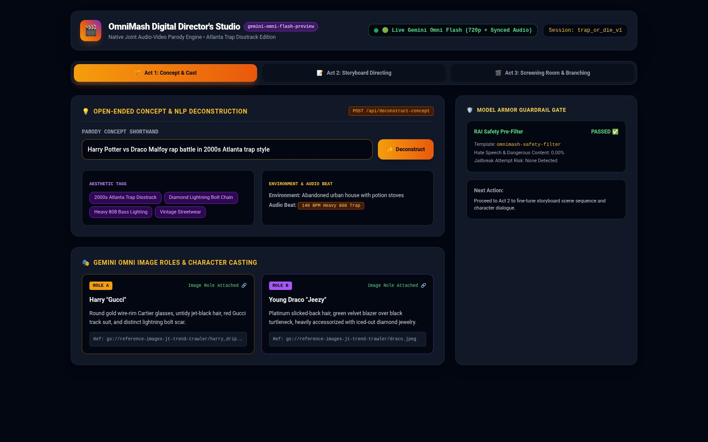
</div>

1. **1-Click Studio Reset Control:** Use the 🔄 **"New Project / Start Over"** button in the top navigation header toolbar at any time to instantly wipe current concept state, character bindings, aesthetic tags, and storyboard scenes, generating a fresh session ID and blank studio workspace.
2. **Enter Visual Shorthand:** Type your open-ended parody concept (e.g., *"Harry Potter vs Draco Malfoy rap battle in 2000s Atlanta trap style"*).
3. **Deconstruct Concept:** Click **✨ Deconstruct Concept** (`POST /api/deconstruct-concept`). OmniMash's upfront NLP concept parser automatically deconstructs your 1-sentence idea into structured, editable building blocks:
   - **👥 Dynamic Character Roles (`Role A`, `Role B`, etc.):** Extracts character names (*Harry*, *Draco*), populates physical likeness descriptions (*"Harry Potter, a young wizard with round wire-rim glasses..."*), binds character-specific style signifiers (*Red Gucci Tracksuit*, *Cartier Glasses*), and assigns dedicated **🎙️ Voice Style & Accent** instructions (*Fast-paced confident Atlanta rap flow with autotune* vs *Pompous British drawl*).
   - **🎨 Global Aesthetic & Style Signifiers:** Extracts overall video genre and visual style tags (*2000s Atlanta Trap Disstrack*).
   - **🏛️ Environment & Setting Tag:** Builds location and atmosphere descriptors (*Gothic Hogwarts courtyard lit by neon stage lights and smoky haze*).
   - **🎥 Camera & Lighting Directive:** Generates camera movement and rim lighting (*Low-angle 90s fisheye tracking shot with green and purple neon rim lights*).
   - **🥁 Background Audio Beat & 🎙️ Vocal Delivery:** Configures background tempo (*140 BPM Heavy 808 Trap*) and global delivery style (*Rhythmic aggressive rap delivery*).
4. **🏛️ Character Vault & Saved Library Toolbar:** Access the 🏛️ **Character Vault & Saved Library** toolbar above the character cards to instantly load pre-saved character presets (`+ Harry`, `+ Young Draco`, `+ Cyborg Gordon Ramsay`, `+ Neon Julia Child`) into your active cast with 1 click, complete with miniature avatar image thumbnails next to each preset chip.
5. **Configure Dynamic Character Roles & Reference Images:** Review dynamic character roles (`Role A: Harry`, `Role B: Young Draco`). Attach reference image URLs per the [Gemini Omni Image Roles Specification](https://ai.google.dev/gemini-api/docs/omni#set-image-roles) (`gs://reference-images-jt-trend-trawler/...`) to lock facial likeness across scenes, featuring live character reference image preview rendering inside dedicated `Linked Image Role` thumbnail containers on each Character Role card.
6. **💾 Save to Vault Card Buttons:** Click 💾 **"Save to Vault"** on any individual Character Role card to persist its name, description, reference image URL, voice style, and style tags into your persistent Character Vault library for future sessions.
7. **💾 Save Cast Roster / 📂 Restore Cast Session Controls:** Use the 💾 **"Save Cast Roster"** and 📂 **"Restore Cast"** buttons in the Character Roles header toolbar to snapshot or restore the full multi-character cast ensemble for the current project session.
8. **Manage Character-Specific Style Signifiers & 🎙️ Voice Style & Accent:** Refine granular character-level style tags and dedicated **🎙️ Voice Style & Accent** inputs inside each Character Role card (e.g., `Red Gucci Tracksuit`, `Cartier Glasses`, and `Fast-paced confident Atlanta rap flow with autotune` for Role A; `Platinum Slicked Hair`, `Diamond Iced-Out Chain`, and `Pompous, cynical British drawl with aggressive rap cadence` for Role B). The prompt compiler binds these tags into character definitions and the `[AUDIO & VOCAL DIRECTION]` block to anchor attire and vocal delivery across scenes.
9. **Tune Global Meta-Prompt Tags & 🎙️ Vocal Delivery:** Review scene-wide aesthetic tag chips (`2000s Atlanta Trap Disstrack`, `Heavy 808 Bass Lighting`), audio beat (`140 BPM Heavy 808 Trap`), and the dedicated **🎙️ Vocal Delivery / Voiceover Style** global control (`High-energy back-and-forth rap battle delivery with synchronized lip-sync`).

---

### Step 3: Act 2 — Fine-Tune & Storyboard Directing

In **Act 2**, sequence your multi-character storyline into structured scenes.

<div align="center">
  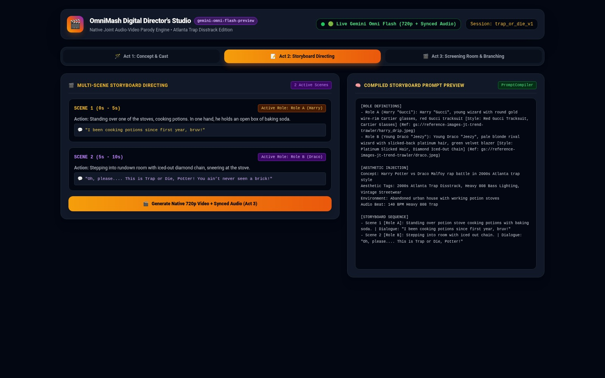
</div>

1. **Add Scene Directives:** Break your script into sequential scenes (`Scene 1: Standing over potion stoves with baking soda`, `Scene 2: Stepping into room with iced out diamond chain`).
2. **Select Directing Mode:** Toggle between **Guided Mode** (`[ Guided Mode | 📜 Screenplay Mode ]`) for structured action & dialogue fields, or **Screenplay Mode** to write raw script text: `Character: (Action description. Audio cue.) "Dialogue"`.
3. **Assign Active Roles:** Toggle active character roles for each scene (`Role A`, `Role B`).
4. **Write Actions & Dialogue / Screenplay Scripts:** Provide character actions and synced rap bars in Guided Mode or full screenplay scripts (e.g. `Harry: (Takes wand. Subwoofers rumble). "How many Galleons?"`).
5. **Inspect Compiled Storyboard Prompt:** Verify the live prompt compiler box on the right, structured with `[ROLE DEFINITIONS]`, `[AESTHETIC INJECTION]`, `[AUDIO & VOCAL DIRECTION]`, and `[STORYBOARD SEQUENCE]` matching the official Gemini Omni Prompt Guide.

#### 📜 Screenplay Mode Syntax & 3-Character Example

In **Screenplay Mode**, direct multi-character scenes using natural screenplay formatting:

```text
CharacterName: (Action description / Stage directions. Audio cue.) "Spoken dialogue quote."
```

##### 🔑 Formatting Rules:
- **Character Name / Role Prefix:** Must end with a colon `:` and match either the character's Name (e.g. `Harry:`, `Ollivander:`, `Dumbledore:`) or Role ID (`Role A:`, `Role B:`, `Role C:`).
- **Parentheticals `(...)`:** Actions, stage directions, and sound effects inside parentheses are parsed into visual actions and background audio cues.
- **Double Quotes `"..."`:** Spoken dialogue **must** be wrapped in double quotes `"..."` (or smart quotes `“...”`) to be parsed as spoken dialogue tracks.

##### 🎬 Example: 3-Character Scene Script
```text
Harry: (Holds up the glowing ice wand. Heavy sub-bass drops) "Is this really the 1017 edition?"
Ollivander: (Adjusts spectacles and leans over counter) "Indeed it is, Mr. Potter!"
Dumbledore: (Steps into frame smiling) "Handle it with care, gentlemen."
```

##### ⚙️ How PromptCompiler Parses This Script:
- **Active Roles:** `[Role A (Harry), Role B (Ollivander), Role C (Dumbledore)]`
- **Parsed Actions:** `Holds up the glowing ice wand. Adjusts spectacles and leans over counter. Steps into frame smiling.`
- **Audio SFX Cues:** `Heavy sub-bass drops.`
- **Dialogue Track:** `Harry: "Is this really the 1017 edition?" / Ollivander: "Indeed it is, Mr. Potter!" / Dumbledore: "Handle it with care, gentlemen."`

---

### Step 4: Act 3 — The Screening Room & Branching

In **Act 3**, render your 720p HD parody cut with native synced audio, inspect the final generation prompt, control non-autoplay playback, export masters to GCS, extend scenes, and branch conversational edits.

<div align="center">
  <picture>
    <source srcset="imgs/live_parody_cut.webp" type="image/webp" />
    
  </picture>
  <p><em>🎬 <strong>Live Gemini Omni Flash 720p HD Render</strong> — Moving character rapping animations with native synchronized 140 BPM Atlanta trap audio generated directly from OmniMash.</em></p>
</div>

<br />

<div align="center">
  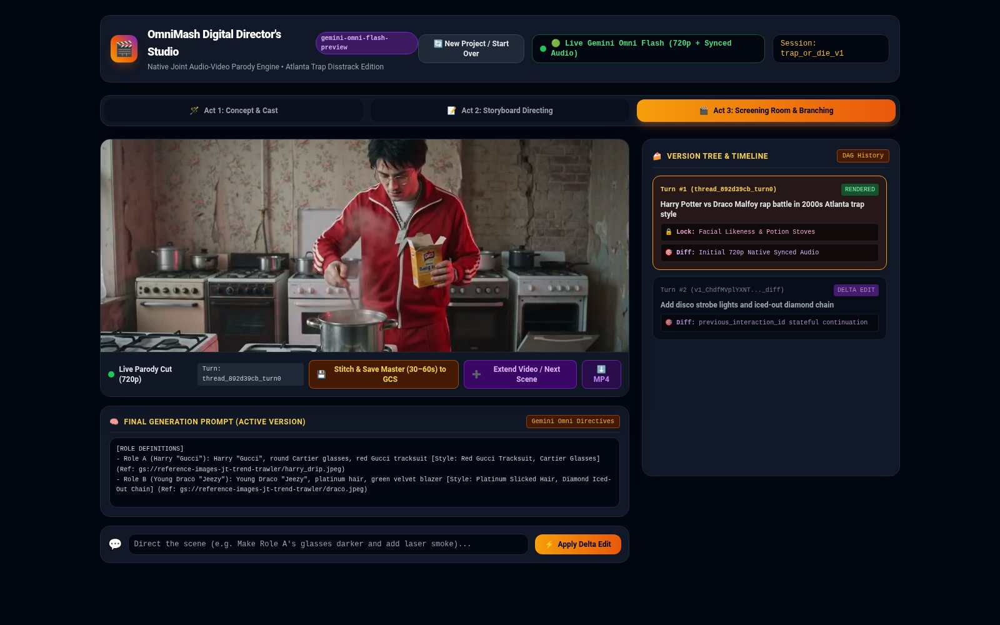
</div>

1. **Generate Parody Cut:** Click **🎬 Generate Parody Cut** (`POST /api/generate`).
2. **Monitor Generation Health:**
   - **Generation Status Badge:** Look for the green `🟢 Live Gemini Omni Flash (720p + Synced Audio)` status pill in the header.
   - **Prioritized Developer API Client:** Google AI Studio routing is prioritized via `GOOGLE_API_KEY`, enabling pure native joint video and audio generation alongside stateful `previous_interaction_id` editing.
3. **Inspect 720p Native Video with Non-Autoplay Control:** Inspect the rendered 720p 24fps video with moving character rapping animations and synchronized 140 BPM background trap beats. Videos do not autoplay on render, giving the director full manual playback and scrubber control.
4. **Inspect Final Generation Prompt:** Review the **🧠 Final Generation Prompt (Active Version)** inspection pane below the video player. This viewer exposes the exact `rawCompiledPrompt` (`[ROLE DEFINITIONS]`, `[AESTHETIC INJECTION]`, `[AUDIO & VOCAL DIRECTION]`, and `[STORYBOARD SEQUENCE]`) sent to Gemini Omni Flash for the currently selected version. Selecting any historical turn from the Version Tree updates the prompt viewer dynamically in real time.
5. **Stitch & Combine Selected Clips Modal:** Click **🎬 Stitch & Combine Selected Clips** (`POST /api/stitch-clips`) to open a dedicated modal where directors can re-order and select specific scene clips from session history to concatenate into a custom master video saved to GCS (`final_masters/<session_name>_<master_title>.mp4`).
6. **Save Master Video to GCS & Download MP4:**
   - **💾 Stitch & Save Master (30–60s) to GCS (`POST /api/save-final`):** Exports the active 720p video master to permanent Cloud Storage (`final_masters/<session_name>_<master_title>.mp4`). For single-clip sessions, it saves the current clip; for multi-scene sessions, it automatically concatenates all timeline clips into the final master MP4.
   - **⬇️ Download MP4:** Click the download link next to the video controls to instantly download the active MP4 video file to your local computer.
7. **Extend Video / Next Scene:** Click **➕ Extend Video / Next Scene** (`POST /api/extend-scene`) to seamlessly continue narrative progression. This locks the active character identities and keyframe baselines and transitions back to Act 2 with a new appended storyboard scene card ready for dialogue directing.
8. **Branch Conversational Diffs:** Direct iterative scene edits via the Delta Prompt chat bar (e.g., *"Add disco strobe lights and iced-out diamond chain"*) to create non-linear branches in the **Version Tree DAG**.
9. **Commit & Branch:** At edit depth $\ge 3$ (`COMMIT_RECOMMENDED`), click **Commit & Branch** (`POST /api/commit`) to flush token context decay and re-anchor from the committed video.

---

### 🎬 Multimodal Generation Showcase & Examples

Below are live examples rendered natively by `gemini-omni-flash-preview` using OmniMash's structured prompt compiler and qualitative audio direction:

<div align="center">
  <picture>
    <source srcset="imgs/wand_shop_example.webp" type="image/webp" />
    
  </picture>
  <p><em>✨ <strong>Scene Example: Mr. Ice-Vander's Diamond District Wand Shop</strong> — Multi-character hip-hop dialogue scene featuring Mr. Ice-Vander, Harry "Gucci", and Swagrid Tha Plug in a gothic boutique with heavy 808s and synchronized rap delivery.</em></p>
</div>

---

## Quickstart

**1. Clone and authenticate**

```bash
git clone https://github.com/tottenjordan/omnimash.git
cd omnimash

export GOOGLE_CLOUD_PROJECT=$(gcloud config get-value project)
gcloud auth application-default login
```

**2. Configure environment and provision storage**

```bash
cp .env.example .env
./scripts/setup_gcs_bucket.sh
uv sync
```

**3. Run the development server**

```bash
uv run uvicorn src.omnimash.api.app:create_app --factory --reload --port 8000
```

Open `http://localhost:8000` to access the **OmniMash Digital Director's Studio Web UI Dashboard**.

---

## Usage

### 1. Deconstructing an Open-Ended Parody Concept via API

Parse open-ended concept shorthand into structured Character Roles (`Role A`, `Role B`), aesthetic tags, environment settings, and audio beat:

```bash
curl -X POST http://localhost:8000/api/deconstruct-concept \
  -H "Content-Type: application/json" \
  -d '{
    "concept": "Harry Potter vs Draco Malfoy rap battle in 2000s Atlanta trap style"
  }'
```

### 2. Generating a Multi-Character Parody Cut (`POST /api/generate`)

Pass the deconstructed or custom character roles (with attached Gemini Omni Image Role reference image URLs) and multi-scene storyboard sequence:

```bash
curl -X POST http://localhost:8000/api/generate \
  -H "Content-Type: application/json" \
  -d '{
    "user_id": "usr_studio",
    "project_id": "prj_director",
    "concept": "Harry Potter vs Draco Malfoy rap battle in 2000s Atlanta trap style",
    "characters": [
      {
        "role_id": "Role A",
        "name": "Harry",
        "description": "Young wizard with round wire-rim glasses and lightning scar",
        "reference_url": "https://example.com/harry.jpg"
      },
      {
        "role_id": "Role B",
        "name": "Draco",
        "description": "Blonde rival wizard in tailored silver-trimmed robes",
        "reference_url": "https://example.com/draco.jpg"
      }
    ],
    "scenes": [
      {
        "scene_number": 1,
        "active_roles": ["Role A"],
        "action": "Arriving at foggy Hogwarts courtyard rapping into microphone wand",
        "dialogue": "I been cooking potions since first year. Burrr!"
      },
      {
        "scene_number": 2,
        "active_roles": ["Role B"],
        "action": "Stepping from shadows in high-gloss neon lighting with ice chain",
        "dialogue": "This is Trap or Die, Potter! Let'\''s get it!"
      }
    ],
    "aesthetic_tags": ["2000s Atlanta Trap Disstrack", "Diamond Lightning Bolt Chain"],
    "environment_tag": "Gothic Hogwarts courtyard lit by neon stage lights",
    "clip_index": 0
  }'
```

### 3. Conversational Delta Diff (Iterative Branching)

Pass the `parent_turn_id` returned from turn 1 to apply a conversational diff preserving character roles and facial likeness:

```bash
curl -X POST http://localhost:8000/api/generate \
  -H "Content-Type: application/json" \
  -d '{
    "user_id": "usr_studio",
    "project_id": "prj_director",
    "prompt": "Swap microphone for glowing neon wand and add diamond chains",
    "clip_index": 0,
    "parent_turn_id": "turn_abc123"
  }'
```

### 4. Commit & Branch Checkpointing

When thread depth reaches $\ge 3$ (`status: "COMMIT_RECOMMENDED"`), commit the turn to flush conversational token clutter and re-anchor from the output video:

```bash
curl -X POST http://localhost:8000/api/commit \
  -H "Content-Type: application/json" \
  -d '{
    "user_id": "usr_studio",
    "project_id": "prj_director",
    "turn_id": "turn_abc123",
    "next_prompt": "Continue editing in fresh thread",
    "session_name": "parody_session_1"
  }'
```

### 5. Custom Clip Stitching & Master Assembly (`POST /api/stitch-clips`)

Select specific clips from session history to concatenate into a custom master parody video and export directly to GCS:

```bash
curl -X POST http://localhost:8000/api/stitch-clips \
  -H "Content-Type: application/json" \
  -d '{
    "session_name": "parody_session_1",
    "clip_urls": [
      "/static/rendered/session_turn0.mp4",
      "/static/rendered/session_turn1.mp4"
    ],
    "master_title": "custom_stitched_cut"
  }'
```

---

## Web UI Dashboard

The built-in single-page web dashboard (React 18 + Tailwind CSS) implements Continuity Studio:

- **Act 1: The Concept & Cast Manager:** Open-ended parody prompt input, 1-click NLP concept deconstruction (`POST /api/deconstruct-concept`), project-level **Character Vault & Saved Library** toolbar with turnaround sheet gallery grid (`🖼️ Saved Character Turnaround Sheets`) and Quick-Select dropdowns (`🖼️ Quick-Select Saved Reference Sheet`), `🧹 Reset Roster` button, modal loading spinners (`⏳ Creating...`), and dedicated **🎙️ Voice Style & Accent** inputs.
- **Act 2: Fine-Tune & Storyboard Directing:** Multi-scene storyboard sequence editor, dual-layer audio controls (`🌐 Inherit Global`, `🎵 Custom Shot Beat`, `🔇 Silent Shot`), character voice badges, and real-time live compiled 4-block prompt preview (`### INPUT ROLES & REFERENCES`, `### CUMULATIVE SHOT STATE`, `### VISUAL ACTION & CAMERA`, `### TIMELINE & DIALOGUE`).
- **Act 3: The Screening Room & Branching:** 720p native video player with non-autoplay playback controls, SynthID C2PA indicators, final generation prompt inspector (`rawCompiledPrompt`), custom clip stitching (`POST /api/stitch-clips`), and master GCS export (`POST /api/save-final`).

---

## 🛡️ Gemini Omni Flash Zero-Veo Policy, Relaxed Safety & Error Mitigation

- **Zero-Veo Policy:** OmniMash exclusively targets `gemini-omni-flash-preview` for native joint video and audio synthesis and conversational editing. Legacy Veo fallback models are strictly prohibited.
- **Relaxed Safety Filters (`BLOCK_NONE`):** `OmniFlashClient` passes `google.genai.types.SafetySetting` configured with `BLOCK_NONE` across all harm categories (`HARM_CATEGORY_HARASSMENT`, `HARM_CATEGORY_HATE_SPEECH`, `HARM_CATEGORY_SEXUALLY_EXPLICIT`, `HARM_CATEGORY_DANGEROUS_CONTENT`, `HARM_CATEGORY_CIVIC_INTEGRITY`) to eliminate false-positive policy blocks on creative parodies.
- **Expanded Safety Sanitization Rules:** Automatically converts street slang (`stepped on` $\rightarrow$ `diluted`), band trademarks (`Widespread Panic` $\rightarrow$ `vintage band emblem`), and tattoo signifiers (`tear drop tattoo` $\rightarrow$ `facial ink accent`, `face tattoos` $\rightarrow$ `artistic facial ink`, `1017` $\rightarrow$ `gold`) in addition to celebrity name abstractions. See [Gemini Omni Flash Safety Guardrails & Real-Person Likeness Policy Note](docs/notes/gemini_omni_flash_safety_guardrails.md) for full details on 400 error mitigation, trigger conditions, character handles, and turnaround sheets.
- **Dual-Strategy Client Authentication:** Automatically initializes Google AI Studio Developer API (`GOOGLE_API_KEY`) and Vertex AI ADC (`GOOGLE_CLOUD_PROJECT`, `GEMINI_LOCATION`) clients.
- **3-Attempt Exponential Backoff:** Automatically retries transient errors (`429 Rate Limit`, `404 Endpoint Mismatch`, `ResourceExhausted`) with exponential backoff delays.
- **OpenTelemetry GenAI Telemetry & Observability:** Configures OpenTelemetry GenAI semantic conventions v1.37.0+, structured span labels (`gen_ai.system`, `event.name`, `gen_ai.input.messages_ref`, `gen_ai.output.messages_ref`, `gen_ai.error.code`, `gen_ai.safety.guardrail_type`), and JSONL message exports to GCS. See [Gemini Enterprise Telemetry & Guardrail Guidance Note](docs/notes/gemini_enterprise_telemetry_and_guardrail_guidance.md) for full architecture details.


---

## Deployment

### 1. Serverless Full-Stack Cloud Run (Live Production)

Deploy the complete FastAPI app, React Web UI dashboard, and FFmpeg video stitcher to Cloud Run:

```bash
./scripts/deploy_cloud_run.sh
```

**Live Production URL:** [https://omnimash-api-934903580331.us-central1.run.app](https://omnimash-api-934903580331.us-central1.run.app)

### 2. Vertex AI Agent Engine

Deploy the Google ADK root agent to managed Vertex AI Agent Engine runtime:

```bash
python scripts/deploy_agent_engine.py
```

---

## Testing & Quality

All development adheres strictly to [CODE_STANDARDS.md](CODE_STANDARDS.md):

```bash
# Run pytest test suite
uv run pytest

# Run linting & formatting checks
uv run ruff check .
uv run ruff format --check .

# Run static type checking
uv run ty check .
```

---

## Repo Structure

```text
.
├── CODE_STANDARDS.md          # Mandatory tooling rules (uv, ruff, ty, pytest)
├── Dockerfile                 # Production Cloud Run container image
├── docs
│   ├── diagrams/              # Architecture diagrams & topology guides
│   ├── notes/                 # Non-derivable session knowledge & quirks
│   └── plans/                 # Subagent-driven TDD implementation plans
├── GEMINI.md                  # AI agent workflow instructions
├── imgs
│   └── omnimash_banner.png    # High-resolution Dripwarts project banner
├── main.py                    # Entrypoint script
├── pyproject.toml             # uv dependencies & project configuration
├── README.md                  # Main project documentation
├── scripts
│   ├── deploy_agent_engine.py # Vertex AI Agent Engine deploy runner
│   └── deploy_cloud_run.sh    # Cloud Run automated deploy script
├── src
│   └── omnimash
│       ├── agent              # Google ADK agent orchestration loop & multi-agent pipeline
│       │   ├── adk_pipeline.py# ADK SequentialAgent & ParallelAgent pipeline
│       │   ├── agent.py
│       │   └── orchestrator.py
│       ├── api                # FastAPI async endpoints & Web UI dashboard
│       │   └── app.py
│       ├── engine             # Gemini Omni Flash client (Interactions API)
│       │   └── omni_client.py
│       ├── ingestion          # Reference asset & YouTube media extraction
│       │   └── media_extractor.py
│       ├── prompts            # Concept deconstruction, Image Roles & storyboard compiler
│       │   ├── character_roles.py
│       │   ├── compiler.py
│       │   ├── storyboard_agent.py
│       │   └── taxonomy.py
│       ├── security           # Model Armor guardrail & safety gateway
│       │   └── guardrail.py
│       ├── state              # Version Tree DAG & thread depth manager
│       │   └── session_manager.py
│       ├── stitching          # FFmpeg video & audio stitching engine
│       │   └── stitcher.py
│       └── storage            # GCS project & session artifact manager
│           └── gcs.py
└── tests
    ├── agent/                 # Agent orchestrator & ADK pipeline unit tests
    ├── api/                   # FastAPI route & UI endpoint tests
    ├── engine/                # Omni Flash & exponential retry tests
    ├── ingestion/             # Reference media extractor tests
    ├── prompts/               # Character Roles & storyboard compiler tests
    ├── security/              # Model Armor guardrail tests
    ├── state/                 # Version Tree DAG & session tests
    ├── stitching/             # FFmpeg video stitcher tests
    └── storage/               # GCS project & session artifact storage tests
```
