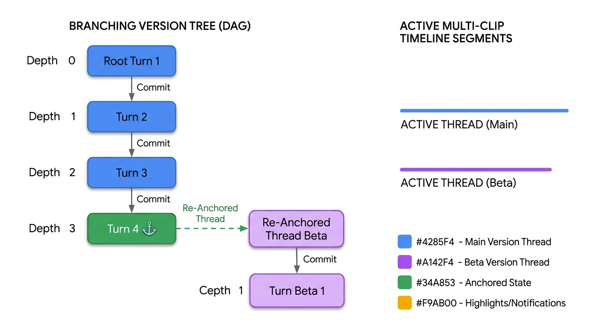
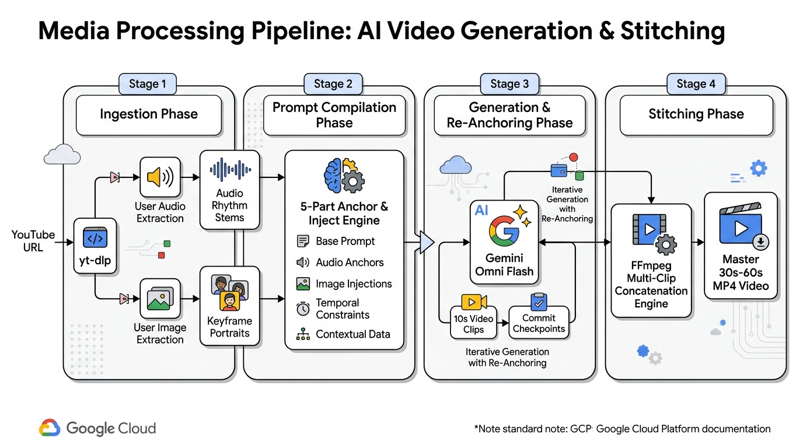

# Agent Architecture & Reference Diagrams

Publication-quality architecture and system diagrams for **OmniMash** (`gemini-3-pro-image-preview` / PaperBanana style), formatted in the visual standard of official Google Cloud Platform documentation.

Each diagram details the multi-agent orchestration loop, state version tree branching, multimodal media extraction, FFmpeg video stitching, and FastAPI/Next.js full-stack topology.

---

## 🏛️ Reference Architecture Suite

| Diagram | Component / Scope | Highlights |
| :--- | :--- | :--- |
|  | **`omnimash.agent` & `security`** | **ADK Agent Orchestration & Security:** FastAPI Web Gateway → OmniMash ADK Agent Orchestrator → Model Armor Guardrail Gateway pre-gating → 5-Part "Anchor & Inject" Prompt Compiler → Session Version DAG with Thread Depth Tracker → Gemini Omni Flash Client → 720p Video with SynthID / C2PA watermark. |
|  | **`omnimash.state`** | **Non-Linear Version Tree (DAG) & Checkpointing:** Non-linear conversational diff branching with `SessionManager`, `TurnNode`, and `ProjectSession`. Tracks thread edit depth (>= 3), rendering ⚓ **Checkpoint Anchor Badges** on committed nodes that branch into clean Interactions API threads. |
|  | **`omnimash.ingestion` & `stitching`** | **4-Phase Media Processing Pipeline:** 1. Ingestion Phase (`yt-dlp` YouTube & user asset extraction), 2. Prompt Compilation Phase (5-Part Anchor & Inject Engine), 3. Generation & Re-Anchoring Phase (Omni Flash 10s clips + commit checkpoints), 4. Stitching Phase (FFmpeg Concatenation Engine → Master 30s–60s MP4). |
|  | **`omnimash.api` & Web UI** | **Full-Stack Topology & SSE Streams:** Next.js / React 18 single-page Web UI (Prompt Input Bar, 5-Part Compiler Preview Card, Style Selector Cards, Version DAG Viewer with Checkpoint Badges, Commit & Re-Anchor Modal, 720p Video Player) communicating via `POST /api/generate`, `POST /api/commit`, and SSE stream to FastAPI backend. |

---

## 📑 Detailed Architecture Documents

- [🛡️ Agent Orchestration Architecture Document](omnimash_agent_architecture.md)
- [🌳 Version Tree DAG & State Lifecycle Document](version_tree_dag_lifecycle.md)
- [🎬 Multimodal Ingestion & Video Stitching Document](multimodal_ingestion_stitching.md)
- [🌐 Frontend API & SSE Streaming Topology Document](frontend_api_topology.md)
