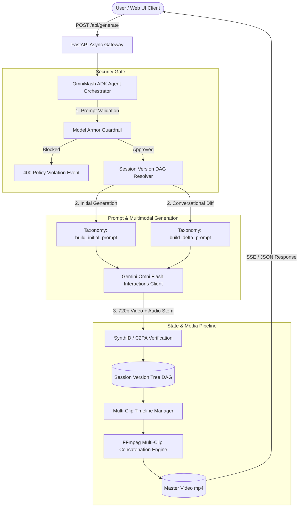

# OmniMash Architecture & System Diagrams

Interactive and structural reference diagrams for the **OmniMash** platform, detailing agent orchestration, security gating, multimodal generation, version tree branching, and video stitching pipelines.

---

## 📑 Diagram Index

| Diagram / Document | Scope | Architecture Highlights |
| :--- | :--- | :--- |
| [Agent Orchestration Architecture](omnimash_agent_architecture.md) | `omnimash.agent` & `omnimash.security` | Google ADK orchestrator loop $\rightarrow$ Model Armor safety gateway $\rightarrow$ Prompt Taxonomy Engine $\rightarrow$ Gemini Omni Flash Interactions API $\rightarrow$ SynthID watermarked 720p clips. |
| [Version Tree DAG & State Lifecycle](version_tree_dag_lifecycle.md) | `omnimash.state` | Non-linear conversational diff branching with `SessionManager`, `TurnNode`, `ProjectSession`, and multi-clip timeline segments. |
| [Multimodal Ingestion & Video Stitching](multimodal_ingestion_stitching.md) | `omnimash.ingestion` & `omnimash.stitching` | Reference asset extraction (user uploads + YouTube via `yt-dlp`), 10s clip rendering, and FFmpeg master concatenation pipeline. |
| [Frontend API & SSE Streaming Topology](frontend_api_topology.md) | `omnimash.api` & Web UI | FastAPI async endpoints (`/api/generate`), SSE stream events, and Next.js / React 18 single-page dashboard with interactive DAG timeline. |

---

## 🏛️ System Overview Flowchart

