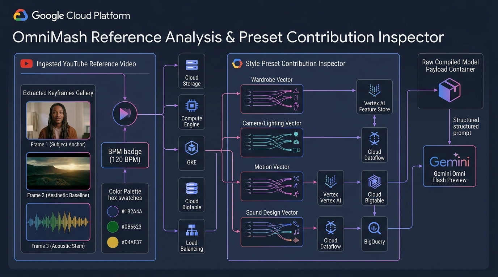
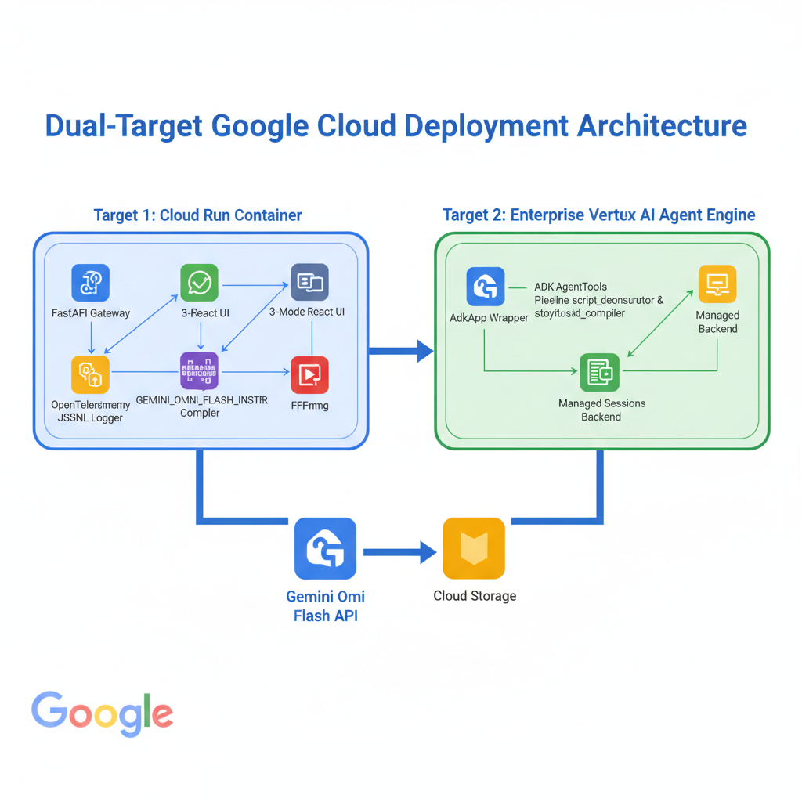
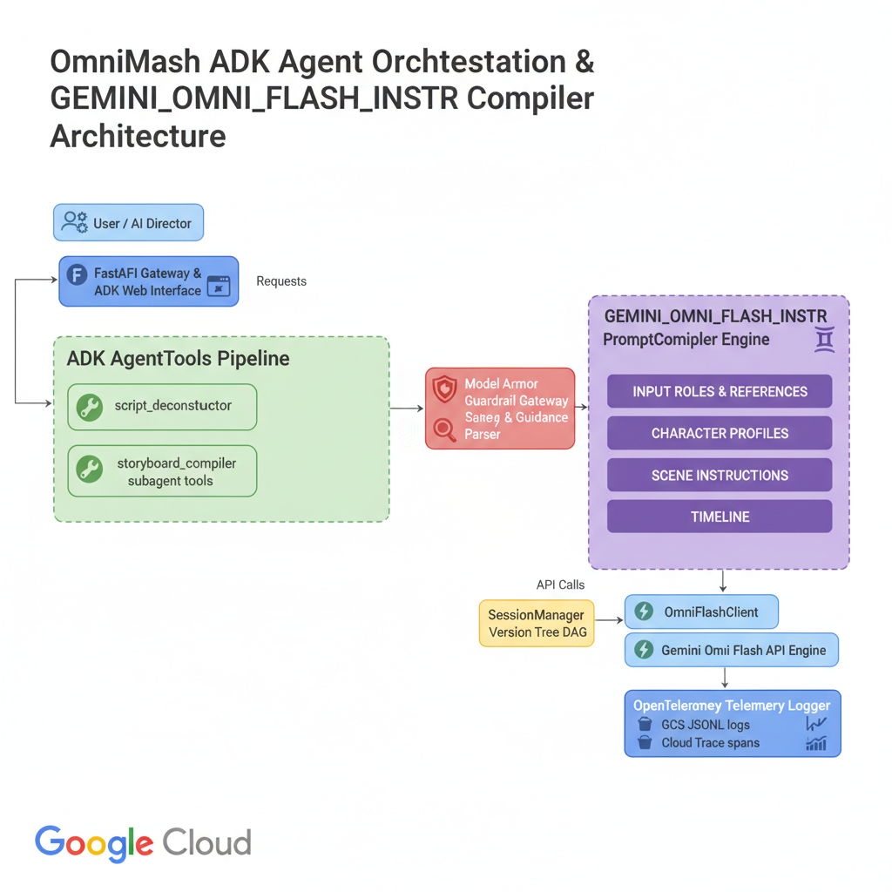
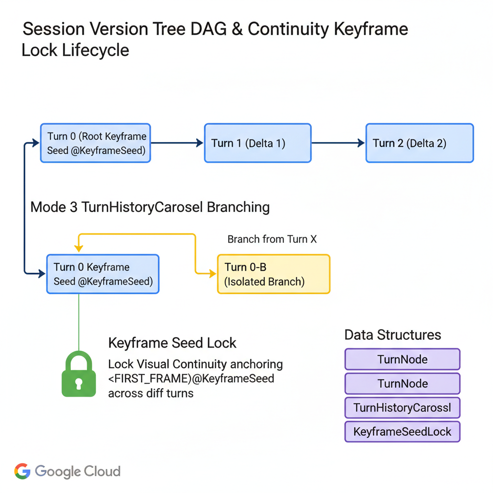
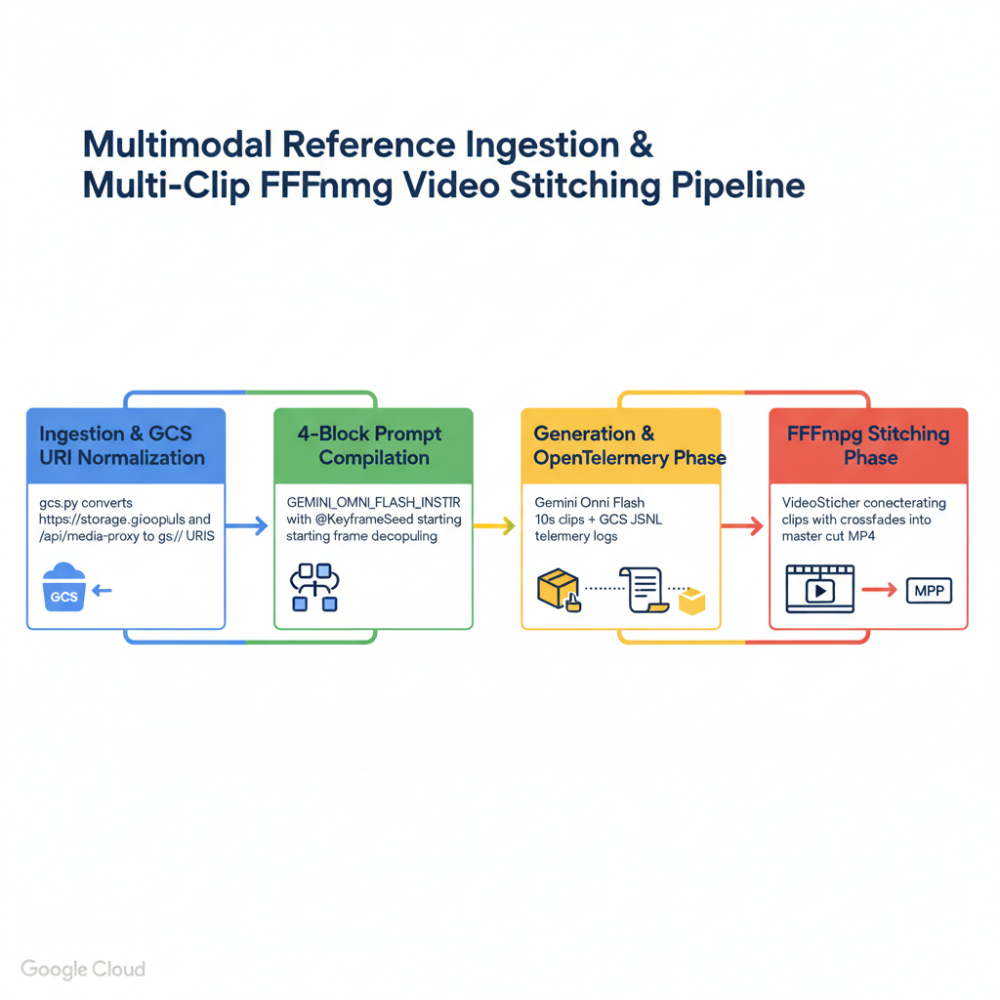
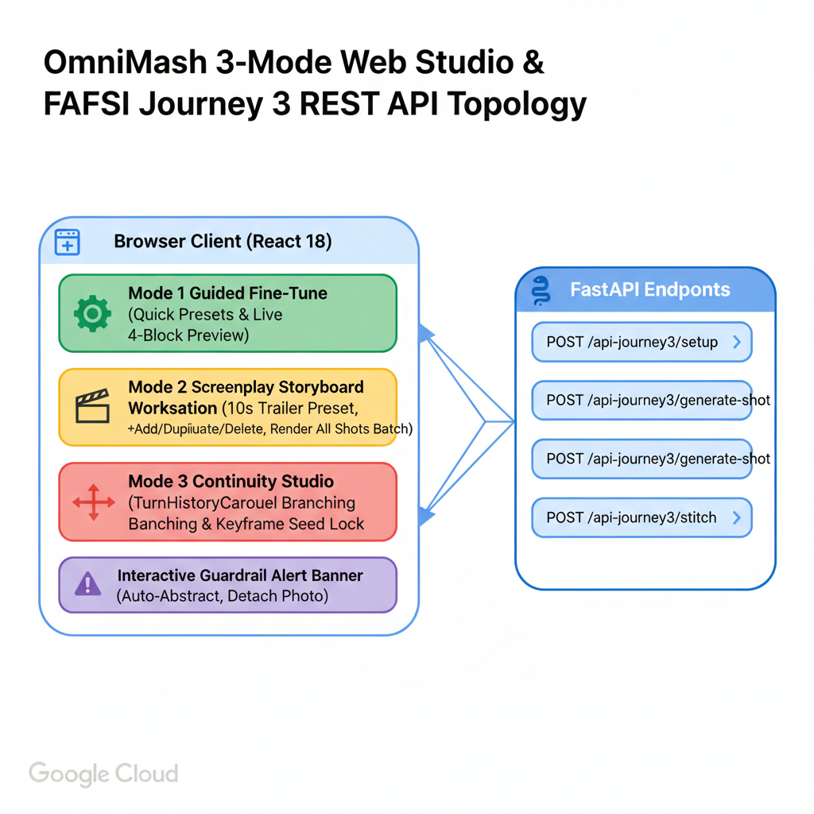

# Agent Architecture & Reference Diagrams

Publication-quality architecture and system diagrams for **OmniMash** (`gemini-3-pro-image-preview` / PaperBanana style), formatted in the visual standard of official Google Cloud Platform documentation.

Each diagram details the multi-agent orchestration loop, state version tree branching, multimodal media extraction, GCS URI normalization, FFmpeg video stitching, OpenTelemetry telemetry logging, and dual-target GCP deployment patterns.

---

## 🏛️ Reference Architecture Suite

| Diagram | Component / Scope | Highlights |
| :--- | :--- | :--- |
|  | **Multimodal Ingestion & UI Inspector** | **Preset Contribution & Reference Analysis:** Extracted YouTube keyframes (Frame 1 Subject Anchor, Frame 2 Aesthetic Baseline, Frame 3 Acoustic Stem), detected 120 BPM badge, dominant hex color palette swatches, 4-vector Style Preset Inspector, and raw compiled prompt container. |
|  | **Google Cloud Platform Deployment** | **Dual-Target Deployment Architecture:** Compares Target 1 (Serverless Full-Stack Cloud Run with FastAPI + 3-Mode React UI + OpenTelemetry JSONL Logger + FFmpeg on port 8080) and Target 2 (Enterprise Vertex AI Agent Engine with Google ADK `script_deconstructor` and `storyboard_compiler` `AgentTool` subagent wrappers + Managed Sessions). |
|  | **`omnimash.agent` & `security`** | **ADK Agent Orchestration & Security:** FastAPI Web Gateway → ADK AgentTools Pipeline → Model Armor Guardrail Gateway & Guidance Parser → `GEMINI_OMNI_FLASH_INSTR` 4-Block Prompt Compiler → Session Version DAG → OpenTelemetry Telemetry Logger → Gemini Omni Flash Client → 720p Video with SynthID / C2PA watermark. |
|  | **`omnimash.state`** | **Non-Linear Version Tree (DAG) & Thread Locking:** Non-linear conversational diff branching with `SessionManager`, `TurnNode`, and `ProjectSession`. Mode 3 `TurnHistoryCarousel` (`⏪ Branch from Turn X`) and Keyframe Seed Anchor Locking (`🔒 Lock Visual Continuity` / `<FIRST_FRAME>@KeyframeSeed`). |
|  | **`omnimash.ingestion` & `stitching`** | **4-Phase Media Processing Pipeline:** 1. Ingestion & GCS URI Normalization (`https://storage.googleapis.com` and `/api/media-proxy` -> `gs://`), 2. 4-Block Prompt Compilation (`GEMINI_OMNI_FLASH_INSTR`), 3. Generation & OpenTelemetry Phase (GCS JSONL logs), 4. Stitching Phase (FFmpeg Concatenation Engine → Master MP4). |
|  | **`omnimash.api` & Web UI** | **Full-Stack Topology & Journey 3 REST API:** Next.js / React 18 single-page Web UI with 3-Mode Studio Switcher (Mode 1 Guided, Mode 2 Storyboard, Mode 3 Continuity), Live 4-Block Prompt Preview, Interactive Policy Guardrail Alert Banner (`⚡ Auto-Abstract`, `❌ Detach Photo`), communicating via `POST /api/journey3/generate-shot`, `POST /api/diff`, and `/api/journey3/stitch`. |

---

## 📑 Detailed Architecture Documents

- [🚀 Google Cloud Deployment Patterns Document](gcp_deployment_patterns.md)
- [🛡️ Agent Orchestration Architecture Document](omnimash_agent_architecture.md)
- [🌳 Version Tree DAG & State Lifecycle Document](version_tree_dag_lifecycle.md)
- [🎬 Multimodal Ingestion & Video Stitching Document](multimodal_ingestion_stitching.md)
- [🌐 Frontend API & SSE Streaming Topology Document](frontend_api_topology.md)

