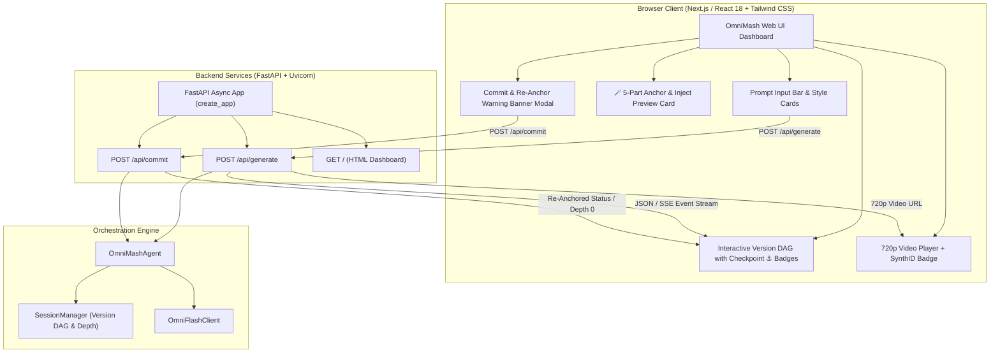

# Frontend UI & FastAPI Async API Topology

This document details the Next.js / React 18 single-page application and its connection to FastAPI's async generation endpoints, commit endpoints, and SSE event streams (`src/omnimash/api/app.py`).

---

## 🖼️ Reference Architecture Diagram


---

## 🌐 Application Architecture



---

## 🔌 API Contracts

### `POST /api/generate`
**Request Payload:**
```json
{
  "user_id": "usr_prod",
  "project_id": "prj_mashup",
  "prompt": "Severus Snape in 90s rap video wearing gold chains",
  "clip_index": 0,
  "parent_turn_id": "optional-turn-id-for-diffs"
}
```

**Response Payload (`GenerateResponse`):**
```json
{
  "success": true,
  "status": "COMPLETED",
  "video_url": "/static/rendered/thread_123_turn0.mp4",
  "turn_id": "turn_abc456",
  "depth": 1,
  "error": null
}
```

### `POST /api/commit`
**Request Payload (`CommitRequest`):**
```json
{
  "user_id": "usr_prod",
  "project_id": "prj_mashup",
  "turn_id": "turn_abc456",
  "next_prompt": "Continue with glowing wand gestures"
}
```

**Response Payload (`GenerateResponse`):**
```json
{
  "success": true,
  "status": "REANCHORED",
  "video_url": "/static/rendered/reanchored_thread_789_turn0.mp4",
  "turn_id": "turn_xyz999",
  "depth": 0,
  "error": null
}
```
