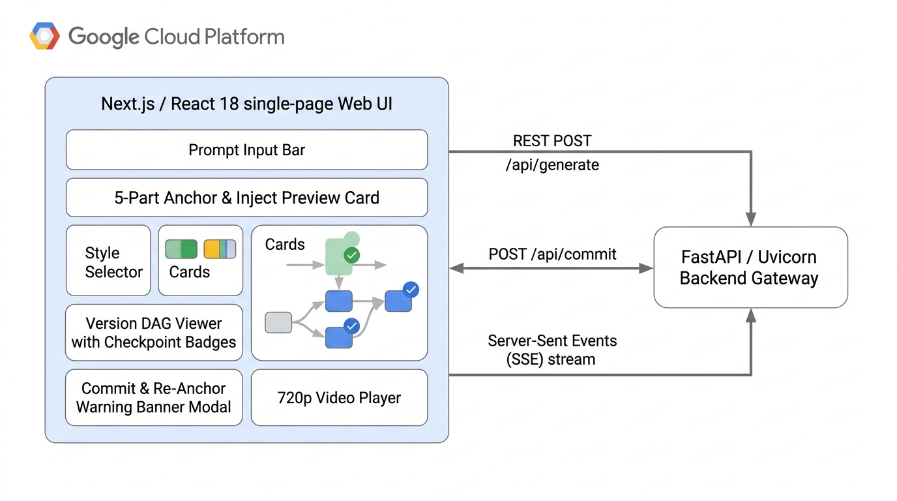
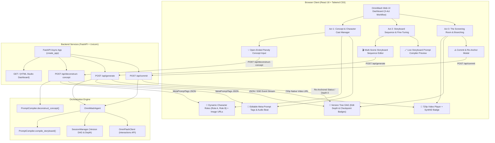

# Frontend UI & FastAPI Async API Topology

This document details the Next.js / React 18 single-page application and its connection to FastAPI's async concept deconstruction, generation endpoints, commit endpoints, and SSE event streams (`src/omnimash/api/app.py`).

---

## 🖼️ Reference Architecture Diagram



---

## 🌐 Application Architecture



---

## 🔌 API Contracts

### `POST /api/deconstruct-concept`
Parses open-ended parody concept shorthand into structured Character Roles (`Role A`, `Role B`), aesthetic tags, environment settings, camera framing, and audio beat.

**Request Payload (`ConceptDeconstructRequest`):**
```json
{
  "concept": "Harry Potter vs Draco Malfoy rap battle in 2000s Atlanta trap style"
}
```

**Response Payload (`MetaPromptTags`):**
```json
{
  "characters": [
    {
      "role_id": "Role A",
      "name": "Harry",
      "description": "Harry Potter, a young wizard with round wire-rim glasses, untidy jet-black hair, and a distinct lightning bolt scar on his forehead",
      "reference_url": null
    },
    {
      "role_id": "Role B",
      "name": "Draco",
      "description": "Draco Malfoy, a pale blonde rival wizard with slicked-back platinum hair, sharp sneering facial features, and tailored silver-trimmed robes",
      "reference_url": null
    }
  ],
  "aesthetic_tags": [
    "2000s Atlanta Trap Disstrack",
    "Diamond Lightning Bolt Chain",
    "Vintage Streetwear",
    "Heavy 808 Bass Lighting"
  ],
  "environment_tag": "Gothic Hogwarts courtyard lit by neon stage lights and smoky haze",
  "camera_lighting_tag": "Low-angle 90s fisheye tracking shot with high-contrast green and purple neon rim lights",
  "audio_beat": "140 BPM Heavy 808 Trap"
}
```

---

### `POST /api/generate`
Generates a multi-character parody cut by compiling storyboard scene directives, character roles with attached Gemini Omni Image Role reference URLs, and aesthetic tags.

**Request Payload (`GenerateRequest`):**
```json
{
  "user_id": "usr_studio",
  "project_id": "prj_director",
  "concept": "Harry Potter vs Draco Malfoy rap battle in 2000s Atlanta trap style",
  "characters": [
    {
      "role_id": "Role A",
      "name": "Harry",
      "description": "Harry Potter, a young wizard with round wire-rim glasses...",
      "reference_url": "https://example.com/harry.jpg"
    },
    {
      "role_id": "Role B",
      "name": "Draco",
      "description": "Draco Malfoy, a pale blonde rival wizard...",
      "reference_url": "https://example.com/draco.jpg"
    }
  ],
  "scenes": [
    {
      "scene_number": 1,
      "active_roles": ["Role A"],
      "action": "Arriving at foggy Hogwarts courtyard rapping into microphone wand",
      "dialogue": "I been cooking potions since first year. Burrr!"
    },
    {
      "scene_number": 2,
      "active_roles": ["Role B"],
      "action": "Stepping from shadows in high-gloss neon lighting with ice chain",
      "dialogue": "This is Trap or Die, Potter! Let's get it!"
    }
  ],
  "aesthetic_tags": ["2000s Atlanta Trap Disstrack", "Diamond Lightning Bolt Chain"],
  "environment_tag": "Gothic Hogwarts courtyard lit by neon stage lights and smoky haze",
  "clip_index": 0,
  "parent_turn_id": null
}
```

**Response Payload (`GenerateResponse`):**
```json
{
  "success": true,
  "status": "COMPLETED",
  "video_url": "/static/rendered/session_turn0.mp4",
  "turn_id": "turn_abc123",
  "depth": 1,
  "raw_compiled_prompt": "[ROLE DEFINITIONS]\n- Role A (Harry)...",
  "error": null
}
```

---

### `POST /api/commit`
Flushes conversational token context decay when edit depth reaches $\ge 3$, establishing a new keyframe baseline.

**Request Payload (`CommitRequest`):**
```json
{
  "user_id": "usr_studio",
  "project_id": "prj_director",
  "turn_id": "turn_abc123",
  "next_prompt": "Re-anchored baseline keyframe for Act 3",
  "session_name": "parody_session_1"
}
```

**Response Payload (`GenerateResponse`):**
```json
{
  "success": true,
  "status": "REANCHORED",
  "video_url": "/static/rendered/reanchored_session_turn1.mp4",
  "turn_id": "turn_xyz789",
  "depth": 0,
  "error": null
}
```
