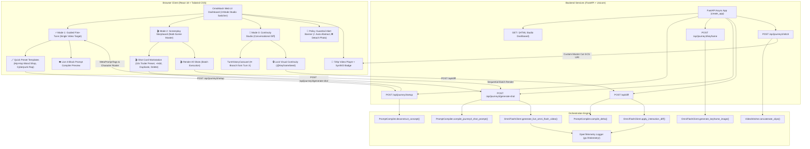

# Frontend UI & FastAPI Async API Topology

This document details the Next.js / React 18 single-page application and its connection to FastAPI's async concept deconstruction, generation endpoints, commit endpoints, and Journey 3 REST API endpoints (`src/omnimash/api/app.py`).

---

## 🖼️ Reference Architecture Diagram


---

## 🌐 Application Architecture


```mermaid
graph TD
    subgraph BrowserClient["Browser Client (React 18 + Tailwind CSS)"]
        UI["OmniMash Web UI Dashboard (3-Mode Studio Switcher)"]
        Mode1["⚡ Mode 1: Guided Fine-Tune (Single Video Target)"]
        Mode2["🎬 Mode 2: Screenplay Storyboard (Multi-Scene Master)"]
        Mode3["🚀 Mode 3: Continuity Studio (Conversational Diff)"]
        
        Presets1["🪄 Quick Preset Templates (Hip-Hop Wand Shop, Cyberpunk Rap)"]
        PreviewCard["👁️ Live 4-Block Prompt Compiler Preview"]
        ShotWorkstation["🎬 Shot Card Workstation (10s Trailer Preset, +Add, Duplicate, Delete)"]
        BatchBtn["🎬 Render All Shots (Batch Execution)"]
        Carousel3["TurnHistoryCarousel (⏪ Branch from Turn X)"]
        KeyframeLock["🔒 Lock Visual Continuity (<FIRST_FRAME>@KeyframeSeed)"]
        GuardBanner["🚨 Policy Guardrail Alert Banner (⚡ Auto-Abstract, ❌ Detach Photo)"]
        Player["🎥 720p Video Player + SynthID Badge"]

        UI --> Mode1
        UI --> Mode2
        UI --> Mode3
        
        Mode1 --> Presets1
        Mode1 --> PreviewCard
        Mode2 --> ShotWorkstation
        Mode2 --> BatchBtn
        Mode3 --> Carousel3
        Mode3 --> KeyframeLock
        UI --> GuardBanner
        UI --> Player
    end

    subgraph BackendServices["Backend Services (FastAPI + Uvicorn)"]
        Gateway["FastAPI Async App (create_app)"]
        EndpointSetup["POST /api/journey3/setup"]
        EndpointKeyframe["POST /api/journey3/keyframe"]
        EndpointGenerateShot["POST /api/journey3/generate-shot"]
        EndpointDiff["POST /api/diff"]
        EndpointStitch["POST /api/journey3/stitch"]
        EndpointRoot["GET / (HTML Studio Dashboard)"]
        
        Gateway --> EndpointRoot
        Gateway --> EndpointSetup
        Gateway --> EndpointKeyframe
        Gateway --> EndpointGenerateShot
        Gateway --> EndpointDiff
        Gateway --> EndpointStitch
    end

    subgraph OrchestrationEngine["Orchestration Engine"]
        EndpointSetup --> CompilerDeconstruct["PromptCompiler.deconstruct_concept()"]
        EndpointGenerateShot --> CompilerShot["PromptCompiler.compile_journey3_shot_prompt()"]
        EndpointDiff --> CompilerDelta["PromptCompiler.compile_delta()"]
        EndpointKeyframe --> OmniKeyframe["OmniFlashClient.generate_keyframe_image()"]
        EndpointGenerateShot --> OmniVideo["OmniFlashClient.generate_live_omni_flash_video()"]
        EndpointDiff --> OmniDiff["OmniFlashClient.apply_interaction_diff()"]
        EndpointStitch --> StitcherEngine["VideoStitcher.concatenate_clips()"]
        
        OmniVideo --> TelemetryLogger["OpenTelemetry Logger (gs://<bucket>/telemetry/)"]
        OmniDiff --> TelemetryLogger
    end

    Presets1 -->|POST /api/journey3/setup| EndpointSetup
    EndpointSetup -->|MetaPromptTags & Character Roster| Mode1
    
    ShotWorkstation -->|POST /api/journey3/generate-shot| EndpointGenerateShot
    BatchBtn -->|Sequential Batch Render| EndpointGenerateShot
    KeyframeLock -->|POST /api/diff| EndpointDiff
    EndpointStitch -->|Custom Master Cut GCS URI| Player
```

---

## 🔌 API Contracts

### `POST /api/journey3/setup`
Parses open-ended parody concept shorthand into structured Character Roles (`Role A`, `Role B`), aesthetic tags, environment settings, camera framing, audio beat, and character wardrobe.

**Request Payload:**
```json
{
  "concept": "Harry Potter vs Draco Malfoy rap battle in 2000s Atlanta trap style"
}
```

---

### `POST /api/journey3/generate-shot`
Generates a multi-character parody cut by compiling shot directives, character roles with attached reference image URLs, and `GEMINI_OMNI_FLASH_INSTR` 4-block meta-prompts.

**Request Payload (`Journey3ShotGenerateRequest`):**
```json
{
  "shot_number": 1,
  "action_directive": "Hero stance in rain with microphone wand",
  "title_card_text": "BLOCKBUSTER TRAILER",
  "title_card_subtitle": "IN THEATERS NOW",
  "narrator_text": "In a world where magic meets high-tech cybernetics...",
  "narrator_voice": "Deep Cinematic Announcer",
  "characters": [
    {
      "role_id": "Role A",
      "name": "Harry",
      "wardrobe": "Plaid Trench with Gold Chains",
      "reference_url": "https://storage.googleapis.com/omnimash-bucket/harry.jpg"
    }
  ]
}
```

---

### `POST /api/diff`
Applies conversational interaction diffs referencing baseline keyframes (`<FIRST_FRAME>@KeyframeSeed`) for visual continuity locking across turns.

---

### `POST /api/journey3/stitch`
Concatenates multi-shot storyboard clips into a single master MP4 export and saves to session-scoped GCS paths.
