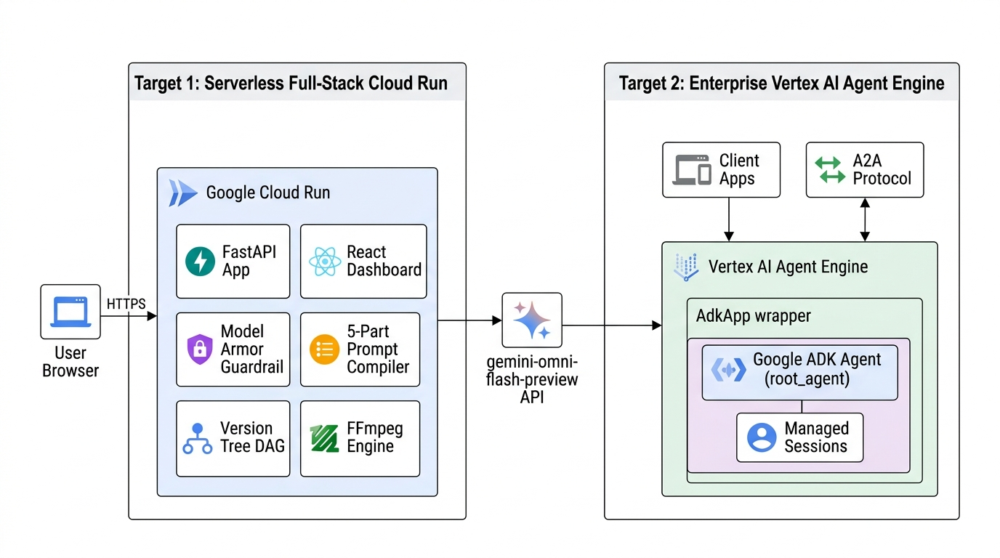
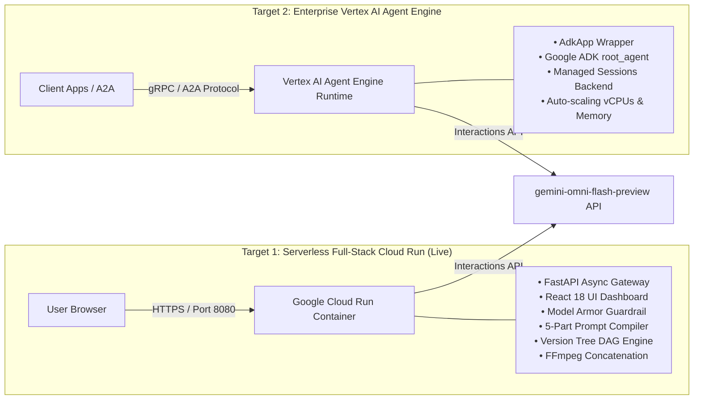

# Google Cloud Deployment Patterns

This document details the **Dual-Target Deployment Architecture** for **OmniMash** on Google Cloud Platform: Serverless Full-Stack Cloud Run vs. Enterprise Vertex AI Agent Engine.

---

## 🖼️ Reference Architecture Diagram



---

## 🏗️ Deployment Target Comparison

OmniMash supports two production-ready deployment targets on Google Cloud:



---

## 🚀 1. Target A: Serverless Full-Stack Cloud Run (Live)

**Best for:** End-user web applications, interactive dashboards, and standalone multi-clip video studios.

### Architecture & Capabilities:
- **Container Runtime:** Docker container built with `python:3.12-slim`, `uv`, and `ffmpeg`.
- **Embedded Web Dashboard:** Single-page Next.js / React 18 UI served directly on `/` with Tailwind CSS, live 5-Part Preview card, and Version DAG Timeline explorer.
- **REST & SSE Endpoints:** `POST /api/generate` and `POST /api/commit` with Server-Sent Events for streaming render progress.
- **Scaling:** Scales automatically to zero when idle, saving compute costs.

### Live Production Deployment:
- **Service URL:** [https://omnimash-934903580331.us-central1.run.app](https://omnimash-934903580331.us-central1.run.app)
- **Deploy Script:** `scripts/deploy_cloud_run.sh`

```bash
./scripts/deploy_cloud_run.sh
```

---

## 🏛️ 2. Target B: Enterprise Vertex AI Agent Engine

**Best for:** Multi-agent ecosystems, Agent-to-Agent (A2A) protocol communication, and enterprise backend agent workflows.

### Architecture & Capabilities:
- **Managed Agent Runtime:** Source-based deployment directly to Vertex AI Agent Engine (`projects/*/locations/*/reasoningEngines/*`).
- **Google ADK Binding:** Wrapped via `AdkApp(agent=root_agent)` in `scripts/deploy_agent_engine.py`.
- **Session Persistence:** Native `VertexAiSessionService` / Agent Engine sessions backend.
- **Multi-Agent Interop:** Connects with Remote A2A Agents across Google Cloud.

### Deploy Command:

```bash
python scripts/deploy_agent_engine.py
```
