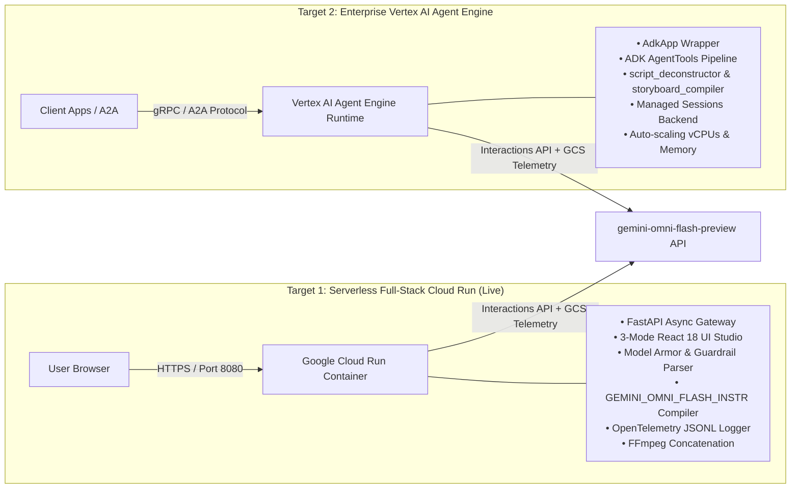

# Google Cloud Deployment Patterns

This document details the **Dual-Target Deployment Architecture** for **OmniMash** on Google Cloud Platform: Serverless Full-Stack Cloud Run vs. Enterprise Vertex AI Agent Engine.

---

## 🖼️ Reference Architecture Diagram

---

## 🏗️ Deployment Target Comparison

OmniMash supports two production-ready deployment targets on Google Cloud:

```mermaid
graph LR
    subgraph Target1["Target 1: Serverless Full-Stack Cloud Run (Live)"]
        Browser["User Browser"] -->|HTTPS / Port 8080| CloudRun["Google Cloud Run Container"]
        CloudRun --- Components["• FastAPI Async Gateway<br/>• 3-Mode React 18 UI Studio<br/>• Model Armor & Guardrail Parser<br/>• GEMINI_OMNI_FLASH_INSTR Compiler<br/>• OpenTelemetry JSONL Logger<br/>• FFmpeg Concatenation"]
    end

    subgraph Target2["Target 2: Enterprise Vertex AI Agent Engine"]
        Clients["Client Apps / A2A"] -->|gRPC / A2A Protocol| AgentEngine["Vertex AI Agent Engine Runtime"]
        AgentEngine --- ADKComponents["• AdkApp Wrapper<br/>• ADK AgentTools Pipeline<br/>• script_deconstructor & storyboard_compiler<br/>• Managed Sessions Backend<br/>• Auto-scaling vCPUs & Memory"]
    end

    CloudRun -->|Interactions API + GCS Telemetry| OmniFlash["gemini-omni-flash-preview API"]
    AgentEngine -->|Interactions API + GCS Telemetry| OmniFlash
```

---

## 🚀 1. Target A: Serverless Full-Stack Cloud Run (Live)

**Best for:** End-user web applications, interactive dashboards, and standalone multi-clip video studios.

### Architecture & Capabilities:
- **Container Runtime:** Docker container built with `python:3.12-slim`, `uv`, and `ffmpeg`.
- **Embedded Web Dashboard:** Single-page Next.js / React 18 UI served directly on `/` with Tailwind CSS, 3-Mode Studio Switcher (Guided, Storyboard, Continuity), 4-Block Live Prompt Preview, and Version DAG Explorer.
- **REST & SSE Endpoints:** `POST /api/journey3/generate-shot`, `POST /api/journey3/keyframe`, `POST /api/diff`, and `POST /api/journey3/stitch`.
- **Scaling:** Scales automatically to zero when idle, saving compute costs.

---

## 🏛️ 2. Target B: Enterprise Vertex AI Agent Engine

**Best for:** Multi-agent ecosystems, Agent-to-Agent (A2A) protocol communication, and enterprise backend agent workflows.

### Architecture & Capabilities:
- **Managed Agent Runtime:** Source-based deployment directly to Vertex AI Agent Engine (`projects/*/locations/*/reasoningEngines/*`).
- **Google ADK Subagent Tools:** Wrapped via `create_adk_agent_tool_pipeline()` in `src/omnimash/agent/adk_pipeline.py`, providing subagent tools (`script_deconstructor`, `storyboard_compiler`) for conversational AI director agents.
- **Session Persistence & Telemetry:** Native `VertexAiSessionService` / Agent Engine sessions backend integrated with OpenTelemetry GenAI semantic conventions v1.37.0+ (`OTEL_SEMCONV_STABILITY_OPT_IN='gen_ai_latest_experimental'`).
- **Multi-Agent Interop:** Connects with Remote A2A Agents across Google Cloud.
