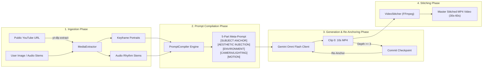

# Multimodal Reference Ingestion & Multi-Clip Video Stitching

This document outlines the 4-phase pipeline for ingesting external character lore, compiling 5-part Anchor & Inject meta-prompts, re-anchoring Omni Flash clips, and concatenating segments into a master 30–60s video.

---

## 🖼️ Reference Architecture Diagram

---

## 🎬 4-Phase Processing Pipeline Flow

---

## ⚙️ Pipeline Specifications

- **Reference Ingestion (`omnimash.ingestion.media_extractor`):**
  - Extract visual character keyframes for prompt lore anchoring.
  - Separate background instrumental and vocal stems to guide the audio tempo and style cadence.

- **Prompt Compiler (`omnimash.prompts.compiler`):**
  - Translates character lore into physical descriptors preventing latent space averaging.

- **FFmpeg Concatenation Engine (`omnimash.stitching.stitcher`):**
  - Collects active clips from the `ProjectSession` timeline.
  - Applies seamless video crossfades, audio beat-matching, and codec normalization (`libx264` + `aac` in 720p).
