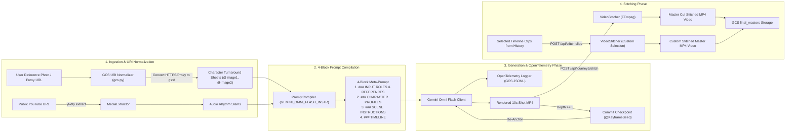

# Multimodal Reference Ingestion & Multi-Clip Video Stitching

This document outlines the 4-phase pipeline for ingesting external character lore, normalizing GCS/HTTPS storage URIs, compiling `GEMINI_OMNI_FLASH_INSTR` 4-block meta-prompts, re-anchoring Omni Flash clips, and concatenating segments into a master video.

---

## 🖼️ Reference Architecture Diagram

---

## 🎬 4-Phase Processing Pipeline Flow

```mermaid
graph LR
    subgraph IngestionPhase["1. Ingestion & URI Normalization"]
        YT["Public YouTube URL"] -->|yt-dlp extract| Extractor["MediaExtractor"]
        Uploads["User Reference Photo / Proxy URL"] --> Normalizer["GCS URI Normalizer (gcs.py)"]
        Normalizer -->|Convert HTTPS/Proxy to gs://| Keyframes["Character Turnaround Sheets (@Image1, @Image2)"]
        Extractor --> AudioStem["Audio Rhythm Stems"]
    end

    subgraph PromptCompilation["2. 4-Block Prompt Compilation"]
        Keyframes --> Compiler["PromptCompiler (GEMINI_OMNI_FLASH_INSTR)"]
        AudioStem --> Compiler
        Compiler --> FourBlocks["4-Block Meta-Prompt<br/>1. ### INPUT ROLES & REFERENCES<br/>2. ### CHARACTER PROFILES<br/>3. ### SCENE INSTRUCTIONS<br/>4. ### TIMELINE"]
    end

    subgraph GenerationReAnchoring["3. Generation & OpenTelemetry Phase"]
        FourBlocks --> Omni["Gemini Omni Flash Client"]
        Omni --> Telemetry["OpenTelemetry Logger (GCS JSONL)"]
        Omni --> Clip0["Rendered 10s Shot MP4"]
        Clip0 -->|"Depth >= 3"| Checkpoint["Commit Checkpoint (<FIRST_FRAME>@KeyframeSeed)"]
        Checkpoint -->|Re-Anchor| Omni
    end

    subgraph StitchingPhase["4. Stitching Phase"]
        Clip0 -->|"POST /api/journey3/stitch"| Stitcher["VideoStitcher (FFmpeg)"]
        HistoryClips["Selected Timeline Clips from History"] -->|"POST /api/stitch-clips"| CustomStitcher["VideoStitcher (Custom Selection)"]
        Stitcher --> Master["Master Cut Stitched MP4 Video"]
        CustomStitcher --> CustomMaster["Custom Stitched Master MP4 Video"]
        Master --> GCS["GCS final_masters Storage"]
        CustomMaster --> GCS
    end
```

---

## ⚙️ Pipeline Specifications

- **Reference Ingestion & GCS Normalization (`omnimash.storage.gcs` & `media_extractor`):**
  - Extract visual character keyframes and turnaround sheets for prompt lore anchoring.
  - Automatically decodes media proxy URLs (`/api/media-proxy?uri=...`) and normalizes `https://storage.googleapis.com/<bucket>/<blob>` into native `gs://` URIs inside `download_blob_bytes()`, guaranteeing binary PNG/JPEG image bytes are loaded into `genai.types.Part.from_bytes` objects without dropping character reference images (`@Image1`, `@Image2`).

- **Prompt Compiler (`omnimash.prompts.compiler`):**
  - Translates character lore into physical descriptors preventing latent space averaging.
  - Enforces `GEMINI_OMNI_FLASH_INSTR` 4-block meta-prompt structure (`INPUT ROLES & REFERENCES`, `CHARACTER PROFILES`, `SCENE INSTRUCTIONS`, `TIMELINE`).
  - Decouples starting keyframe seed anchors (`<FIRST_FRAME>@KeyframeSeed`) from character reference image tokens (`@Image1`, `@Image2`), preventing token collision.
  - Formats title cards (`- On-Screen Displayed Text / Title Card: "TITLE" (Subtitle: "SUBTITLE")`) and dual-layer audio ducking rules.

- **OpenTelemetry Multimodal Telemetry (`omnimash.engine.telemetry`):**
  - Exports structured `_input.jsonl` and `_output.jsonl` telemetry logs to GCS tracking prompt text, attached reference image URIs array, and model generation outputs.

- **FFmpeg Concatenation Engine & Custom Selection (`omnimash.stitching.stitcher` & `/api/journey3/stitch`):**
  - Collects active clips from the `ProjectSession` timeline or receives custom clip URL selections via `POST /api/stitch-clips`.
  - Applies seamless video crossfades, audio beat-matching, and codec normalization (`libx264` + `aac` in 720p with `aresample=async=1:first_pts=0` PTS frame locking).
  - Persists master exports to session-scoped GCS paths (`sessions/{session_id}/final_masters/{master_title}.mp4`).

