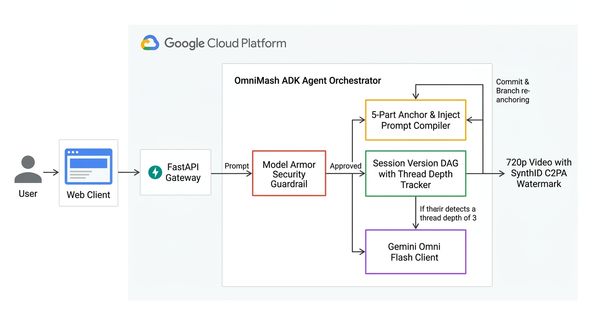
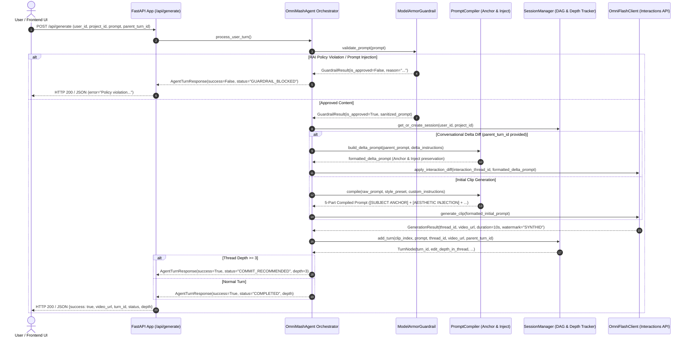

# Agent Orchestration Architecture

This document describes the orchestration loop, safety gateways, and prompt compiler subsystems powering the **OmniMash Agent** (`src/omnimash/agent/orchestrator.py`).

---

## 🖼️ Reference Architecture Diagram

---

## 🏗️ Architectural Topology & Sequence

---

## 🧩 Core Subsystem Responsibilities

1. **Model Armor Guardrail Gateway (`omnimash.security.guardrail`):**
   - Pre-gates all incoming prompts before executing expensive multimodal generation calls.
   - Screen for RAI violations (hate speech, sexual, harassment, dangerous content) and prompt injection/jailbreak attempts.

2. **5-Part Prompt Compiler (`omnimash.prompts.compiler`):**
   - Implements the "Anchor & Inject" framework to eliminate character decay and latent space averaging.
   - Formats user shorthand into `[SUBJECT ANCHOR] + [AESTHETIC INJECTION] + [ENVIRONMENT] + [CAMERA/LIGHTING] + [MOTION]`.

3. **Session Version DAG & Depth Tracker (`omnimash.state.session_manager`):**
   - Tracks `edit_depth_in_thread` across sequential turns.
   - Emits `COMMIT_RECOMMENDED` at depth $\ge 3$ and manages non-linear version branching.

4. **Gemini Omni Flash Interactions Client (`omnimash.engine.omni_client`):**
   - Integrates with `google-genai` SDK and Gemini Omni Flash.
   - Preserves thread continuity across turns using `interaction_thread_id`, supports `start_thread_from_video` on commits, and tags rendered video artifacts with SynthID / C2PA watermark provenance.
