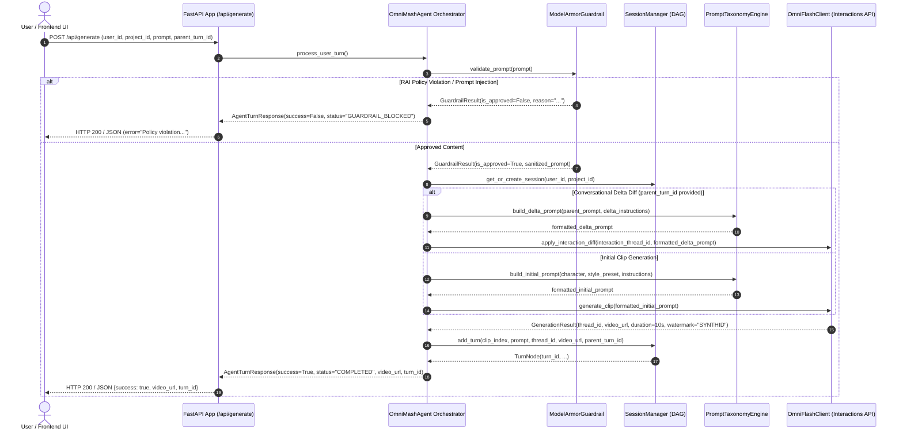

# Agent Orchestration Architecture

This document describes the orchestration loop and core subsystems powering the **OmniMash Agent** (`src/omnimash/agent/orchestrator.py`).

---

## 🖼️ Reference Architecture Diagram

---

## 🏗️ Architectural Topology & Sequence

---

## 🧩 Core Subsystem Responsibilities

1. **Model Armor Guardrail Gateway (`omnimash.security.guardrail`):**
   - Pre-gates all incoming prompts before executing expensive multimodal generation calls.
   - Screen for RAI violations (hate speech, sexual, harassment, dangerous content) and prompt injection/jailbreak attempts.

2. **Prompt Taxonomy Engine (`omnimash.prompts.taxonomy`):**
   - Applies style-blending heuristics across four core presets: `90s_rap_video`, `trap_disstrack`, `cyberpunk_drift`, and `vhs_anime`.
   - Structures lore anchors and scene constraints to preserve facial and lighting consistency across conversational diffs.

3. **Gemini Omni Flash Interactions Client (`omnimash.engine.omni_client`):**
   - Integrates with `google-genai` SDK and Gemini Omni Flash.
   - Preserves thread continuity across turns using `interaction_thread_id` and tags rendered video artifacts with SynthID / C2PA watermark provenance.
