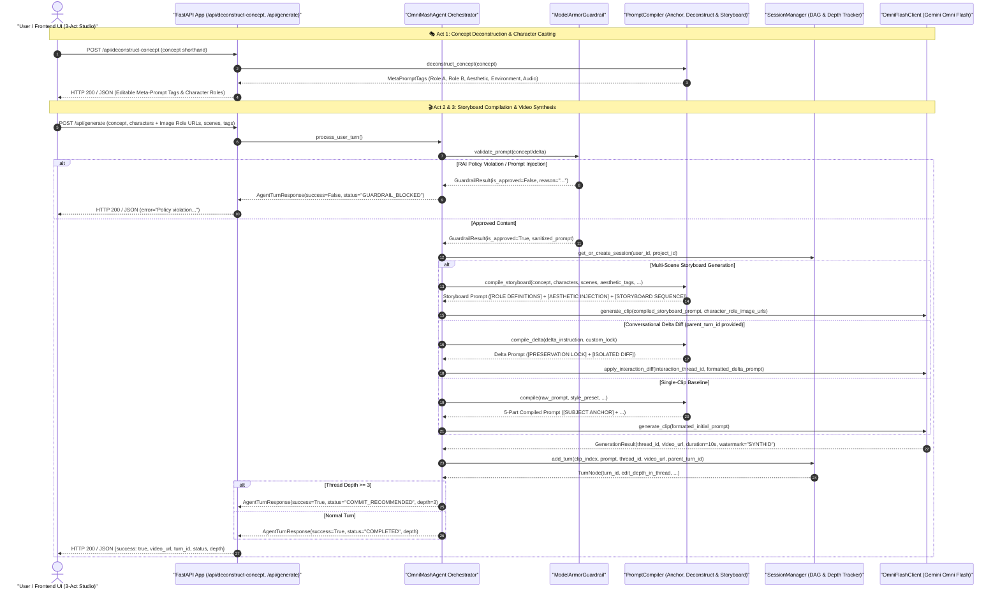

# Agent Orchestration Architecture

This document describes the orchestration loop, concept deconstruction engine, safety gateways, and prompt compiler subsystems powering the **OmniMash Agent** (`src/omnimash/agent/orchestrator.py`).

---

## 🖼️ Reference Architecture Diagram

---

## 🏗️ Architectural Topology & Sequence

---

## 🧩 Core Subsystem Responsibilities

1. **Model Armor Guardrail Gateway (`omnimash.security.guardrail`):**
   - Pre-gates all incoming prompts before executing expensive multimodal generation calls.
   - Screens for RAI violations (hate speech, sexual, harassment, dangerous content) and prompt injection/jailbreak attempts.

2. **Concept Deconstruction & Storyboard Prompt Compiler (`omnimash.prompts.compiler`):**
   - **NLP Concept Deconstruction (`deconstruct_concept`)**: Parses open-ended parody shorthand into structured `MetaPromptTags`, extracting character entities, aesthetic tags, environment settings, and audio beat tempo.
   - **Gemini Omni Image Roles Specification**: Defines `CharacterRole` bindings (`Role A`, `Role B`) with rich visual descriptions and attached reference image URLs ([Gemini Omni Image Roles API](https://ai.google.dev/gemini-api/docs/omni#set-image-roles)).
   - **Storyboard Sequence Compiler (`compile_storyboard`)**: Compiles multi-scene storyboards into three structured prompt blocks (`[ROLE DEFINITIONS]`, `[AESTHETIC INJECTION]`, and `[STORYBOARD SEQUENCE]`).
   - **Single-Clip & Delta Compilation**: Implements 5-part Anchor & Inject (`compile`) and 2-part Lock & Isolate (`compile_delta`).

3. **Session Version DAG & Depth Tracker (`omnimash.state.session_manager`):**
   - Tracks `edit_depth_in_thread` across sequential turns in a session tree.
   - Emits `COMMIT_RECOMMENDED` at depth $\ge 3$ and manages non-linear version branching.

4. **Gemini Omni Flash Interactions Client (`omnimash.engine.omni_client`):**
   - Integrates with Google GenAI SDK and Gemini Omni Flash (`gemini-omni-flash-preview`).
   - Generates 720p native MP4 video with synchronized audio and multi-character consistency.
   - Preserves thread continuity across turns using `interaction_thread_id`, supports `start_thread_from_video` on commits, and tags rendered video artifacts with SynthID / C2PA watermark provenance.
