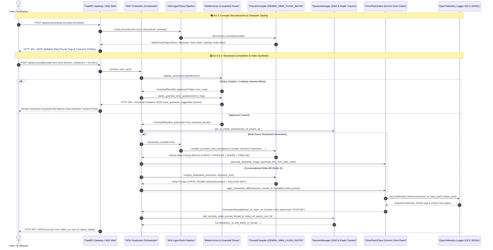

# Agent Orchestration Architecture

This document describes the orchestration loop, concept deconstruction engine, Google ADK subagent tools, safety gateways, OpenTelemetry telemetry logger, and `GEMINI_OMNI_FLASH_INSTR` 4-block prompt compiler powering the **OmniMash Agent** (`src/omnimash/agent/orchestrator.py` & `src/omnimash/agent/adk_pipeline.py`).

---

## 🖼️ Reference Architecture Diagram

---

## 🏗️ Architectural Topology & Sequence

```mermaid
sequenceDiagram
    autonumber
    actor User as "User / AI Director"
    participant API as "FastAPI Gateway / ADK Web"
    participant Orchestrator as "ADK Production Orchestrator"
    participant ADKTools as "ADK AgentTools Pipeline"
    participant Guard as "Model Armor & Guardrail Parser"
    participant Compiler as "PromptCompiler (GEMINI_OMNI_FLASH_INSTR)"
    participant Session as "SessionManager (DAG & Depth Tracker)"
    participant Omni as "OmniFlashClient (Gemini Omni Flash)"
    participant Telemetry as "OpenTelemetry Logger (GCS JSONL)"

    %% 1. Act 1: Script Deconstruction & Character Casting
    Note over User,Telemetry: 🎭 Act 1: Concept Deconstruction & Character Casting
    User->>API: POST /api/journey3/setup (concept shorthand)
    API->>ADKTools: script_deconstructor.run() / deconstruct_concept()
    ADKTools->>Compiler: deconstruct_concept(concept)
    Compiler-->>API: MetaPromptTags (Roles, Wardrobe, Voice Style, Lighting, Audio Beat)
    API-->>User: HTTP 200 / JSON (Editable Meta-Prompt Tags & Character Profiles)

    %% 2. Act 2/3: Multi-Character Storyboard & Video Synthesis
    Note over User,Telemetry: 🎬 Act 2 & 3: Storyboard Compilation & Video Synthesis
    User->>API: POST /api/journey3/generate-shot (shot directive, characters + ref URLs)
    API->>Orchestrator: process_user_turn()
    
    Orchestrator->>Guard: validate_prompt(concept/directive)
    alt Policy Violation / Celebrity Likeness Block
        Guard-->>Orchestrator: GuardrailResult(is_approved=False, error_msg)
        Orchestrator->>Guard: parse_guardrail_error_guidance(error_msg)
        Guard-->>API: HTTP 400 + Guardrail Guidance JSON (user_guidance, suggested_actions)
        API-->>User: Render Interactive Guardrail Alert Banner (Auto-Abstract / Detach Photo)
    else Approved Content
        Guard-->>Orchestrator: GuardrailResult(is_approved=True, sanitized_prompt)
        Orchestrator->>Session: get_or_create_session(user_id, project_id)
        
        alt Multi-Scene Storyboard Generation
            Orchestrator->>ADKTools: storyboard_compiler.run()
            ADKTools->>Compiler: compile_journey3_shot_prompt(shot_number, directive, characters, ...)
            Compiler-->>Orchestrator: 4-Block Meta-Prompt (ROLES & REFS + PROFILES + SCENE + TIMELINE)
            Orchestrator->>Omni: generate_keyframe_image / generate_live_omni_flash_video
        else Conversational Delta Diff (Mode 3)
            Orchestrator->>Compiler: compile_delta(delta_instruction, keyframe_lock)
            Compiler-->>Orchestrator: Delta Prompt (<FIRST_FRAME>@KeyframeSeed + ISOLATED DIFF)
            Orchestrator->>Omni: apply_interaction_diff(interaction_thread_id, formatted_delta_prompt)
        end
        
        Omni->>Telemetry: _log_multimodal_inference(session_id, input_jsonl, output_jsonl)
        Telemetry-->>Omni: Exported telemetry JSONL logs & Cloud Trace spans
        
        Omni-->>Orchestrator: GenerationResult(thread_id, video_url, duration=10s, watermark="SYNTHID")
        Orchestrator->>Session: add_turn(clip_index, prompt, thread_id, video_url, parent_turn_id)
        Session-->>Orchestrator: TurnNode(turn_id, edit_depth_in_thread, ...)
        
        API-->>User: HTTP 200 / JSON {success: true, video_url, turn_id, status, depth}
    end
```

---

## 🧩 Core Subsystem Responsibilities

1. **Google ADK Pipeline & Subagent Tools (`omnimash.agent.adk_pipeline`):**
   - **`script_deconstructor` (`Agent`)**: Analyzes scripts and concepts into structured scenes, active character roles, actions, dialogue beats, and audio cues.
   - **`storyboard_compiler` (`Agent`)**: Compiles deconstructed directives into `GEMINI_OMNI_FLASH_INSTR` 4-block meta-prompts.
   - **`create_adk_agent_tool_pipeline()`**: Wraps `script_deconstructor` and `storyboard_compiler` into ADK `AgentTool` instances, allowing autonomous AI director agents to converse, critique, draft, and execute workflows.
   - **`ParallelAgent` (`shot_execution_pipeline`)**: Executes concurrent shot execution worker rendering.

2. **`GEMINI_OMNI_FLASH_INSTR` 4-Block Prompt Compiler (`omnimash.prompts.compiler`):**
   - Enforces the 4-Block Anchor & Inject hierarchy:
     - **Block 1: `### INPUT ROLES & REFERENCES`**: Maps positional tags (`<IMAGE_REF_0>@Image1`, `<FIRST_FRAME>@KeyframeSeed`).
     - **Block 2: `### CHARACTER PROFILES`**: Defines visual descriptions, `[Wardrobe: ...]`, and `[Voice Style: ...]`.
     - **Block 3: `### SCENE INSTRUCTIONS`**: Specifies environment, lighting, continuous camera motion, title card overlays (`- On-Screen Displayed Text / Title Card: "TITLE" (Subtitle: "SUBTITLE")`), and dual-layer audio ducking.
     - **Block 4: `### TIMELINE`**: Chronological timecodes (`[0-3s]`, `[3-6s]`) with spoken character dialogue and offscreen narrator voiceovers.

3. **OpenTelemetry Telemetry Logger (`omnimash.engine.telemetry` & `omni_client`):**
   - Configured with `OTEL_SEMCONV_STABILITY_OPT_IN='gen_ai_latest_experimental'` and `OTEL_INSTRUMENTATION_GENAI_COMPLETION_HOOK='upload'`.
   - Uploads structured `_input.jsonl` and `_output.jsonl` telemetry logs to `gs://<bucket>/telemetry/` capturing system instructions, prompt text, reference image URIs, and generation metadata with Cloud Trace spans.

4. **Model Armor Guardrail & Error Guidance Parser (`omnimash.security.guardrail` & `omni_client`):**
   - Pre-gates incoming prompts for policy and injection safety.
   - Implements `parse_guardrail_error_guidance()` to inspect HTTP 400 policy blocks and generate interactive quick-fix action buttons (`⚡ Auto-Abstract Real Names`, `❌ Detach Reference Photo`) for the frontend UI.

