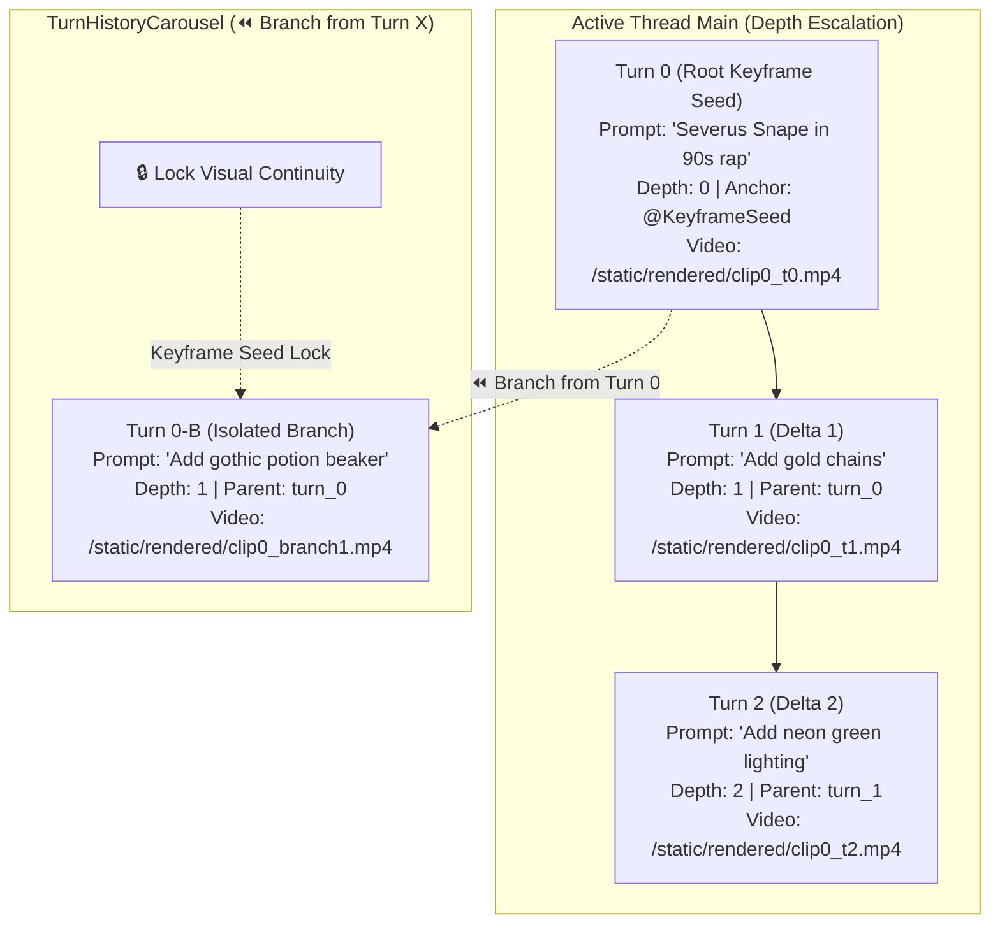

# Session Version Tree DAG & State Lifecycle

This document illustrates the non-linear version tree (DAG) structure, Mode 3 `TurnHistoryCarousel` visual branching (`⏪ Branch from Turn X`), and Keyframe Seed Anchor Locking (`🔒 Lock Visual Continuity`) that powers conversational video iteration in **OmniMash** (`src/omnimash/state/session_manager.py`).

---

## 🖼️ Reference Architecture Diagram

---

## 🌳 Version Tree DAG & Thread Depth Lifecycle

To prevent context decay in the multimodal latent space after sequential edits, OmniMash combines non-linear version branching with **Keyframe Seed Anchoring** (`<FIRST_FRAME>@KeyframeSeed`):

---

## 💾 State Model Data Structures

1. **`TurnNode`:** Immutable record of a single generation step:
   - `turn_id`: UUID4 string identifier.
   - `parent_turn_id`: UUID4 pointer to the parent turn in the version DAG.
   - `clip_index`: Target position in the multi-clip sequence.
   - `prompt`: Sanitized prompt instruction.
   - `interaction_thread_id`: Gemini Omni Flash session handle.
   - `video_url`: Output 720p `.mp4` artifact URI.
   - `edit_depth_in_thread`: Sequential turn counter within the active thread.
   - `is_committed`: Boolean checkpoint indicator.
   - `base_video_anchor_url`: URI of base video input if re-anchored.

2. **`TurnHistoryCarousel` (Mode 3 UI Component):**
   - Displays interactive history cards for all turns (`Turn 0`, `Turn 1`, `Turn 2`).
   - Renders 1-click **`⏪ Branch from Turn X`** controls to spawn clean side-branches without losing main timeline state.

3. **`KeyframeSeedLock` (`<FIRST_FRAME>@KeyframeSeed`):**
   - Decouples starting keyframe seed anchors from character reference image tokens (`@Image1`, `@Image2`).
   - Toggles visual continuity locking across conversational diff turns.

