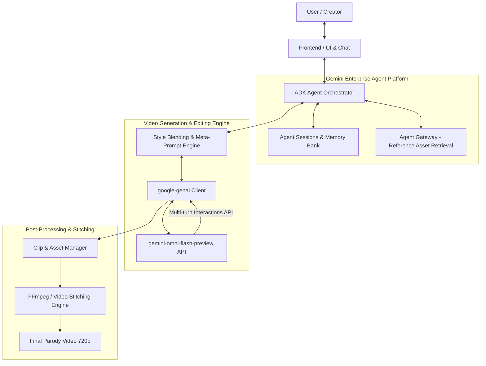

# OmniMash Reference Architecture & System Design Notes

## 🎯 Project Overview
**OmniMash** is a Python application built on Google Cloud's **Gemini Enterprise Agent Platform** and the **`gemini-omni-flash-preview`** multimodal model. It enables users to generate and iteratively edit AI parody and mashup videos (e.g., "Dripwarts" — blending Harry Potter lore with 90s rap/trap aesthetics and character disstracks).

---

## 🏗️ Reference Architecture

---

## 🧩 Core Technical Components

### 1. Agent Reasoning & State (Google ADK & Enterprise Platform)
- **ADK Agent Loop**: Orchestrates intent classification (Concept Ingestion, Style Blending, Clip Extension, Conversational Refinement).
- **Agent Sessions & Memory Bank**: Persists conversation history, active Interaction IDs from `gemini-omni-flash-preview`, visual anchor seeds, and storyboard beat sheets.
- **Agent Gateway**: Interfaces with external media sources or image/audio retrieval if the user provides external reference images or beat stems.

### 2. Multimodal Generation & Conversational Editing (`google-genai`)
- **Model**: `gemini-omni-flash-preview` (unified multimodal space for text, image, audio, and video).
- **Interactions API**: Enables conversational delta edits (e.g., "turn the robe into a leather bomber jacket", "add a trap beat drop") without regenerating the clip from scratch.
- **Constraints**: 720p resolution, max 10 seconds per native clip generation.

### 3. Style-Blending Prompt Taxonomy
- **Character / Lore Anchors**: Fixed facial/costume cues to maintain recognizable character identity (e.g., Snape's hair + signature scowl).
- **Style Inversion**: Target genre aesthetics (e.g., 90s fisheye lens, VHS tracking distortion, gold chains, boom-bap/trap audio).
- **Lyrical / Audio Synchronization**: Parody bars/script aligned with character cadence.

### 4. Sequencing & Multi-Clip Stitching
- **Beat-Sheet Breakdown**: For videos exceeding 10s, breaks the script into 5–10s storyboard chunks.
- **Anchor Frame Continuity**: Feeds the last frame of Clip N into Clip N+1 as a visual conditioning input.
- **Stitching**: Local FFmpeg processing to concatenate clips and normalize audio tracks.
