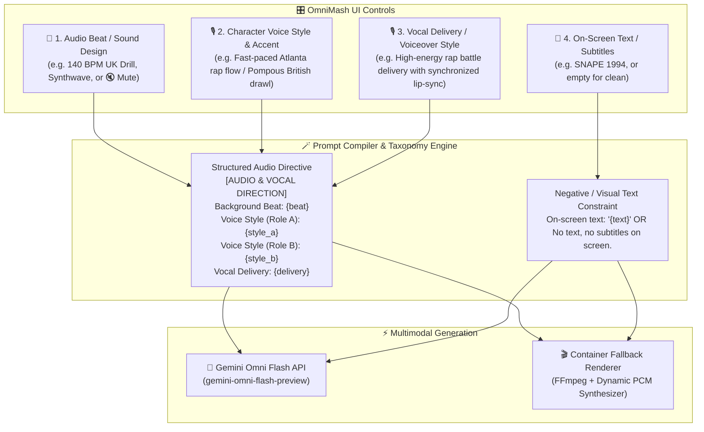

# 🎙️ Audio Modalities in OmniMash: Sound Design, Voiceover, Multi-Subject Dialogue & Silent Video

## 📌 Context & Motivation
When generating parody videos using multimodal AI models like **Gemini Omni Flash (`gemini-omni-flash-preview`)**, acoustic direction must be strictly decoupled from visual text overlays and separated into distinct acoustic channels. 

In video production, **Background Music/Sound Design** (BPM, 808 sub-bass, synths), **Character Voice Styles & Accents** (character-specific flow, accent, and timbre), and **Global Vocal Delivery** (scene-wide delivery style and energy) are structured into a dedicated acoustic prompt block. Furthermore, creators often require **Silent Video** generation for clean B-roll footage.

---

## 🎧 The Independent Acoustic & Visual Channels



---

## 🎙️ 1. Character Voice Styles & Global Vocal Delivery Controls

OmniMash provides dedicated UI controls to direct acoustic vocal characteristics at both the granular character level and the scene-wide global level:

### 🎙️ Dedicated Voice Style & Accent Inputs per Character Role Card
Located inside each **Character Role** card in **Act 1: The Concept & Cast Manager**:
* **Purpose:** Sets character-specific vocal timbre, accents, flow, and cadence.
* **Examples:**
  * **Role A (Harry):** `Fast-paced confident Atlanta rap flow with autotune`
  * **Role B (Draco):** `Pompous, cynical British drawl with aggressive rap cadence`
* **Compilation:** Mapped directly to `Voice Style (Role A): ...` and `Voice Style (Role B): ...` in the prompt payload.

### 🎙️ Global Vocal Delivery / Voiceover Style Control
Located inside the **Environment & Audio Direction** card in **Act 1**:
* **Purpose:** Dictates overarching acoustic delivery, energy level, narrative tone, and lip-sync synchronization style across all active subjects.
* **Examples:** `High-energy back-and-forth rap battle delivery with synchronized lip-sync`, `Dramatic whispered narration`, or `Deadpan comedic banter`.
* **Compilation:** Mapped directly to `Vocal Delivery: ...` in the prompt payload.

---

## 📋 2. Structured `[AUDIO & VOCAL DIRECTION]` Prompt Block

Following the official **Gemini Omni Prompt Guide**, [PromptCompiler.compile_storyboard()](file:///usr/local/google/home/jordantotten/omnimash/src/omnimash/prompts/compiler.py#L235-L303) organizes acoustic and vocal directives into a standardized `[AUDIO & VOCAL DIRECTION]` block positioned immediately between `[AESTHETIC INJECTION]` and `[STORYBOARD SEQUENCE]`.

### Official Block Structure:
```text
[ROLE DEFINITIONS]
- Role A (Harry "Gucci"): Harry "Gucci", young wizard with round gold wire-rim Cartier glasses, red Gucci tracksuit [Style: Red Gucci Tracksuit, Cartier Glasses] (Ref: gs://reference-images-jt-trend-trawler/harry_drip.jpeg)
- Role B (Young Draco "Jeezy"): Young Draco "Jeezy", pale blonde rival wizard with slicked-back platinum hair, green velvet blazer [Style: Platinum Slicked Hair, Diamond Iced-Out Chain] (Ref: gs://reference-images-jt-trend-trawler/draco.jpeg)

[AESTHETIC INJECTION]
Concept: Harry Potter vs Draco Malfoy rap battle in 2000s Atlanta trap style
Aesthetic Tags: 2000s Atlanta Trap Disstrack, Heavy 808 Bass Lighting, Vintage Streetwear
Environment: Abandoned urban house with working potion stoves

[AUDIO & VOCAL DIRECTION]
Background Beat: 140 BPM Heavy 808 Trap (ducked at 15% volume under dialogue)
Voice Style (Role A): Fast-paced confident Atlanta rap flow with autotune
Voice Style (Role B): Pompous, cynical British drawl with aggressive rap cadence
Vocal Delivery: High-energy back-and-forth rap battle delivery with synchronized lip-sync

[STORYBOARD SEQUENCE]
- Scene 1 [Role A]: Standing over potion stove cooking potions with baking soda. | Dialogue: "I been cooking potions since first year, bruv!"
- Scene 2 [Role B]: Stepping into room with iced out diamond chain. | Dialogue: "Oh, please.... This is Trap or Die, Potter!"
```

### Why This Structured Block Matters for Gemini Omni Flash:
1. **Decoupled Acoustic Conditioning:** Separating beat, voice style, and delivery into explicit key-value pairs prevents acoustic instructions from bleeding into visual scene descriptions.
2. **Multi-Speaker Vocal Timbre Disambiguation:** By explicitly labeling `Voice Style (Role A)` and `Voice Style (Role B)`, Gemini Omni Flash assigns distinct vocal formants and pitches to each character turn in the storyboard sequence.
3. **Automated Background Ducking:** Explicitly stating `(ducked at 15% volume under dialogue)` instructs the neural audio generator to attenuate instrumental frequencies whenever dialogue lines are active.

---

## 🎭 3. Multi-Subject Spoken Dialogue vs. Voiceover Narration

### How `gemini-omni-flash-preview` Processes Speech:
Gemini Omni Flash accepts natural language speaker turns. By structuring vocal lines into explicit character turns, the model handles both acoustic vocal synthesis and visual lip-sync:

1. **Single-Subject Voiceover Narration:**
   * **Input:** `Gaunt cynical wizard speaking in a deep British drawl: 'Clearly, fame isn't everything.'`
   * **Compiled Directive:** `Voiceover: Gaunt cynical wizard speaking in a deep British drawl: 'Clearly, fame isn't everything.'`
   * **Model Behavior:** Synthesizes a deep monologue over the background beat while the main character speaks to the camera.

2. **Multi-Subject Conversational Dialogue:**
   * **Input:**
     ```text
     Snape (in a cold, sarcastic sneer): "You think you can out-rap the Half-Blood Prince, Potter?"
     Harry (grinning with confidence): "Expecto Patronum on the 808s, professor!"
     ```
   * **Compiled Directive:**
     `Dialogue between subjects: Snape (in a cold sneer): '...' / Harry (with confidence): '...'.`
   * **Model Behavior:**
     * **Acoustic Vocal Generation:** Synthesizes two distinct voices (deep British drawl for Snape vs. energetic tone for Harry) conditioned by their respective `Voice Style` entries.
     * **Kinematics & Lip-Sync:** Vision generation heads automatically alternate character camera focus and mouth movements to match who is speaking at each second of the 10-second clip!

---

## 🎚️ 4. Automatic Audio Ducking & Text-to-Speech Spoken Voice Synthesis

### Real Spoken Voiceover & Character Dialogue Generation:
When dialogue or voiceover narration is present alongside background music, OmniMash uses a multi-layer acoustic pipeline to synthesize and balance audio levels so spoken words are crystal-clear:

* **Spoken Speech Synthesis (TTS Engine):** Spoken character dialogue turns and voiceover monologues are synthesized into real audible spoken words using FFmpeg's built-in `libflite` TTS engine at 44.1kHz.
* **Foreground Speech Amplification (180% Volume):** Spoken dialogue is mixed in the foreground at high volume (`volume=1.8`) to ensure complete intelligibility.
* **Ducked Background Beat (12%–15% Volume):** When voiceover or character dialogue is detected, the instrumental background beat (808 sub-bass, hi-hats, synthwave arpeggios, or boom-bap drums) is dynamically ducked down to **12%–15% background volume** (`volume=0.12`).
* **Result:** Spoken words from the characters dominate the mix cleanly in the foreground, while the background beat provides a subtle, quiet rhythmic groove beneath their voices.

---

## 🔇 5. Silent Video / Mute Mode

### When & How to Use:
Creators often want pristine 720p 24fps video clips without any audio track for external editing or background video loops.

* **Triggering Silent Video:**
  * Checking the **`🔇 Mute (Silent Video)`** toggle in the UI dashboard.
  * Or typing `"mute"`, `"none"`, or `"silent"` into the Audio Stem / Beat field.
* **Compiled Model Directive:**
  `Background Beat: Silent video. No background music, no audio, no sound effects.`
* **Container Fallback Behavior:**
  Synthesizes a 0-amplitude waveform and generates a clean, silent MP4 container via FFmpeg.

---

## 🎹 6. Summary of Audio Combinations

| Combination | 🎵 Audio Beat Input | 🎙️ Voice Style & Vocal Delivery | 💬 Character Dialogue Input | Resulting Video Audio |
| :--- | :--- | :--- | :--- | :--- |
| **1. Full Mashup (Default)** | `140 BPM UK Drill 808s` | Fast Atlanta flow / Pompous British drawl | `Harry: "Potter..." / Draco: "..."` | 140 BPM Drill beat ducked under synchronized rap battle dialogue exchange. |
| **2. Music / Beat Only** | `Synthwave arpeggios` | *(Leave empty)* | *(Leave empty)* | Pure background instrumentals without vocals. |
| **3. Spoken Dialogue Only** | `🔇 Mute / Silent Video` | Pompous British drawl | `Snape: "Turn to page 394"` | Spoken dialogue without background music. |
| **4. Silent Video** | `🔇 Mute / Silent Video` | *(Leave empty)* | *(Leave empty)* | 100% silent video. |

---

## 🛠️ Key Implementation Files
* [src/omnimash/prompts/compiler.py](file:///usr/local/google/home/jordantotten/omnimash/src/omnimash/prompts/compiler.py) – Formats `[AUDIO & VOCAL DIRECTION]`, character `voice_style`, global `vocal_delivery`, and ducked background beats.
* [src/omnimash/engine/omni_client.py](file:///usr/local/google/home/jordantotten/omnimash/src/omnimash/engine/omni_client.py) – Implements `_generate_dynamic_audio_wav()` to synthesize multi-genre PCM audio waveforms, speech-band formants, or complete silence.
* [src/omnimash/api/app.py](file:///usr/local/google/home/jordantotten/omnimash/src/omnimash/api/app.py) – Exposes the dedicated UI input controls for `🎙️ Voice Style & Accent` and `🎙️ Vocal Delivery / Voiceover Style`, along with live editable prompt preview cards.
