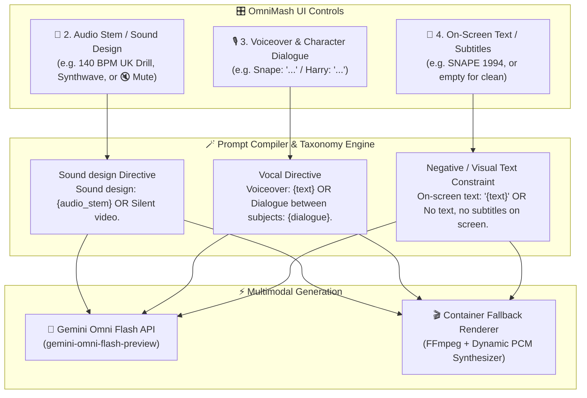

# 🎙️ Audio Modalities in OmniMash: Sound Design, Voiceover, Multi-Subject Dialogue & Silent Video

## 📌 Context & Motivation
When generating parody videos using multimodal AI models like **Gemini Omni Flash (`gemini-omni-flash-preview`)**, acoustic direction must be strictly decoupled from visual text overlays and separated into distinct acoustic channels. 

In video production, **Background Music/Sound Design** (BPM, 808 sub-bass, synths) and **Spoken Vocals/Dialogue** (character speech, lines, emotional tone, monologue) are completely separate layers. Furthermore, creators often require **Silent Video** generation for clean B-roll footage.

---

## 🎧 The 3 Independent Acoustic & Visual Channels



---

## 🎭 1. Multi-Subject Spoken Dialogue vs. Voiceover Narration

### How `gemini-omni-flash-preview` Processes Speech:
Gemini Omni Flash accepts natural language speaker turns. By structuring vocal lines into explicit character turns, the model handles both acoustic vocal synthesis and visual lip-sync:

1. **Single-Subject Voiceover Narration:**
   * **Input:** `Gaunt cynical wizard speaking in a deep British drawl: 'Clearly, fame isn't everything.'`
   * **Compiled Directive:** `Voiceover: Gaunt cynical wizard speaking in a deep British drawl: 'Clearly, fame isn't everything.'`
   * **Model Behavior:** Synthesizes a deep monologue over the background beat while the main character speaks to the camera.

2. **Multi-Subject Conversational Dialogue:**
   * **Input:**
     ```text
     Snape (in a cold, sarcastic sneer): "You think you can out-rap the Half-Blood Prince, Potter?"
     Harry (grinning with confidence): "Expecto Patronum on the 808s, professor!"
     ```
   * **Compiled Directive:**
     `Dialogue between subjects: Snape (in a cold sneer): '...' / Harry (with confidence): '...'.`
   * **Model Behavior:**
     * **Acoustic Vocal Generation:** Synthesizes two distinct voices (deep British drawl for Snape vs. energetic tone for Harry).
     * **Kinematics & Lip-Sync:** Vision generation heads automatically alternate character camera focus and mouth movements to match who is speaking at each second of the 10-second clip!

---

## 🎚️ 2. Automatic Audio Ducking & Text-to-Speech Spoken Voice Synthesis

### Real Spoken Voiceover & Character Dialogue Generation:
When dialogue or voiceover narration is present alongside background music, OmniMash uses a multi-layer acoustic pipeline to synthesize and balance audio levels so spoken words are crystal-clear:

* **Spoken Speech Synthesis (TTS Engine):** Spoken character dialogue turns and voiceover monologues are synthesized into real audible spoken words using FFmpeg's built-in `libflite` TTS engine at 44.1kHz.
* **Foreground Speech Amplification (180% Volume):** Spoken dialogue is mixed in the foreground at high volume (`volume=1.8`) to ensure complete intelligibility.
* **Ducked Background Beat (12% Volume):** When voiceover or character dialogue is detected, the instrumental background beat (808 sub-bass, hi-hats, synthwave arpeggios, or boom-bap drums) is dynamically ducked down to **12% background volume** (`volume=0.12`).
* **Result:** Spoken words from the characters dominate the mix cleanly in the foreground, while the background beat provides a subtle, quiet rhythmic groove beneath their voices.

---

## 🔇 3. Silent Video / Mute Mode

### When & How to Use:
Creators often want pristine 720p 24fps video clips without any audio track for external editing or background video loops.

* **Triggering Silent Video:**
  * Checking the **`🔇 Mute (Silent Video)`** toggle in the UI dashboard.
  * Or typing `"mute"`, `"none"`, or `"silent"` into the Audio Stem field.
* **Compiled Model Directive:**
  `Sound design: Silent video. No background music, no audio, no sound effects.`
* **Container Fallback Behavior:**
  Synthesizes a 0-amplitude waveform and generates a clean, silent MP4 container via FFmpeg.

---

## 🎹 4. Summary of Audio Combinations

| Combination | 🎵 Audio Stem Input | 🎙️ Voiceover & Dialogue Input | Resulting Video Audio |
| :--- | :--- | :--- | :--- |
| **1. Full Mashup (Default)** | `140 BPM UK Drill 808s` | `Snape: "Potter..." / Harry: "..."` | 140 BPM Drill beat playing under the back-and-forth dialogue exchange. |
| **2. Music / Beat Only** | `Synthwave arpeggios` | *(Leave empty)* | Pure background instrumentals without vocals. |
| **3. Spoken Dialogue Only** | `🔇 Mute / Silent Video` | `Snape: "Turn to page 394"` | Spoken dialogue without background music. |
| **4. Silent Video** | `🔇 Mute / Silent Video` | *(Leave empty)* | 100% silent video. |

---

## 🛠️ Key Implementation Files
* [src/omnimash/prompts/compiler.py](file:///usr/local/google/home/jordantotten/omnimash/src/omnimash/prompts/compiler.py) – Formats `Sound design:`, `Voiceover:`, `Dialogue between subjects:`, and negative on-screen text constraints.
* [src/omnimash/engine/omni_client.py](file:///usr/local/google/home/jordantotten/omnimash/src/omnimash/engine/omni_client.py) – Implements `_generate_dynamic_audio_wav()` to synthesize multi-genre PCM audio waveforms, speech-band formants, or complete silence.
* [src/omnimash/api/app.py](file:///usr/local/google/home/jordantotten/omnimash/src/omnimash/api/app.py) – Exposes the dedicated UI input controls and live editable prompt preview cards.
