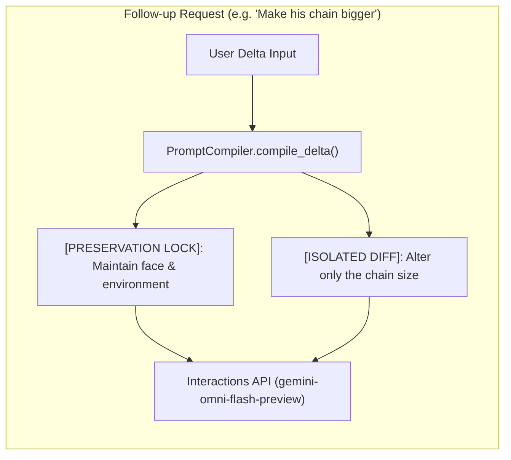

# Delta Prompting: The "Lock & Isolate" Framework

This note documents the solution to **Facial Likeness Drift & Over-Correction** during multi-turn conversational edits with `gemini-omni-flash-preview` via the Interactions API.

---

## 🔬 Problem: Over-Correction on Multi-Turn Full Prompts

When a user requests a subtle tweak (e.g. *"make his chain bigger"* or *"change the lighting to neon green"*), resubmitting the entire massive prompt from Turn 1 causes Omni Flash's multimodal latent space to over-correct. Re-evaluating the entire prompt taxonomy often leads to:
1. Facial identity shifting (loss of character likeness).
2. Unintended changes to background environment and camera angle.
3. Audio tempo or style desynchronization.

---

## 💡 Solution: The 2-Part "Lock & Isolate" Minimal Diff Taxonomy

Instead of passing the full initial prompt, the **Prompt Compiler** intercepts follow-up turns and formats them into a strict 2-part minimal delta prompt:

```text
Delta Prompt = [PRESERVATION LOCK] + [ISOLATED DIFF]
```

### [1] Acknowledge the Lock (Preservation Anchor)
Explicitly start the delta prompt by instructing the model what NOT to change.
* *Structure:* `[PRESERVATION LOCK]: Maintain exact character facial structure, identity, expression, wardrobe baseline, and background environment from the previous turn.`

### [2] Isolate the Variable (Isolated Diff Target)
Specify only the precise element being altered.
* *Structure:* `[ISOLATED DIFF]: Alter only the specified element: {delta_instruction}. Do not modify any surrounding visual features.`

---

## 🏗️ Pipeline Flow


