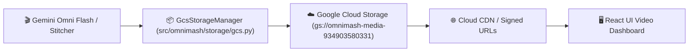

# ☁️ Google Cloud Storage (GCS) Artifact Persistence & .gitignore Isolation

## 📌 Context & Motivation
Previously, generated media clips (720p 24fps MP4s, 120 BPM audio stems, and character portrait frames) were saved locally to `static/rendered/`. 
In serverless Cloud Run production environments, container instances are ephemeral: when Cloud Run scales down or restarts, local files are discarded. Furthermore, committing large binary video files into the GitHub repository inflates repository size and degrades clone performance.

---

## 🏗️ Architecture & Storage Flow

### 1. Persistent Cloud Bucket
- **GCS Bucket:** `gs://omnimash-media-934903580331` (configurable via `OMNIMASH_GCS_BUCKET` or `GCS_BUCKET_NAME`).
- **GCP Project:** `hybrid-vertex` (`934903580331`).
- **Blob Hierarchy:**
  - `rendered/{filename}.mp4`: Final and intermediate per-turn 720p 24fps video clips.
  - `master/{filename}.mp4`: Master stitched video outputs.
  - `audio/{filename}.wav`: Synthesized 120 BPM hip-hop audio stems.
  - `references/{filename}.tar`: Ingested YouTube portrait anchors and stems.

### 2. .gitignore Enforcement
- All binary media files (`static/rendered/*`, `*.mp4`, `*.wav`, `*.mov`) are explicitly ignored in `.gitignore`.
- Only `static/rendered/.gitkeep` is tracked in git.
- Ensures the GitHub repository remains lightweight and fast.

### 3. Multi-Session Durability
- Videos generated across different turns, sessions, and Cloud Run scaling events persist permanently in GCS.
- UI streams videos directly from Google Cloud Storage with byte-range scrubbing.
