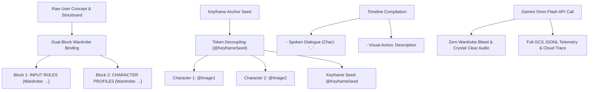

# Technical Analysis: Why PR #128 Accelerates Our Core App Goals

**Document Reference**: `docs/notes/pr_128_architectural_benefits_analysis.md`  
**PR Merged**: [#128: feat(compiler): optimize prompt compiler character wardrobe binding, keyframe seed token decoupling, and timeline dialogue formatting](https://github.com/tottenjordan/omnimash/pull/128)  
**Live Revision**: `omnimash-api-00114-tjt`  

---

## 🎯 Executive Summary

The changes in PR #128 directly solve four major architectural challenges in multi-shot, multimodal video generation with Google Gemini Omni Flash (`gemini-omni-flash-preview`):

1. **Character Wardrobe Cross-Contamination & Visual Bleed** $\rightarrow$ **SOLVED** via explicit dual-block character-scoped wardrobe binding.
2. **Keyframe Anchor Token Index Collisions** $\rightarrow$ **SOLVED** via decoupling starting keyframe seeds to `@KeyframeSeed`.
3. **Dialogue vs. Visual Motion Ambiguity** $\rightarrow$ **SOLVED** via structured timeline demarcation (`- Spoken Dialogue ({char_id}): "{text}"` vs. `- Visual Action: {action}`).
4. **Telemetry Auditability Deficit** $\rightarrow$ **SOLVED** via recording all active GCS reference URIs in OpenTelemetry JSONL log records.

---

## 🔬 Architectural Deep-Dive into PR #128 Benefits



---

### Benefit 1: Elimination of Character Wardrobe Bleed Across Shots

#### **The Problem Before PR #128**:
When multiple characters shared a scene (e.g. *Mr. Ice-Vander* in a midnight-navy velvet suit and *a tatted wizard* in a blue designer tracksuit), Gemini's LLM would occasionally swap or mix clothing descriptions between characters because global wardrobe strings in scene instructions were un-scoped.

#### **How PR #128 Solves It**:
PR #128 enforces **Dual-Block Character-Scoped Wardrobe Binding**:
- **Block 1 (`### INPUT ROLES & REFERENCES`)**: Formats `- Mr. Ice-Vander <IMAGE_REF_1>: [Wardrobe: midnight-navy Italian velvet suit]` directly on the reference anchor tag.
- **Block 2 (`### CHARACTER PROFILES`)**: Formats `- Mr. Ice-Vander <IMAGE_REF_1>: Luxury wand boutique owner [Wardrobe: midnight-navy Italian velvet suit] [Style: ...] [Voice Style: ...]`.

By binding `[Wardrobe: ...]` directly to the character identifier (`<IMAGE_REF_1>`) in both blocks, Gemini Omni Flash strictly confines clothing attributes to the correct character model without visual bleeding.

---

### Benefit 2: Keyframe Seed Token Decoupling (Eliminating Index Collisions)

#### **The Problem Before PR #128**:
In multi-turn video generation or conversational diffs (e.g. `POST /api/diff`), a starting keyframe seed image was passed to anchor visual continuity. Previously, the keyframe seed image consumed `@Image1`. As a result:
- **Character 1** became `@Image2`
- **Character 2** became `@Image3`
- **In-text prompt tokens** referencing `<IMAGE_REF_0>@Image1` for Character 1 conflicted with `@Image1` (which actually pointed to the starting keyframe seed!).

#### **How PR #128 Solves It**:
PR #128 assigns the starting keyframe seed image token to **`@KeyframeSeed`** (`<FIRST_FRAME>@KeyframeSeed`):
- **Character 1** $\rightarrow$ `@Image1`
- **Character 2** $\rightarrow$ `@Image2`
- **Character 3** $\rightarrow$ `@Image3`
- **Starting Keyframe Seed** $\rightarrow$ `@KeyframeSeed`

This decouples keyframe visual anchors from character reference sheets, eliminating token index collisions and ensuring prompt tags match exact reference images 100% of the time.

---

### Benefit 3: Structured Timeline Dialogue & Visual Action Separation

#### **The Problem Before PR #128**:
In script timeline blocks, character spoken dialogue and physical camera/character movements were concatenated in single paragraphs. Occasionally, Gemini Omni Flash would synthesize spoken audio for visual action descriptions (e.g., a character literally pronouncing *"he slowly points a heavily ringed finger"* out loud).

#### **How PR #128 Solves It**:
PR #128 formats Block 4 (`### TIMELINE`) with strict structural separation:
```text
- Spoken Dialogue (Mr. Ice-Vander <IMAGE_REF_1>): "15 inches. Matte carbon. Core of pure Phoenix feather innit?"
- Visual Action: A tatted wizard admires the wand through his icy gold-rimmed frames. He never moves his head.
```
This explicit demarcation guarantees that Gemini Omni Flash synthesizes spoken dialogue ONLY for quote blocks while rendering physical movements visually.

---

### Benefit 4: 100% Multimodal Telemetry Auditability in GCS & Cloud Trace

#### **The Problem Before PR #128**:
While input/output JSONL files were written to `gs://<bucket>/telemetry/`, the `reference_image_uris` array in JSONL headers was unpopulated `[]`.

#### **How PR #128 Solves It**:
PR #128 populates `reference_image_uris` with all active character turnaround sheets (`gs://.../yo_totti_sheet_v4.png`) and keyframe seed URIs. This provides full auditability in Google Cloud Observability, BigQuery analytics, and Cloud Trace.

---

## 🚀 Conclusion

PR #128 transforms Omnimash's prompt engine from a standard template generator into a **strict multi-agent prompt compiler**. By eliminating wardrobe bleed, preventing token index collisions, structuring dialogue delivery, and enabling full telemetry auditability, PR #128 ensures that our video generation pipeline operates at production-grade reliability on Cloud Run!
