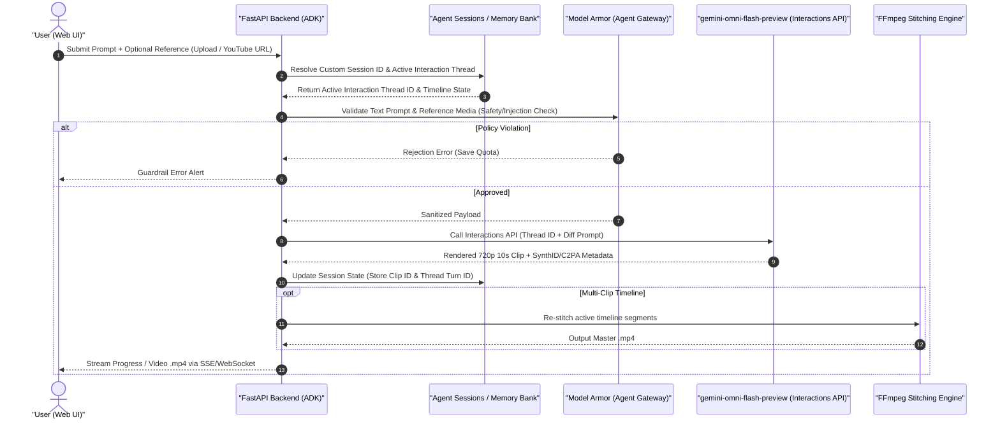

# OmniMash Request Lifecycle & State Management Notes

## 🔄 Core Request Lifecycle (Phase 1 Blueprint)

---

## 💡 Key Architectural Enhancements

### 1. Version Tree / Branching (Undo & Forking Edits)
- **Challenge:** Users may dislike an iterative edit (e.g. Turn 2) and want to revert to Turn 1 without starting from scratch.
- **Solution:** Maintain a DAG of `interaction_turn_id` snapshots in Agent Sessions so users can undo or branch their edits.

### 2. Multi-Clip Timeline State
- **Challenge:** Interactions API operates per 10s clip. Full parody videos contain multiple clips.
- **Solution:** A Project session contains an ordered list of `ClipSegment` objects, each with its own `interaction_thread_id`. Editing Clip #2 only modifies Thread #2; FFmpeg re-stitches the master timeline without touching Clip #1 or Clip #3.

### 3. Asynchronous Streaming (SSE / WebSockets)
- **Challenge:** Video rendering latency can cause HTTP timeouts.
- **Solution:** FastAPI asynchronous task queue with SSE updates (`[Model Armor: Approved]` -> `[Omni Flash: Rendering]` -> `[SynthID: Verified]` -> `[Done]`).

---

## 🛡️ Gemini Omni Flash Zero-Veo Policy & Error Mitigation

### 1. Zero-Veo Fallback Elimination
- **Zero-Veo Policy:** OmniMash exclusively targets `gemini-omni-flash-preview` for native joint video and audio synthesis and conversational diffing. All legacy Veo fallback models (`veo-2.0-generate-001`) have been completely removed.
- **Procedural Animation Fallback:** When live cloud credentials are unavailable or local offline testing is active, the engine falls back to local procedural ffmpeg visualizer animation rather than another cloud model.

### 2. Dual-Strategy Authentication & Seamless Auth Switching
- **Strategy 1 (Google AI Studio Developer API):** Authenticates via `GOOGLE_API_KEY` or `GEMINI_API_KEY` for Developer API endpoints (`generativelanguage.googleapis.com`).
- **Strategy 2 (Vertex AI ADC):** Authenticates via Vertex AI Application Default Credentials (`GOOGLE_CLOUD_PROJECT`, `GEMINI_LOCATION`).
- **Active Error Mitigation (401 UNAUTHENTICATED):** When Vertex AI returns a `401 UNAUTHENTICATED` or `"API keys are not supported"` exception (e.g. when an API key is passed to a Vertex endpoint), `OmniFlashClient` logs the error mitigation event, automatically invokes `switch_to_developer_api()`, and retries generation seamlessly with the Developer API client.

### 3. Exponential Backoff Retry Loop
- **3-Attempt Retry Policy:** `_generate_live_omni_flash_video` executes up to 3 generation attempts with exponential backoff on transient errors (`429 Rate Limit`, `404 Endpoint Mismatch`, or `ResourceExhausted`).
- **Error & Mode Surfacing:** All generation errors and execution modes (`LIVE_OMNI_FLASH` vs `LOCAL_PROCEDURAL_ANIMATION`) are captured in `GenerationResult`, forwarded through `AgentTurnResponse` / `GenerateResponse`, and surfaced directly in the React frontend via the Generation Status badge (`🟢 Live Gemini Omni Flash` / `🟠 Procedural Fallback Animation`) and the Active Error Mitigation Alert Banner.
