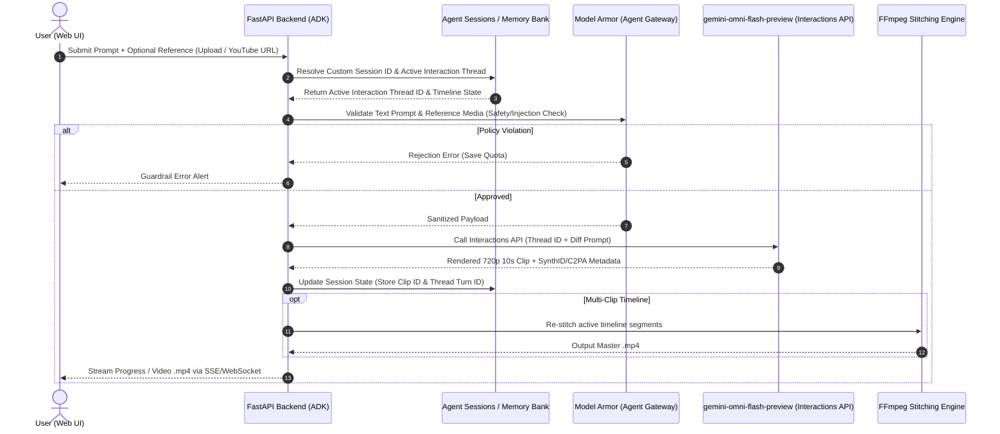

# OmniMash Request Lifecycle & State Management Notes

## 🔄 Core Request Lifecycle (Phase 1 Blueprint)

---

## 💡 Key Architectural Enhancements

### 1. Version Tree / Branching (Undo & Forking Edits)
- **Challenge:** Users may dislike an iterative edit (e.g. Turn 2) and want to revert to Turn 1 without starting from scratch.
- **Solution:** Maintain a DAG of `interaction_turn_id` snapshots in Agent Sessions so users can undo or branch their edits.

### 2. Multi-Clip Timeline State
- **Challenge:** Interactions API operates per 10s clip. Full parody videos contain multiple clips.
- **Solution:** A Project session contains an ordered list of `ClipSegment` objects, each with its own `interaction_thread_id`. Editing Clip #2 only modifies Thread #2; FFmpeg re-stitches the master timeline without touching Clip #1 or Clip #3.

### 3. Asynchronous Streaming (SSE / WebSockets)
- **Challenge:** Video rendering latency can cause HTTP timeouts.
- **Solution:** FastAPI asynchronous task queue with SSE updates (`[Model Armor: Approved]` -> `[Omni Flash: Rendering]` -> `[SynthID: Verified]` -> `[Done]`).
