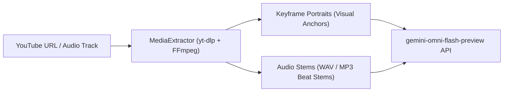

# Multimodal Ingestion: YouTube Reference URLs & Audio Tracks

This note documents how OmniMash ingests and processes reference YouTube videos, character portraits, and audio stems to guide `gemini-omni-flash-preview` multimodal generation.

---

## 🎬 Ingestion Pipeline Overview

When a user provides a YouTube URL (e.g. `https://www.youtube.com/@Onirostudios` or a reference beat track), the **`MediaExtractor`** parses and extracts multimodal anchors:



---

## 🛠️ Step-by-Step API & UI Usage

### 1. In the Web UI Dashboard
1. Paste any YouTube URL or reference audio stem link into the **"📺 YouTube Reference URL / Audio Track"** input field.
2. Enter your parody prompt (e.g. *"DumbleDior rapping to this beat"*).
3. Click **"Generate Parody Clip"**. The UI displays an active **"🎵 Extracted Audio Stem Attached"** badge in the 5-Part Preview Card.

### 2. Via REST API
```bash
curl -X POST http://localhost:8000/api/generate \
  -H "Content-Type: application/json" \
  -d '{
    "user_id": "usr_prod",
    "project_id": "prj_dripwarts",
    "prompt": "DumbleDior dropping bars",
    "clip_index": 0,
    "reference_url": "https://www.youtube.com/watch?v=sample_beat"
  }'
```
