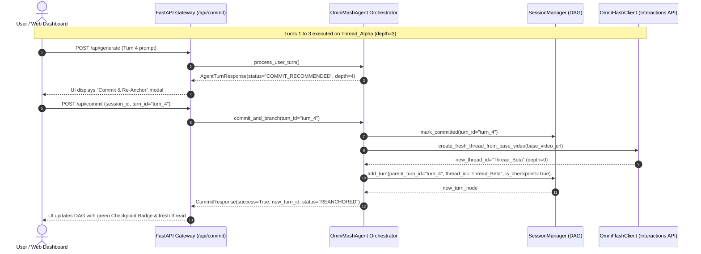

# Implementation Plan: Context Window "Commit & Branch" Checkpointing

**Date:** 2026-07-18  
**Target:** Address multimodal context window decay and visual drift in `gemini-omni-flash-preview` by introducing a "Commit & Branch" checkpointing architecture.  
**Standards:** Follow all guidelines in [CODE_STANDARDS.md](../../CODE_STANDARDS.md) (`uv`, `ruff`, `ty`, `pytest`).

---

## 🎯 Executive Summary & Problem Statement

Empirical evaluation of `gemini-omni-flash-preview` reveals a critical multimodal property:
- **Optimal Coherence Window:** The Interactions API preserves character facial lore anchors, lighting consistency, and background detail across **~3–4 sequential conversational delta edits** on a single thread.
- **Context Decay & Visual Drift:** Beyond 4 consecutive turns, accumulated conversational history and token clutter in the multimodal latent space induce noticeable visual drift in 720p output clips.

### 💡 The Architectural Solution: "Commit & Branch"
To maintain infinite iterative editing without visual decay, OmniMash will introduce **Commit & Branch Checkpointing**:
1. **Thread Depth Tracking:** Track `edit_depth_in_thread` on each `TurnNode`.
2. **Commit Recommendation:** When `edit_depth_in_thread >= 3`, notify the client via `status_event="COMMIT_RECOMMENDED"`.
3. **Base Video Re-Anchoring:** When the user commits a turn, the backend takes the final rendered 720p video of that turn, closes the cluttered conversational thread, and initializes a **brand-new Interactions API thread** using the committed video as the clean base visual anchor.
4. **DAG Continuity:** The new turn node links to the committed parent turn in the Session Version Tree DAG (`parent_turn_id`), preserving non-linear editing history while resetting thread context depth to 0.

---

## 🏗️ Architectural Data Flow



---

## 📋 5-Task Subagent-Driven Implementation Breakdown

### Task 1: State Model Checkpointing & Thread Depth Tracking
**Files:**
- Modify: `src/omnimash/state/session_manager.py`
- Test: `tests/state/test_session_manager.py`

**Instructions:**
1. Update `TurnNode` schema with:
   - `edit_depth_in_thread: int = 0`
   - `is_committed: bool = False`
   - `base_video_anchor_url: str | None = None`
2. Update `SessionManager.add_turn()` to calculate thread depth from `parent_turn_id`. If the parent turn exists and belongs to the same thread, increment depth (`parent.edit_depth_in_thread + 1`).
3. Add `commit_turn(session_id: str, turn_id: str) -> TurnNode` method to `SessionManager` that marks `is_committed=True`.
4. Add unit tests in `tests/state/test_session_manager.py` verifying depth incrementation and checkpoint marking.
5. Verify with `uv run pytest tests/state/test_session_manager.py`.

---

### Task 2: Gemini Omni Flash Client Base Video Re-Anchoring
**Files:**
- Modify: `src/omnimash/engine/omni_client.py`
- Test: `tests/engine/test_omni_client.py`

**Instructions:**
1. Add `start_thread_from_video(base_video_url: str, initial_prompt: str | None = None) -> GenerationResult` to `OmniFlashClient`.
2. In mock mode, generate a fresh `interaction_thread_id` prefixed with `reanchored_thread_` and return the new thread handle.
3. In live mode, initialize a fresh Interactions API conversation passing the base video file URI as the initial multimodal context.
4. Add unit tests in `tests/engine/test_omni_client.py` testing thread re-anchoring from a base video.
5. Verify with `uv run pytest tests/engine/test_omni_client.py`.

---

### Task 3: ADK Orchestrator Commit & Branch Workflow
**Files:**
- Modify: `src/omnimash/agent/orchestrator.py`
- Test: `tests/agent/test_orchestrator.py`

**Instructions:**
1. Update `process_user_turn()` in `OmniMashAgent`:
   - Inspect calculated `turn_node.edit_depth_in_thread`.
   - If `edit_depth_in_thread >= 3`, return `status_event="COMMIT_RECOMMENDED"`.
2. Implement `commit_and_branch(user_id: str, project_id: str, turn_id: str, prompt: str) -> AgentTurnResponse` in `OmniMashAgent`:
   - Retrieve target turn from `SessionManager`.
   - Mark target turn as committed.
   - Invoke `omni_client.start_thread_from_video(target_turn.video_url, prompt)`.
   - Add new `TurnNode` with `edit_depth_in_thread=0`, `parent_turn_id=turn_id`, and `is_checkpoint=True`.
3. Expose `commit_and_branch` tool in `build_adk_agent()`.
4. Add unit tests in `tests/agent/test_orchestrator.py` verifying commit recommendation and branching.
5. Verify with `uv run pytest tests/agent/test_orchestrator.py`.

---

### Task 4: FastAPI Commit Endpoints & SSE Notification
**Files:**
- Modify: `src/omnimash/api/app.py`
- Test: `tests/api/test_app.py`

**Instructions:**
1. Define `CommitRequest(BaseModel)` and `CommitResponse(BaseModel)`:
   ```python
   class CommitRequest(BaseModel):
     user_id: str
     project_id: str
     turn_id: str
     next_prompt: str = ""
```
2. Implement `POST /api/commit` in `create_app()` routing to `agent.commit_and_branch()`.
3. Add API-level tests in `tests/api/test_app.py` for `/api/commit`.
4. Verify with `uv run pytest tests/api/test_app.py`.

---

### Task 5: Web UI Dashboard "Commit & Re-Anchor" Modal & DAG Badge
**Files:**
- Modify: `src/omnimash/api/app.py` (UI template & React components)
- Test: `tests/api/test_integration.py`

**Instructions:**
1. Update the frontend Web UI dashboard in `app.py`:
   - Display a **"Commit & Re-Anchor"** button and warning banner whenever the active turn reaches depth $\ge 3$.
   - Render a distinctive **Green Anchor Badge** ⚓ on committed checkpoint nodes in the Version Tree DAG viewer.
   - Wire the "Commit & Re-Anchor" button to trigger `POST /api/commit`.
2. Update `tests/api/test_integration.py` to test the complete end-to-end flow:
   - Generate turns until depth recommendation triggers.
   - Commit turn via `/api/commit`.
   - Verify new turn has fresh thread ID and depth reset.
3. Verify with `uv run pytest`, `uv run ruff check .`, `uv run ruff format .`, and `uv run ty check .`.

---

## 🧪 Verification & Quality Checklist

Every task will be executed using subagent-driven development:
- **Implementer Subagent** $\rightarrow$ **Spec Reviewer** $\rightarrow$ **Code Quality Reviewer** $\rightarrow$ **Git Commit**.
- `uv run pytest` (All unit and integration tests passing).
- `uv run ruff check .` and `uv run ruff format --check .` (0 lint/formatting issues).
- `uv run ty check .` (0 type check diagnostics).
