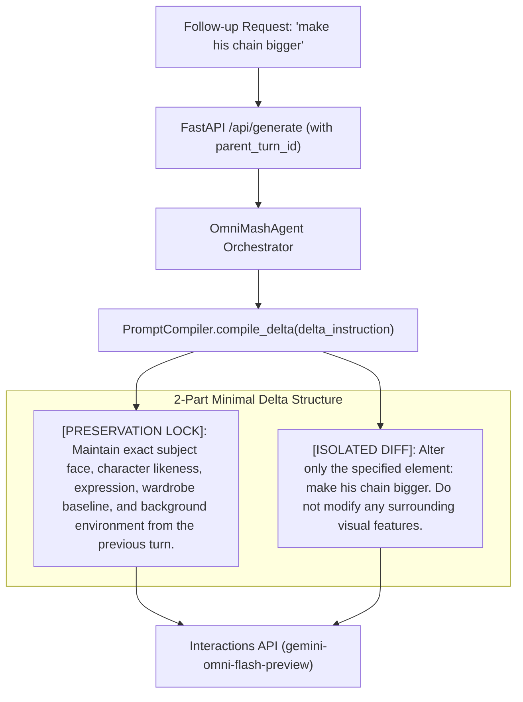

# Conversational Delta Prompt Compiler ("Lock & Isolate" Framework) Implementation Plan

## Overview
When submitting multi-turn edits via the Interactions API (e.g. "make his chain bigger" or "change the lighting to neon green"), passing the entire massive prompt from turn 1 causes `gemini-omni-flash-preview` to over-correct and shift the character's facial likeness and background environment.

This plan implements the **2-part "Lock & Isolate" Minimal Delta Prompt Compiler**:
```text
Delta Prompt = [PRESERVATION LOCK]: {lock_text} | [ISOLATED DIFF]: {isolated_diff_text}
```
1. **`[PRESERVATION LOCK]`**: Acknowledge the lock. Tells the model what not to change (subject face, character identity, expression, wardrobe baseline, and background environment).
2. **`[ISOLATED DIFF]`**: Isolate the variable. Specifies only the precise element being altered.

---

## Architecture Flow



---

## User Review Required

> [!NOTE]
> All subagent executions inherit full permissions (`Workspace: "inherit"`, `command(*)` execution) and follow strict TDD (`uv run pytest`, `uv run ruff`, `uv run ty`).

---

## Proposed Changes & Tasks

### Prompts Subsystem

#### [Task 1] Implement `compile_delta()` in `src/omnimash/prompts/compiler.py`
- Define `CompiledDeltaPrompt` dataclass with `preservation_lock: str`, `isolated_diff: str`, and `to_delta_prompt() -> str`.
- Implement `PromptCompiler.compile_delta(delta_instruction: str, custom_lock: str | None = None) -> CompiledDeltaPrompt`.
- Add unit tests in `tests/prompts/test_compiler.py`.

#### [Task 2] Integrate `compile_delta()` into `src/omnimash/prompts/taxonomy.py`
- Update `PromptTaxonomyEngine.build_delta_prompt(current_clip_desc: str, delta_instruction: str) -> str` to invoke `self.compiler.compile_delta(delta_instruction=delta_instruction)`.
- Format as: `Apply conversational diff to the existing video latent space using Lock & Isolate: {compiled_delta.to_delta_prompt()}`.
- Update tests in `tests/prompts/test_taxonomy.py`.

### Agent Orchestration Subsystem

#### [Task 3] Update Google ADK Agent Orchestrator in `src/omnimash/agent/orchestrator.py`
- Update ADK `Agent` system instruction in `build_adk_agent()` to define the 2-part "Lock & Isolate" rules for multi-turn conversational edits.
- Add tests in `tests/agent/test_orchestrator.py`.

### API & Web UI Subsystem

#### [Task 4] Update FastAPI Backend & Web UI Dashboard in `src/omnimash/api/app.py`
- In Web UI dashboard, display live **"🔒 Preservation Lock"** and **"🎯 Isolated Diff"** badges in the prompt preview card when a parent turn is selected.
- Update integration tests in `tests/api/test_integration.py`.

---

## Verification Plan

### Automated Tests
1. `uv run pytest` - Full test suite across compiler, taxonomy, agent, and API integration.
2. `uv run ruff check .` and `uv run ruff format --check .` - Code formatting & linting.
3. `uv run ty check .` - Static typing check.

### Manual Verification
- Test `curl -X POST http://localhost:8000/api/generate` with `parent_turn_id` and verify minimal 2-part delta prompt payload.
