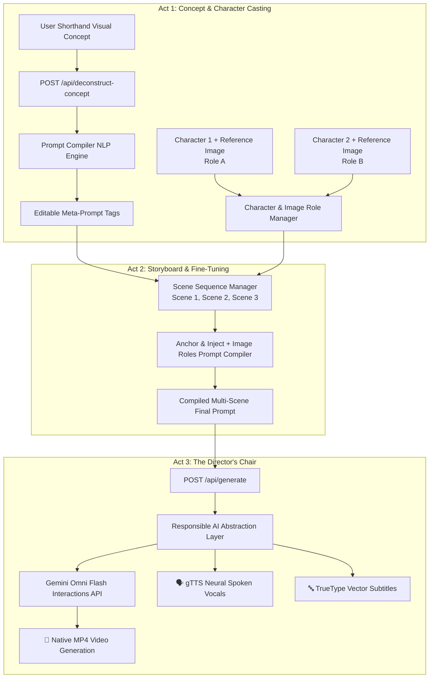

# Flexible Parody Concept & Character Roles Workflow Implementation Plan

> **For Claude:** REQUIRED SUB-SKILL: Use superpowers:executing-plans to implement this plan task-by-task.

**Goal:** Enable users to create ~1-minute parody videos from any open-ended visual and aesthetic concept using a linear 3-Act workflow, dynamic meta-prompt tag deconstruction, multi-character definition with Gemini Omni Image Roles, and multi-scene storyboarding.

**Architecture:** Replace hardcoded presets with an open-ended "Visual Concept / Parody Prompt" widget. The Prompt Compiler expands user shorthand into editable Meta-Prompt Tags (Characters, Aesthetic, Environment, Camera, Lighting, Audio). Characters are defined with explicit Role tags (`Role A`, `Role B`) bound to reference images per the Gemini Omni API specification (`https://ai.google.dev/gemini-api/docs/omni#set-image-roles`). The linear Act workflow sequences multi-character scenes into a cohesive ~1-minute parody cut, maintaining responsible AI name abstraction, gTTS neural vocals, and razor-sharp TrueType subtitles.

**Tech Stack:** FastAPI, React 18 / Tailwind CSS, Google GenAI SDK (`gemini-omni-flash-preview` / Vertex AI), Pydantic v2, pytest.

---

## User Review Required

> [!IMPORTANT]
> **Key Architecture Decisions for Review:**
> 1. **Removal of Hardcoded Archetype & Aesthetic Presets**: Fixed cards ("Harry & Draco", "Snape", "Bounty Hunter") in Act 1 are completely removed in favor of an open-ended **"Visual Concept / Parody Prompt"** input (e.g. *"Harry Potter vs Draco Malfoy rap battle in 2000s Atlanta trap style"* or *"Gordon Ramsay vs Julia Child in a cyberpunk iron chef battle"*).
> 2. **Gemini Omni Image Roles Standard**: Characters are defined with explicit Role IDs (`Role A`, `Role B`, etc.) and attached reference image URLs. The compiled prompt structures storyboard scenes by referencing these character roles directly.
> 3. **Editable Meta-Prompt Tags**: Concept deconstruction produces editable chips/tags for Subject Lore, Aesthetic Injection, Environment, Camera/Lighting, and Audio Beat that users can modify before rendering.

---

## Proposed Changes



---

## Bite-Sized Implementation Tasks

### Task 1: Prompt Compiler Data Models for Characters, Meta-Tags & Image Roles

**Files:**
- Modify: `src/omnimash/prompts/compiler.py`
- Create: `tests/prompts/test_character_roles.py`

**Step 1: Write the failing test**

```python
# tests/prompts/test_character_roles.py
from omnimash.prompts.compiler import CharacterRole, SceneDirective, PromptCompiler

def test_compile_with_character_roles_and_scenes():
    compiler = PromptCompiler()
    chars = [
        CharacterRole(role_id="Role A", name="Harry", description="Young wizard with round glasses and lightning scar", reference_url="https://example.com/harry.jpg"),
        CharacterRole(role_id="Role B", name="Draco", description="Blonde rival wizard in silver-trimmed robes", reference_url="https://example.com/draco.jpg")
    ]
    scenes = [
        SceneDirective(scene_number=1, active_roles=["Role A"], action="Arriving at foggy courtyard rapping into microphone wand", dialogue="I been cooking potions since first year!"),
        SceneDirective(scene_number=2, active_roles=["Role B"], action="Stepping from shadows in high-gloss neon lighting", dialogue="This is Trap or Die, Potter!")
    ]
    compiled = compiler.compile_storyboard(
        concept="Harry vs Draco Atlanta Trap Disstrack",
        characters=chars,
        scenes=scenes,
        aesthetic_tags=["2000s Atlanta Trap", "Fisheye lens", "Heavy 808 bass"],
        environment_tag="Gothic Hogwarts courtyard with neon stage lights",
        audio_beat="140 BPM Heavy 808 Trap"
    )
    assert "[ROLE DEFINITIONS]" in compiled
    assert "Role A (Harry)" in compiled
    assert "[STORYBOARD SEQUENCE]" in compiled
    assert "Scene 1 [Role A]" in compiled
```

**Step 2: Run test to verify it fails**
Run: `uv run pytest tests/prompts/test_character_roles.py`
Expected: FAIL with `ImportError: cannot import name 'CharacterRole'`

**Step 3: Write minimal implementation**
Implement `CharacterRole`, `SceneDirective`, `MetaPromptTags`, and `compile_storyboard()` in `src/omnimash/prompts/compiler.py`.

**Step 4: Run test to verify it passes**
Run: `uv run pytest tests/prompts/test_character_roles.py`
Expected: PASS

**Step 5: Commit**
```bash
git add src/omnimash/prompts/compiler.py tests/prompts/test_character_roles.py
git commit -m "feat(prompts): add CharacterRole and multi-scene storyboard prompt compiler"
```

---

### Task 2: Concept Deconstruction Engine (Shorthand -> Editable Meta-Prompt Tags)

**Files:**
- Modify: `src/omnimash/prompts/compiler.py`
- Modify: `src/omnimash/prompts/taxonomy.py`
- Create: `tests/prompts/test_deconstruct.py`

**Step 1: Write the failing test**

```python
# tests/prompts/test_deconstruct.py
from omnimash.prompts.compiler import PromptCompiler

def test_deconstruct_concept_shorthand():
    compiler = PromptCompiler()
    concept = "Gordon Ramsay vs Julia Child in a cyberpunk iron chef battle"
    tags = compiler.deconstruct_concept(concept)
    assert len(tags.characters) >= 2
    assert any("Ramsay" in c.name or "Chef" in c.description for c in tags.characters)
    assert tags.aesthetic_tags is not None
    assert tags.environment_tag is not None
```

**Step 2: Run test to verify it fails**
Run: `uv run pytest tests/prompts/test_deconstruct.py`
Expected: FAIL with `AttributeError: 'PromptCompiler' object has no attribute 'deconstruct_concept'`

**Step 3: Write minimal implementation**
Implement `deconstruct_concept()` in `PromptCompiler` using NLP extraction to parse any user concept into structured characters, aesthetic tags, environment, camera, and dialogue recommendations.

**Step 4: Run test to verify it passes**
Run: `uv run pytest tests/prompts/test_deconstruct.py`
Expected: PASS

**Step 5: Commit**
```bash
git add src/omnimash/prompts/compiler.py src/omnimash/prompts/taxonomy.py tests/prompts/test_deconstruct.py
git commit -m "feat(prompts): add NLP concept deconstruction into editable meta-prompt tags"
```

---

### Task 3: API Endpoints for Concept Deconstruction & Multi-Character Generation

**Files:**
- Modify: `src/omnimash/api/app.py`
- Modify: `src/omnimash/agent/orchestrator.py`
- Create: `tests/api/test_concept_api.py`

**Step 1: Write the failing test**

```python
# tests/api/test_concept_api.py
from fastapi.testclient import TestClient
from omnimash.api.app import app

client = TestClient(app)

def test_deconstruct_concept_endpoint():
    res = client.post("/api/deconstruct-concept", json={"concept": "Harry vs Draco trap battle"})
    assert res.status_code == 200
    data = res.json()
    assert "characters" in data
    assert "aesthetic_tags" in data
```

**Step 2: Run test to verify it fails**
Run: `uv run pytest tests/api/test_concept_api.py`
Expected: FAIL with 404 Not Found

**Step 3: Write minimal implementation**
Add `POST /api/deconstruct-concept` and update `POST /api/generate` in `src/omnimash/api/app.py` to accept `concept`, `characters`, `scenes`, and `meta_tags`.

**Step 4: Run test to verify it passes**
Run: `uv run pytest tests/api/test_concept_api.py`
Expected: PASS

**Step 5: Commit**
```bash
git add src/omnimash/api/app.py src/omnimash/agent/orchestrator.py tests/api/test_concept_api.py
git commit -m "feat(api): add /api/deconstruct-concept and multi-character generation payload support"
```

---

### Task 4: UI Overhaul: Visual Concept Widget, Character Cast Manager & Linear Acts

**Files:**
- Modify: `src/omnimash/api/app.py` (React frontend `UI_HTML` component)

**Step 1: Update React UI in `UI_HTML`**
1. **Remove Hardcoded Preset Grids**: Replace subject and aesthetic preset grids with the open-ended **"Visual Concept / Parody Prompt"** input.
2. **Act 1: Concept & Character Casting**:
   - Concept text box with "Deconstruct Concept" button.
   - Dynamic Character Manager: Add/remove characters, assign Role tags (`Role A`, `Role B`), enter visual description, and input/upload reference images.
   - Editable Meta-Prompt Tags: Interactive tag chips for Style, Environment, Camera, Lighting, and Drip Props.
3. **Act 2: Storyboard Sequence & Fine-Tuning**:
   - Multi-scene storyboard editor (~1-minute sequence).
   - Assign character roles to scenes.
   - Dialogue editor per character with live gTTS vocal and subtitle preview.
   - Live Anchor & Inject + Image Roles compiled prompt preview.
4. **Act 3: The Director's Chair**:
   - Native Gemini Omni Flash MP4 player, timeline history, and conversational delta prompt editor.

**Step 2: Run pytest and lint/type checks**
Run: `uv run ruff check --fix . && uv run ruff format . && uv run ty check . && uv run pytest`
Expected: All checks and tests pass.

**Step 5: Commit**
```bash
git add src/omnimash/api/app.py
git commit -m "feat(ui): implement open-ended visual concept widget, character casting, and storyboard editor"
```

---

### Task 5: Stale Documentation, Architecture Notes & Diagrams Refresh

**Files:**
- Modify: `docs/notes/digital_directors_studio_3_act_workflow.md`
- Modify: `docs/notes/prompt_compiler_anchor_inject.md`
- Modify: `docs/diagrams/frontend_api_topology.md`
- Modify: `docs/diagrams/omnimash_agent_architecture.md`
- Modify: `README.md`

**Step 1: Update Documentation**
- Update all documentation files to remove references to hardcoded presets and describe the new dynamic concept deconstruction, character roles (`https://ai.google.dev/gemini-api/docs/omni#set-image-roles`), and multi-scene storyboard architecture.

**Step 2: Update Diagrams**
- Update mermaid flowcharts and architecture topology diagrams across `docs/diagrams/` and `docs/notes/`.

**Step 3: Commit**
```bash
git add docs/ README.md
git commit -m "docs: update 3-act workflow notes, prompt compiler specs, and architecture diagrams for character roles"
```

---

## Verification Plan

### Automated Tests
Run the entire test suite including linting, typechecking, and unit tests:
```bash
uv run ruff check --fix .
uv run ruff format .
uv run ty check .
uv run pytest -v
```

### Manual Verification
1. Open the local web interface or live Cloud Run preview:
   - Navigate to Act 1.
   - Enter a custom concept: *"Gordon Ramsay vs Julia Child in a cyberpunk iron chef battle"*.
   - Click **"Deconstruct Concept"** and verify that editable meta-prompt tags and character definitions appear.
   - Add/edit character roles and reference image URLs.
   - Advance to Act 2 and verify multi-scene storyboard generation with character role bindings.
   - Advance to Act 3 and verify full prompt compilation and video generation.
