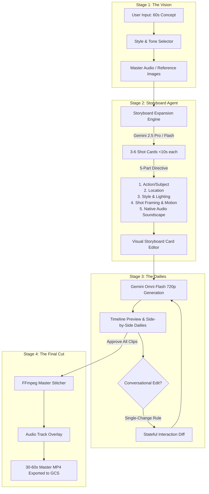

# 30-to-60 Second Gemini Omni Flash User Journey & Directorial Storyboard Architecture

> **For Claude:** REQUIRED SUB-SKILL: Use superpowers:executing-plans to implement this plan task-by-task.

**Goal:** Build a complete 4-stage user journey for creating 30-to-60 second videos using Gemini Omni Flash (`gemini-omni-flash-preview`), enforcing Google DeepMind's official prompting guidelines ("Less micromanaging. More directing", 5-part shot structure, single-change conversational editing, and seamless FFmpeg final cut assembly).

**Architecture:** 
1. **Stage 1 (Vision):** Input high-level 60s concept with Style & Tone selector (Text Script, Audio Track, Reference Images).
2. **Stage 2 (Storyboard Agent):** Backend LLM (`gemini-2.5-pro` / `gemini-3.6-flash`) expands the 60s vision into 3–6 distinct <10s shot cards adhering to a strict 5-part structure (`Action/Subject`, `Location`, `Style & Lighting`, `Shot Framing & Motion`, `Audio`).
3. **Stage 3 (The Dailies):** Side-by-side 10s clip generation and single-change conversational diffing using stateful `previous_interaction_id`.
4. **Stage 4 (Final Cut):** FFmpeg concatenation of approved 10s MP4 clips, optionally overlaying the Stage 1 master audio track.

**Tech Stack:** Python 3.12, FastAPI, Pydantic, Google GenAI SDK (`gemini-omni-flash-preview`), FFmpeg (`VideoStitcher`), React 18 / Tailwind CSS UI (`src/omnimash/api/app.py`).

---

## Architecture & Data Flow Diagram



---

## 🛠️ Detailed Component Tasks

### Task 1: 5-Part Storyboard Directive Data Model & Expansion Engine

**Files:**
- Create: `src/omnimash/prompts/storyboard_agent.py`
- Modify: `src/omnimash/prompts/compiler.py`
- Test: `tests/prompts/test_storyboard_agent.py`

**Step 1: Write the failing test**

```python
# tests/prompts/test_storyboard_agent.py
import pytest
from omnimash.prompts.storyboard_agent import StoryboardShot, StoryboardAgent

def test_storyboard_shot_5_part_structure():
    shot = StoryboardShot(
        shot_index=1,
        duration_seconds=9.5,
        action="Snape stirring a glowing purple potion carefully",
        location="A dimly lit stone dungeon classroom with bubbling cauldrons",
        style_lighting="Cinematic, realistic, lit by a warm off-screen fire with soft shadows",
        framing_motion="Static medium shot",
        audio="Slow booming 808 trap beat with bubbling liquid sounds"
    )
    prompt = shot.to_omni_flash_prompt(role_mappings="[ROLE DEFINITIONS]\n- Role A (Snape)")
    assert "[ROLE DEFINITIONS]" in prompt
    assert "Shot 1 (0-10s)" in prompt
    assert "Framing & Motion: Static medium shot" in prompt
    assert "Audio: Slow booming 808 trap beat" in prompt

def test_expand_vision_into_storyboard():
    agent = StoryboardAgent(mock_mode=True)
    shots = agent.expand_vision(
        concept="30-second Dripwarts video. Snape brews potion, drinks it, becomes Snape Dogg.",
        style_tone="Gritty 90s rap video",
        target_duration=30.0
    )
    assert len(shots) == 3
    assert all(s.duration_seconds <= 10.0 for s in shots)
    assert shots[0].framing_motion != ""
```

**Step 2: Run test to verify it fails**

Run: `uv run pytest tests/prompts/test_storyboard_agent.py`
Expected: `FAIL (ModuleNotFoundError: No module named 'omnimash.prompts.storyboard_agent')`

**Step 3: Implement `StoryboardAgent` and `StoryboardShot` dataclasses**

```python
# src/omnimash/prompts/storyboard_agent.py
from dataclasses import dataclass, field
from typing import Any, List
import json

@dataclass
class StoryboardShot:
    shot_index: int
    duration_seconds: float
    action: str
    location: str
    style_lighting: str
    framing_motion: str
    audio: str

    def to_omni_flash_prompt(self, role_mappings: str = "") -> str:
        prompt_parts = []
        if role_mappings:
            prompt_parts.append(role_mappings)
        
        prompt_parts.append(
            f"[SHOT DIRECTIVE: Shot {self.shot_index} (0-{int(self.duration_seconds)}s)]\n"
            f"- Action / Subject: {self.action}\n"
            f"- Location: {self.location}\n"
            f"- Style & Lighting: {self.style_lighting}\n"
            f"- Shot Framing & Motion: {self.framing_motion}\n"
            f"- Audio Soundscape: {self.audio}"
        )
        return "\n\n".join(prompt_parts)

class StoryboardAgent:
    """Expands a 30-60s vision into 3-6 distinct 10s shot cards adhering to DeepMind prompt guidelines."""
    def __init__(self, mock_mode: bool = False):
        self.mock_mode = mock_mode

    def expand_vision(
        self, concept: str, style_tone: str = "Cinematic Trap Parody", target_duration: float = 30.0
    ) -> List[StoryboardShot]:
        if self.mock_mode:
            return [
                StoryboardShot(
                    shot_index=1,
                    duration_seconds=10.0,
                    action="Snape, a gaunt wizard with black hair, standing in a dark stone dungeon stirring a glowing purple potion",
                    location="A dimly lit stone dungeon potion classroom",
                    style_lighting=f"{style_tone}, cinematic soft shadows",
                    framing_motion="Static medium shot",
                    audio="Slow heavy 808 trap beat with bubbling liquid sound"
                ),
                StoryboardShot(
                    shot_index=2,
                    duration_seconds=10.0,
                    action="Snape lifts the glowing purple vial to his lips and drinks it quickly, expression changing to shock",
                    location="Gothic potion classroom with floating candles",
                    style_lighting=f"{style_tone}, vibrant magical sparks",
                    framing_motion="Dolly zoom in",
                    audio="Trap beat drops heavily with massive sub-bass"
                ),
                StoryboardShot(
                    shot_index=3,
                    duration_seconds=10.0,
                    action="Snape is now wearing an oversized silver puffer jacket and massive diamond chain, nodding slowly",
                    location="High contrast Hogwarts courtyard with stage smoke",
                    style_lighting=f"{style_tone}, neon rim lights",
                    framing_motion="Low angle pedestal shot moving up",
                    audio="Aggressive 90s hip hop beat with sub-bass"
                ),
            ]
        # In live mode: prompt Gemini 2.5 Pro / Flash to generate structured JSON shot list
        return []
```

**Step 4: Run test to verify it passes**

Run: `uv run pytest tests/prompts/test_storyboard_agent.py`
Expected: `PASS`

**Step 5: Commit**

```bash
git add src/omnimash/prompts/storyboard_agent.py tests/prompts/test_storyboard_agent.py
git commit -m "feat(prompts): add StoryboardAgent and 5-part shot prompt structure

TAG=agy
CONV=3e6e0805-9daf-47da-ae1a-2c3ac07b54e9"
```

---

### Task 2: Enforce Single-Change Conversational Editing Rule in Orchestrator

**Files:**
- Modify: `src/omnimash/agent/orchestrator.py:150-250`
- Test: `tests/agent/test_single_change_diff.py`

**Step 1: Write the failing test**

```python
# tests/agent/test_single_change_diff.py
import pytest
from omnimash.agent.orchestrator import OmniMashAgent

def test_single_change_rule_validator():
    agent = OmniMashAgent(mock_mode=True)
    # Single change: acceptable
    is_valid, msg = agent.validate_conversational_edit("Change the jacket to green")
    assert is_valid is True

    # Multi-attribute change: fails rule
    is_valid, msg = agent.validate_conversational_edit(
        "Change the jacket to green, switch camera to wide shot, and make the lighting bright red"
    )
    assert is_valid is False
    assert "one change per turn" in msg.lower()
```

**Step 2: Run test to verify it fails**

Run: `uv run pytest tests/agent/test_single_change_diff.py`
Expected: `FAIL (AttributeError: 'OmniMashAgent' has no attribute 'validate_conversational_edit')`

**Step 3: Implement `validate_conversational_edit` in `orchestrator.py`**

```python
# In src/omnimash/agent/orchestrator.py
    def validate_conversational_edit(self, edit_prompt: str) -> tuple[bool, str]:
        """Enforces Google's Golden Rule for Omni Flash edits: One change per turn."""
        if not edit_prompt or not edit_prompt.strip():
            return True, ""
        
        # Check for multiple action commas/and conjunctions indicating compound edits
        edit_lower = edit_prompt.lower()
        change_keywords = ["change", "make", "switch", "add", "remove", "turn", "set", "replace"]
        
        count = 0
        for kw in change_keywords:
            count += edit_lower.count(kw)
        
        has_multiple_clauses = (edit_prompt.count(",") >= 2) or (" and " in edit_lower and count >= 2)
        if count >= 3 or has_multiple_clauses:
            return (
                False,
                "Gemini Omni Flash performs best with one edit per turn to maintain scene coherence. "
                "Please split your request into single edits (e.g. first change the outfit, then adjust camera angle)."
            )
        return True, ""
```

**Step 4: Run test to verify it passes**

Run: `uv run pytest tests/agent/test_single_change_diff.py`
Expected: `PASS`

**Step 5: Commit**

```bash
git add src/omnimash/agent/orchestrator.py tests/agent/test_single_change_diff.py
git commit -m "feat(agent): enforce single-change conversational editing rule for Omni Flash

TAG=agy
CONV=3e6e0805-9daf-47da-ae1a-2c3ac07b54e9"
```

---

### Task 3: Final Cut Master Audio Overlay in `VideoStitcher`

**Files:**
- Modify: `src/omnimash/stitching/stitcher.py:15-80`
- Test: `tests/stitching/test_audio_overlay.py`

**Step 1: Write the failing test**

```python
# tests/stitching/test_audio_overlay.py
import pytest
from omnimash.stitching.stitcher import VideoStitcher

def test_concatenate_clips_with_master_audio(tmp_path):
    stitcher = VideoStitcher(mock_mode=True)
    clip1 = str(tmp_path / "clip1.mp4")
    clip2 = str(tmp_path / "clip2.mp4")
    audio = str(tmp_path / "master_beat.mp3")

    with open(clip1, "w") as f: f.write("clip1")
    with open(clip2, "w") as f: f.write("clip2")
    with open(audio, "w") as f: f.write("audio")

    out_path = stitcher.concatenate_clips(
        [clip1, clip2], output_dir=str(tmp_path), master_audio_path=audio
    )
    assert out_path.endswith("_stitched.mp4")
```

**Step 2: Run test to verify it fails**

Run: `uv run pytest tests/stitching/test_audio_overlay.py`
Expected: `FAIL (TypeError: concatenate_clips() got an unexpected keyword argument 'master_audio_path')`

**Step 3: Update `VideoStitcher.concatenate_clips` signature & FFmpeg command**

```python
# In src/omnimash/stitching/stitcher.py
    def concatenate_clips(
        self,
        clip_paths: list[str],
        output_dir: str = "/tmp",
        session_id: str | None = None,
        master_audio_path: str | None = None,
    ) -> str:
        # ... resolve local clips ...
        # If master_audio_path is provided, overlay audio in FFmpeg command:
        # ffmpeg -y -f concat -safe 0 -i concat_list.txt -i master_audio.mp3 -c:v copy -c:a aac -map 0:v:0 -map 1:a:0 out_path
```

**Step 4: Run test to verify it passes**

Run: `uv run pytest tests/stitching/test_audio_overlay.py`
Expected: `PASS`

**Step 5: Commit**

```bash
git add src/omnimash/stitching/stitcher.py tests/stitching/test_audio_overlay.py
git commit -m "feat(stitching): add master audio track overlay support to VideoStitcher

TAG=agy
CONV=3e6e0805-9daf-47da-ae1a-2c3ac07b54e9"
```

---

### Task 4: 4-Stage Studio Frontend User Journey UI

**Files:**
- Modify: `src/omnimash/api/app.py`
- Test: `tests/api/test_app.py`

**Step 1: Update API Endpoints for 4-Stage Journey**
- `POST /api/storyboard/expand`: Receives 60s concept + Style/Tone picker $\rightarrow$ Returns 3–6 5-part `StoryboardShot` cards.
- `POST /api/storyboard/generate-all`: Generates 10s clips sequentially for all approved shot cards.
- `POST /api/save-final`: Receives optional `master_audio_url` and stitches complete 30–60s master MP4.

**Step 2: Update React Frontend UI (`UI_HTML` in `app.py`)**
- Render 4 distinct step tabs:
  1. **Stage 1 (Vision):** High-level concept text area + Style & Tone buttons ("Gritty 90s Rap Video", "Gothic Trap Parody", "Cinematic Documentary", "80s Anime Disstrack").
  2. **Stage 2 (Storyboard):** Grid of editable 5-part shot cards (`Action`, `Location`, `Style & Lighting`, `Framing & Motion`, `Audio`).
  3. **Stage 3 (The Dailies):** Side-by-side clip player + Conversational Diff input with Single-Change validation banner.
  4. **Stage 4 (Final Cut):** Stitched 30–60s master player + GCS export + master audio track controls.

---

## 🧪 Verification Plan

### Automated Tests
Run full test suite:
```bash
uv run pytest
uv run ruff check .
uv run ty check .
```

### Manual Verification
1. Open local web app: `uv run adk web` or launch FastAPI app on port 8000.
2. Navigate to `http://127.0.0.1:8000`.
3. Input 30-second concept: *"30-second Dripwarts rap battle. Snape vs Harry Potter."*
4. Select Style/Tone: *"Gritty 90s Rap Video"*.
5. Click **Expand Storyboard** $\rightarrow$ Verify 3 distinct <10s shot cards appear with 5-part structure.
6. Click **Generate Dailies** $\rightarrow$ Verify 10s clips render side-by-side.
7. Test single-change diffing in Stage 3: Edit *"Change Snape's jacket to silver puffer"* $\rightarrow$ Verify stateful interaction succeeds.
8. Test multi-change rejection: Edit *"Change jacket to red, change camera angle to dolly zoom, and add fire background"* $\rightarrow$ Verify warning banner encourages single-change turns.
9. Click **Assemble Final Cut** $\rightarrow$ Verify 30-second master MP4 stitches cleanly.
